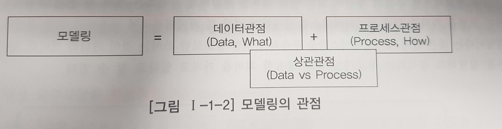
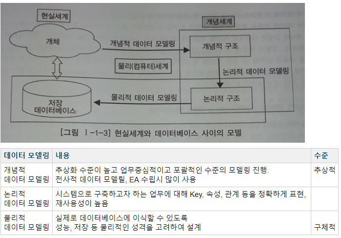
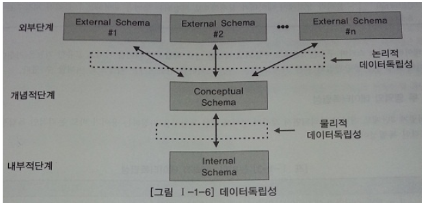
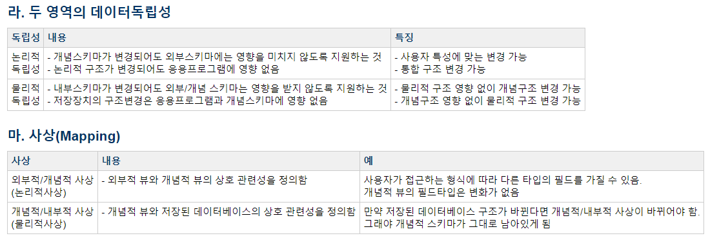

# 데이터 모델의 이해
***

## 1. 모델링의 이해

* 모델링의 정의
  * 사람이 살아가면서 나타날 수 있는 다양한 현상은 사람, 사물 개념 등에 의해 발생된다고 할 수 있으며
    **모델링은 이것을 표기법에 의해 규칙을 가지고 표기하는 것이다.**

* 모델링의 특징
  * 추상화, 단순화, 명확화

* 모델링의 세 가지 관점
  * 
  * 데이터 관점 : **업무가 어떤 데이터와 관련이 있는지 또는 데이터간의 관계는 무엇인지에 대해서 모델링** 하는 방법(What, Data)
  * 프로세스 관점 : **업무가 실제하고 있는 일은 무엇인지 또는 무엇을 해야 하는지를 모델링** 하는 방법(How, Process)
  * 데이터와 프로세스의 상관관점 : 업무가 처리하는 일의 방법에 따라 데이터는 **어떻게 영향을 받고 있는지 모델링** 하는 방법
***

## 2. 데이터 모델의 기본 개념의 이해

* 데이터 모델링의 정의
  * 정보시스템을 구축하기 위한 데이터관점의 업무 분석 기법
  * 현실세계의 데이터(What)에 대해 약속된 표기법에 의해 표현하는 과정
  * 데이터베이스를 구축하기 위한 분석/설계의 과정
***

## 3. 데이터 모델링의 중요성 및 유의점

* 중요성
  * 파급효과 - 데이터 구조의 변경으로 인한 일련의 변경작업은 전체 시스템 구축 프로젝트에서 큰 위험요소가 된다.
  * 복잡한 정보 요구사항의 간결한 표현 - 간결하게 그려져 있는 데이터 모델을 리뷰하면서 파악하는 것이 빠른 방법이다.
  * 데이터 품질(데이터 구조의 문제) - 중복 데이터의 미정의, 데이터 구조의 비즈니스 정의의 불충분, 동일한 성격의 데이터를 통합하지 않고 분리함으로써 나타나는 데이터 불일치 등

* 유의점
  * 중복 - 데이터베이스가 여러 장소에 같은 정보를 저장하는 잘못을 하지 않도록 한다.
  * 비유연성 - 사소한 업무변화에도 데이터 모델이 수시로 변경됨으로써 유지보수의 어려움을 가중시킬 수 있다.
  * 비일관성 - 데이터와 데이터간 상호 연관 관계에 대한 명확한 정의가 필요하다.
***

## 4. 데이터 모델링의 3단계 진행

* 개념적 데이터 모델링
  * 추상화 수준이 높고 업무중심적이고 포괄적인 수준의 모델링 진행.
    전사적 데이터 모델링(데이터 모델링 과정이 전 조직에 걸쳐 이루어짐), EA수립 시 많이 이용
  * 어떠한 자료가 중요하며 또 어떠한 자료가 유지되어야 하는지를 결정하는 것도 포함
  * 핵심 엔터티와 그들 간의 관계를 발견, 엔터티 * 관계 다이어그램을 생성

* 논리적 데이터 모델링
  * 시스템으로 구축하고자 하는 업무에 대해 Key, 속성, 관계 등을 정확하게 표현, 재사용성이 높음
  * 논리적인 구조와 규칙을 명확하게 표현하는 기법 또는 과정
  * 데이터 모델링이 최종적으로 완료된 상태
  * 데이터 모델링 과정에서 가장 핵심이 되는 부분
  * 정규화를 수행. 정규화란, 논리 데이터 모델의 일관성을 확보하고 중복을 제거하여 속성들이  
    가장 적절한 엔터티에 배치
  * 식별자 확정, 정규화, M:M 관게 해소, 참조 무결성 규칙 정의

* 물리적 데이터 모델링
  * 실제로 데이터베이스에 이식할 수 있도록 성능, 저장 등 물리적인 성격을 고려하여 설계
  * 어떻게 컴퓨터 하드웨어에 표현될 것인가를 다룸
***

## 5. 데이터 모델링에서 테이터독립성의 이해

* 데이터 독립성의 필요성
  * 어떤 단위에 대해 **독립적인 의미를 부여** 하고 그것을 효과적으로 구현하게 되면
    자신이 가지는 고유한 특징을 명확하게 할 뿐만 아니라 다른 기능의 변경으로부터 쉽게 변경되지 않고
    **자신의 고유한 기능을 가지고 기능** 을 제공하는 장점
  * 지속적으로 증가하는 유지보수 비용을 절감하고 **데이터 복잡도를 낮추며 중복된 데이터를 줄이기 위한 목적**
  * 따라서 **유지보수 비용증가, 데이터 중복성 증가, 데이터복잡도 증가, 요구사항 대응 저하** 때문에 필요합니다.

* 데이터베이스 3단계 구조
  * 

  * 외부단계, 개념적단계, 내부적단계

* 데이터독립성 요소
  * 외부스키마(외부단계) : View 단계 여러 개의 사용자 관점으로 구성, 즉 개개 사용자 단게로서
                          개개 사용자가 보는 개인적 DB 스키마
  * 개념스키마(개념적단계) : 개념단계 하나의 개념적 스키마로 구성 모든 사용자 관점을 통합한
                            조직 전체의 DB 스키마
  * 내부스키마(내부적단계) : 내부단계, 내부 스키마로 구성, DB가 물리적으로 저장된 형식.
                            데이터가 실제로 저장되는 방법을 표현하는 스키마

* 독립성, 사상 - 상호 관련성
  * 
***

## 6. 데이터 모델링의 중요한 세 가지 개념

* 데이터 모델링의 세 가지 요소
  * 업무가 관여하는 어떤 것(Things)
  * 어떤 것이 가지는 성격(Attributes)
  * 업무가 관여하는 어떤 것 간의 관계(Relationships)
***

## 8. 좋은 데이터 모델의 요소

* 완전성 : 업무에서 필요로 하는 모든 데이터가 데이터 모델에 정의되어 있어야 한다.

* 중복배제 : 하나의 데이터베이스 내에 동일한 사실은 반드시 한 번만 기록하여야 한다.
  * ex) '나이' 칼럼과 '생년월일' 칼럼이 동시에 존재한다면 이것은 데이터 중복이다.

* 업무규칙 : 업무규칙을 데이터 모델에 표현하고 이를 해당 데이터 모델을 활용하는
              모든 사용자가 공유할 수 있도록 제공하는 것이다.

* 데이터 재사용 : 데이터의 재사용성을 향상시키고자 한다면 데이터의 통합성과 독립성에 대해서
                  충분히 고려해야 한다.

* 의사소통 : 데이터를 분석 과정에서는 자연스럽게 많은 업무 규칙들이 도출된다.
              이 과정에서 도출되는 많은 업무 규칙들은 데이터 모델에 엔터티, 서브타입, 속성, 관계 등의 형태로
              최대한 자세하게 표현되어야 한다.

* 통합성 : 동일한 데이터는 조직의 전체에서 한번 만 정의하고 이를 여러 다른 영역에서 참조, 활용하는 것이다.
            여러 업무 영영에서 공동으로 사용하기 용이하게 정의할 수 있어야 한다.
