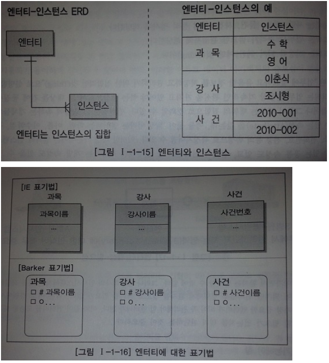

# 엔터티
***

## 1. 엔터티의 개념

* 엔터티란 쉽게 말해서 하나의 Table을 말한다.

* 엔터티는 그 집합에 속하는 개체들의 특성을 설명할 수 있는 속성(Attribute)을 갖는다.
  예를 들어 '학생' 이라는 엔터티는 학번, 이름, 이수학점 등의 속성으로 특징지어질 수 있다.

* 엔터티 인스턴스 전체가 공유할 수 있는 공통 속성도 있고, 엔터티 인스턴스 중 일부에만 해당하는 개별 속성도 있을 수 있다.

* 엔터티는 인스턴스의 집합, 인스턴스라는 것은 엔터티의 하나의 값이다.
***

## 2. 엔터티와 인스턴스에 대한 내용과 표기법
> 주로 쓰이는 표기법은 두가지가 있다.

* 
***

## 3. 엔터티의 특징

* 반드시 해당 업무에서 필요하고 관리하고자 하는 정보이어야 한다.

* 유일한 식별자에 의해 식별이 가능해야 한다.

* 영속적으로 존재하는 인스턴스의 집합이어야 한다.('한 개'가 아니라 '두 개 이상')

* 업무 프로세스에 의해 이용되어야 한다.

* 엔터티는 반드시 속성이 있어야 한다.

* 엔터티는 다른 엔터티와 최소 한 개 이상의 관계가 있어야 한다.
***

## 4. 엔터티의 분류

* 유무형에 따른 분류 - 유형엔터티, 개념엔터티, 사건엔터티
  * 유형엔터티 : 물리적인 형태가 있고 안정적이며, 지속적으로 활용되는 엔터티
    * ex) 사원, 물품, 강사
  * 개념엔터티 : 물리적인 형태는 존재하지 않고 관리해야 할 개념적 정보로 구분이 되는 엔터티
    * ex) 조직, 보험상품
  * 사건엔터티 : 업무를 수행함에 따라 발생되는 엔터티로서 비교적 발생량이 많으며 각종 통계자료에 이용
    * ex) 주문, 청구, 미납

* 발생시점에 따른 분류 - 기본엔터티, 중심엔터티, 행위엔터티
  * 기본엔터티 : 독립적으로 생성이 가능하고 자신은 타 엔터티의 부모의 역할을 한다.
    * ex) 사원, 부서, 고객, 상품, 자재
  * 중심엔터티 : 중심적인 역할, 데이터의 야이 많이 발생되고 다른 엔터티와의 관계를 통해 많은 행위엔터티를 생성한다.
    * ex) 계약, 사고, 예금원장, 청구, 주문, 매출
  * 행위엔터티 : 두 개 이상의 부모엔터티로부터 발생되고 자주 내용이 바뀌거나 데이터양이 증가된다.
    * ex) 주문목록, 사원변경이력
