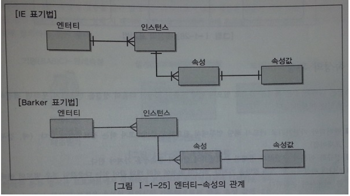
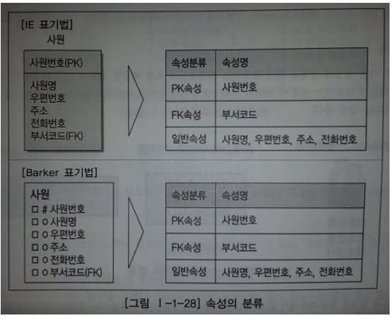

# 속성
***

## 1. 속성의 개념

* 속성은 업무에서 필요로 하는 인스턴스에서 관리하고자 하는 **의미상 더 이상 분리되지 않는 최소의 데이터 단위** 이다.
***

## 2. 엔터티, 인스턴스와 속성, 속성값에 내용과 표기법

* 엔터티, 인스턴스, 속성, 속성값의 관계
  * 엔터티에는 **두 개 이상의 인스턴스가 존재** 하고 각각의 엔터티에는 고유의 성격을 표현하는 속성정보를 두 개 이상 갖는다.
  * 엔터티에 속한 **인스턴스들의 성격을 구체적** 으로 나타내는 항목이 바로 속성이다.
  * 하나의 인스턴스는 각각의 속성들이 대해 **한 개의 속성값만** 을 가질 수 있다.

* 정리하자면,
  * 한 개의 엔터티는 **두 개 이상의 인스턴스의 집합** 이어야 한다.
  * 한 개의 엔터티는 **두 개 이상의 속성** 을 갖는다.
  * 한 개의 속성은 **한 개의 속성값** 을 갖는다.

* 

> ex)

> 엔터티 -> 사원

> 인스턴스, 속성 -> 이름, 주소, 전화번호, 직책

> 속성값 -> 홍길동, 강남구, 010-xxxx-xxxx, 대리
***

## 3. 속성의 분류

* 속성의 특성에 따른 분류
  * 기본속성
    * 업무분석을 통해 바로 정의한 속성

  * 설계속성
    * 업무상 존재하지는 않지만 설계를 하면서 도출해내는 속성
    * 업무를 규칙화하기 위해 속성을 새로 만들거나 변형하여 정의하는 속성

  * 파생속성
    * 다른 속성으로부터 계산이나 변형이 되어 생성되는 속성
    * 보통 계산된 값들이 해당된다.
    * 가급적 파생속을 적게 정의

  * ex)
    * 기본속성(원래속성) -> 제품이름, 제조년월, 제조원가
    * 설계속성(1:1치환) -> [001-식품용기, 002-약품용기, 003-기타용기] 약품용기코드
    * 파생속성(계산값) -> [전체용기 수, 용기의 총금액] 계산값

* 엔터티 구성방식에 따른 분류
  * PK(Primary Key)속성 - 엔터티를 식별
  * FK(Forign Key)속성 - 다른 엔터티와의 관계에서 포함된 속성
  * 일반속성 - 엔터티에 포함되어 있고 PK, FK에 포함되지 않은 속성
  * 
***

## 4. 도메인

* 각 속성은 가질 수 있는 값의 범위가 있는데 이를 그 속성을 **도메인(Domain)** 이라 한다
  * ex) 학생이라는 엔터티가 있을 때 학점이라는 속성의 도메인은 0.0에서 4.0 사이의 실수 값이며,
    주소라는 속성은 길이가 20자리 이내인 문자열로 정의할 수 있다.
