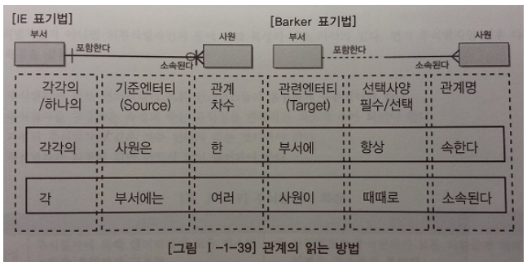

# 관계
***

## 1. 관계의 개념

* 관계의 정의
  * 인스턴스 사이의 논리적인 연관성으로서 존재 또는 행위로서 서로에게 연관성이 부여된 상태

* 관계의 패어링
  * 관계는 엔터티 안에 인스턴스가 개별적으로 관계를 가지는 것(패어링)
***

## 2. 관계의 표기법

* 관계명(Membership) : 관계의 이름
  * 애매한 동사는 피한다. 예를 들면 '관계된다.', '관련이 있다', '이다', '한다' 등은 구체적이지 않아
    어떤 행위가 있는지 또는 두 참여자간 어떤 상태가 존재하는지 파악할 수 없다.
  * 현재형으로 표현한다. 예를 들면 '수강을 신청했다', '강의를 할 것이다'라는 식으로 표현해서는 안된다.(진행형X)

* 관계차수(Cardinality) : 1:1, 1:M, M:N

* 관계선택사양(Optionality) : 필수관계, 선택관계
***

## 3. 관계의 정의 및 읽는 방법

* 관계 체크사항
  * 두 개의 엔터티 사이에 관심있는 연관규칙이 존재하는가?
  * 두 개의 엔터티 사이에 정보의 조합이 발생되는가?
  * 업무기술서, 장표에 관계연결에 대한 규칙이 서술되어 있는가?
  * 업무기술서, 장표에 관계연결을 가능하게 하는 동사(Verb)가 있는가?

* 관계 읽기
  * 기준(Source) 엔터티를 한 개(One) 또는 각(Each)으로 읽는다.
  * 대상(Target) 엔터티의 관게참여도 즉 개수(하나, 하나 이상)를 읽는다.
  * 
