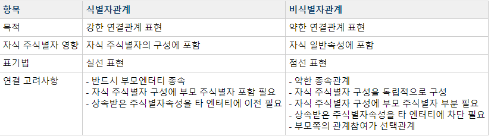

# 식별자
***

## 1. 식별자의 개념

* 식별자란 여러 개의 집합체를 담고 있는 하나의 통에서 **각각을 구분할 수 있는 논리적인 이름**

* 식별자는 엔터티내에서 인스턴스들을 구분할 수 있는 **구분자** 이다.

* 하나의 엔터티에 구성되어 있는 여러 개의 속성 중에 **엔터티를 대표할 수 있는 속성** 을 의미

* 하나의 엔터티에는 **반드시 하나의 유일한 식별자** 가 존재
***

## 2. 식별자의 특징

* 유일성 - 모든 인스턴스들이 유일하게 구분되어야 한다.

* 최소성 - 주식별자를 구성하는 속성의 수는 유일성을 만족하는 최소의 수가 되어야 한다.

* 불변성 - 자주 변하지 않는 것이어야 한다.

* 존재성 - 반드시 데이터 값이 들어와야 한다.(Null X)
***

## 3. 식별자의 분류

* 식별자 분류
  * 대표성 여부
    * 주식별자 - 엔터티 내에서 각 어커런스를 구분할 수 있는 구분자, 타 엔터티와 참조관계를 연결
    * 보조식별자 - 각 어커런스를 구분할 있는 구분자이나 대표성을 가지지 못해 참조관계 연결을 못함
  * 스스로 생성여부
    * 내부식별자 - 엔터티 내부에서 스스로 만들어지는 식별자
    * 외부식별자 - 타 엔터티와의 관계를 통해 타 엔터티로부터 받아오는 식별자
  * 속성의 수
    * 단일식별자 - 하나의 속성으로 구성된 식별자
    * 복합식별자 - 둘 이상의 속성으로 구성된 식별자
  * 대체여부
    * 본질식별자 - 업무에 의해 만들어지는 식별자
    * 인조식별자 - 업무적으로 만들어지지는 않지만 원조식별자가 복잡한 구성을 가지고 있기 때문에 인위적으로 만든 식별자

* 
***

## 4. 주식별자 도출기준

* 해당 업무에서 **자주 이용되는 속성을 주식별자로 지정** 한다.
  * **유일하게 식별가능한 속성**
  * 

* 명칭, 내역 등과 같이 **이름으로 기술되는 것들은 주식별자로 지정하지 않는다.**
  * 따라서 **일련번호와 코드** 를 많이 사용한다.
  * 부서명과 같은 경우는 부서코드를 부여하여 코드엔터티에 등록한 후 **부서코드로 주식별자를 지정하는 방법** 과
    **부서일련번호(부서번호)를 주식별자로 하고 부서명은 보조식별자로 활용** 하는 두 가지 방법이 있다.
  * 

* 복합으로 주식별자로 구성할 경우 **너무 많은 속성이 포함되지 않도록 한다.**
  * 
***

## 5. 식별자관계와 비식별자관계에 따른 식별자

* 식별자관계
  * 자식엔터티의 주식별자로 부모의 주식별자가 **상속이 되는 경우를 식별자 관계** 라고 한다.

* 비식별자관계
  * 부모엔터티로부터 속성을 받았지만 **자식엔터티의 주식별자로 사용하지 않고 일반적인 속성으로만 사용** 한다.
  * 비식별자관계의 경우 반드시 필수가 아니어도 무방하기 때문에 **부모 없는 자식이 생성될 수 있다.**
  * 데이터의 생명주기를 다르게 관리할 경우 **자식만 남겨두고 먼저 소멸** 될 수 있다.
  * **별도의 주식별자를 생성하는 것이 더 유리하다고 판단될 때** 비식별자관계를 사용한다.

> 다음으로

> 식별자 관계로만 설정할 경우 문제점과 비식별자 관계로만 설정할 경우 문제점을 알아보자.

* 식별자 관계로만 설정할 경우의 문제
  * 

  >> 원 부모엔터티 : 1개

  >> 2대 부모엔터티 : 2개 이상 = 원부모 1개 + 추가 1개 이상 +

  >> 3대 부모엔터티 : 3개 이상 = 원부모 1개 + 2대 1개 + 추가 1개 이상

  >> 4개 부모엔터티 : 4개 이상 = 원부모 1개 + 2대 1개 + 3대 1개 + 추가 1개 이상...

  * 

  * 부모로부터 모두 식별자관계 연결로 인해 **PK속성의 개수가 무려 5개** 나 설정된다면 규칙에 의해
    지속적으로 식별자 관계를 연결한 데이터 모델의 PK속성의 수는 **데이터 모델의 흐름이 길어질수록 증가할 수 밖에 없는 구조** 이다.

  * 만약 위의 예시 모델의 맨 하위에 있는 EQPEVTSTSHST에서 다시 새로운 엔터티 EQP_ITEM, EQP_WORKER와 관계를 맺고 있을 때
    이 세 개의 엔터티에서 정보를 가져오는 SQL구문은
    ```SQL
    SELECT A.EVENT_ID, A.TRANS_TIME, A.HST_DEL_FLAG, A.STATUS_PROMPT, A.STATUS_OLD, A.STATUS_NEW
    FROM EQPEVTSTSHST A, EQP_ITEM B, EQP_WORKER C
    WHERE A.PLANT = B.PLANT
    AND A.EQUIPMENT_ID = B.EQUIPMENT_ID
    AND A.STATUS_SEQ = B.STATUS_SEQ
    AND A.EVENT_ID = B.EVENT_ID
    AND A.TRANS_TIME = B.TRANS_TIME
    AND B.ITEM_CD = 'A001'
    AND A.PLANT = C.PLANT
    AND A.EQUIPMENT_ID = C.EQUIPMENT_ID
    AND A.STATUS_SEQ = C.STATUS_SEQ
    AND A.EVENT_ID = C.EVENT_ID
    AND A.TRANS_TIME = C.TRANS_TIME
    AND C.WORKER_SID = 'A012008001'
    ```
    **고작 3개 정도의 엔터티를 조인했을 뿐인데 SQL구문의 WHERE절이 매우 길어진다.**

    * 따라서 식별자 관계만으로 연결된 데이터 모델의 특징은 주식별자 속성이 지속적으로 증가할 수 밖에 없는 구조로서
      **개발자 복잡성과 오류가능성을 유발** 시킬 수 있는 요인이 될 수 있다.

* 비식별자 관계로만 설정할 경우의 문제
  * 
  * **속성이 자식엔터티로 상속이 되지 않아 자식엔터티에서 데이터를 처리할 때 쓸데없이 부모엔터티까지
    찾아가야 하는 경우** 가 발생한다.
  * 불필요한 조인이 다량으로 유발되면서 **SQL구문도 길어지고 성능이 저하되는 현상** 이 발생한다.
    * 비식별자관계
    ```SQL
    SELECT A. 기본가중치, A. 조정가중치
    FROM REP007T A, REP005T, REP001T C
    WHERE A. 분야번호 = B. 분야번호
    AND B. 점검번호 = C. 점검번호
    AND C. 점검번호 = '105'
    ```

    * 식별자관계
    ```SQL
    SELECT A. 기본가중치, A. 조정가중치
    FROM REP007T A, REP005T, REP001T C
    WHERE A. 점검번호 = '105'
    ```
    > 추가적으로 SQL구문을 파악해보자면,

    > SELECT는 내가 찾고 싶은 것, 내가 찾고 싶은 Column

    > FROM은 어떤 엔터티에서 찾을 건가?

    > WHERE 점검번호 = '105'인것

    > 종합해보면, FROM REP007T(나머지는 부모 엔터티)중에서 점검번호 = '105'인 것 중에서 기본가중치와 조정가중치를 찾아라.

    > 앞에 있는 긴 SQL구문과 지금 SQL구문의 차이는 점검번호만 FK로 두었기 때문에 지금 보는 SQL 구문은 WHERE절이 짧은 것이다.

    > 식별자관계를 통해 연결하다보면, **부모의 모든 주식별자 속성을 상속받음으로 인해 맨 하위에 있는 자식엔터티에서 바로 조회의 조건을 이용하여 원하는 정보를 가져올 수 있다.**

* 식별자와 비식별자관계 비교
  * 
