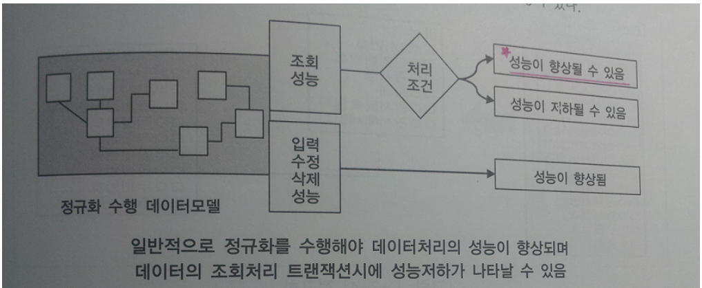
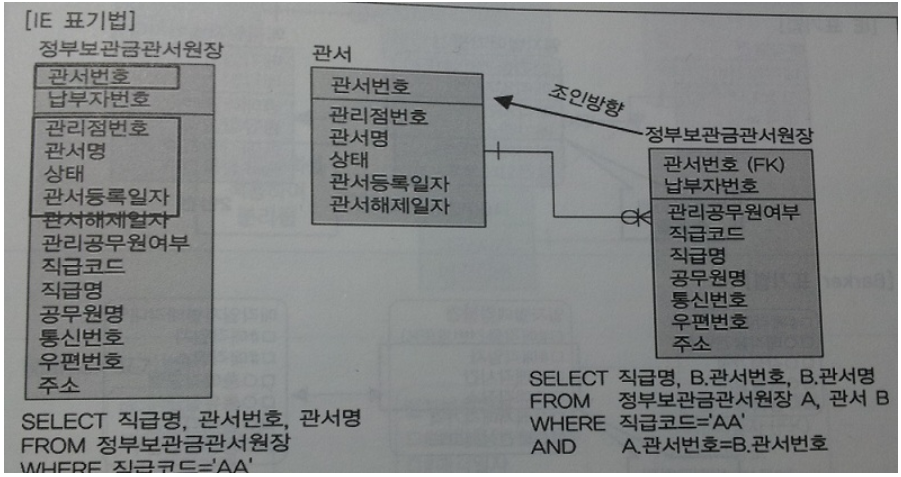
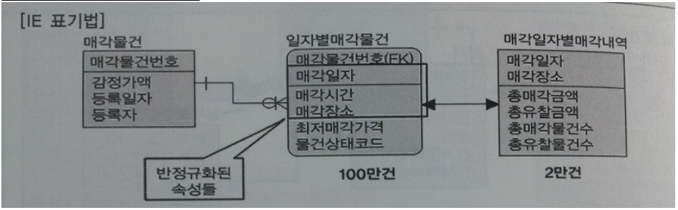
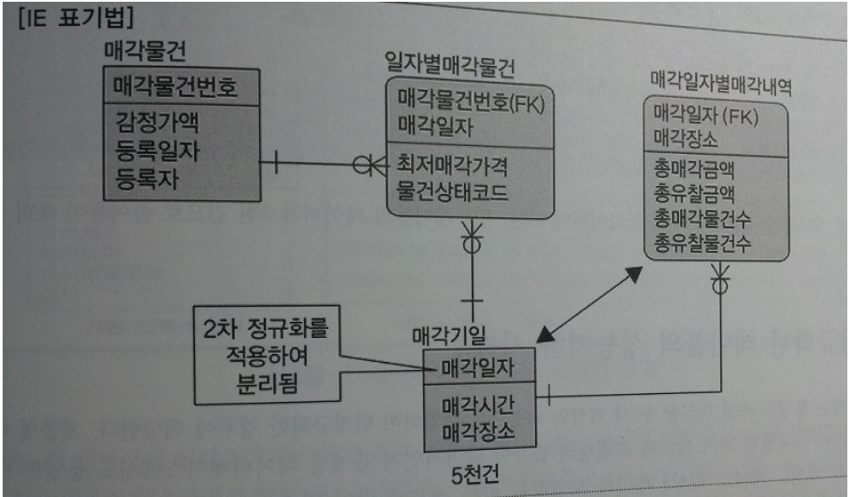
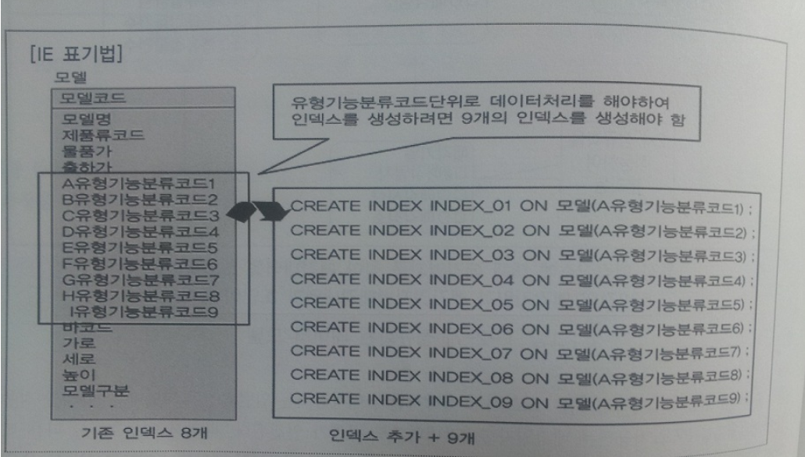
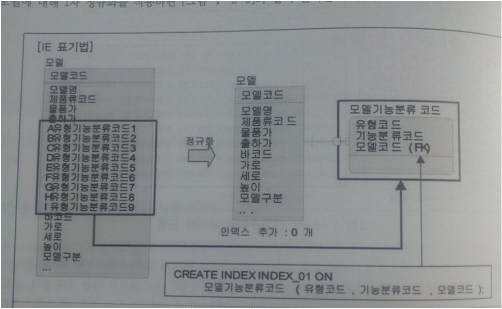

# 정규화와 성능
***

## 1. 정규화를 통한 성능 향상 전략

* 정규화를 하는 것은 기본적으로 데이터에 대한 중복성을 제거하여 주고, 성능이 향상되는 특징이 있다.

* SQL문장에서 조인이 많이 발생하여 이로 인한 성능저하가 일어난다면 반정규화를 적용하는 전략이 필요하다.

* 데이터베이스에서 데이터를 처리할 때 성능이라고 하면 조회 성능과 입력 / 수정 / 삭제 성능의 두 부류로 구분된다.

* 정규화를 수행한다는 것은 입력 / 수정 / 삭제 이상을 제거하는 것이다.

* 데이터의 중복속성을 제거하고 결정자에 의해 동일한 의미의 일반속성이 하나의 테이블로 집약되므로
  한 테이블의 데이터 용량이 최소화되는 효과가 있다.

* 정규화 수행과 성능
  * 조회성능 -> 성능이 향상될 수도 있고, 저하될 수도 있다.
  * 입력 / 수정 / 삭제 성능 -> 성능이 향상된다.

* 데이터 모델링을 할 때 반정규화만이 조회 성능을 향상시킨다는 고정관념은 탈피되어야 한다.

* 

***

## 2. 반정규화된 테이블의 성능저하 사례1
> 2차 정규화가 안 된 반정규화된 테이블과 두 개의 테이블로 분리해 2차 정규화된 테이블의 모습

* 

* 왼쪽 그림은 2차 정규화가 안 된 반정규화된 테이블의 모습이고 오른쪽 그림은 부분키 종속을 정규화하여
  두 개의 테이블로 분리해 2차 정규화된 테이블의 모습이다.

* PK(Primary Key 속성 - 엔터티를 식별)가 걸려있는 방향으로 조인이 걸려 Unique Index를 곧바로 찾아서 데이터를 조회하기 때문에,
  하나의 테이블에서 조회하는 작업과 비교했을 때 미미하게 성능 차이가 날 뿐 사용자에게
  크게 영향을 줄 만큼 성능이 저하되는 일은 없는 것이다.

* (87p 참고)왼쪽 테이블에서는 불필요하게 납부자번호만큼 누적된 데이터를 읽어서 결과를 구분하여 보여주어야 하지만
  오른쪽은 관서수만큼만 존재하는 데이터를 읽어 곧바로 결과를 보여준다.
***

## 3. 반정규화된 테이블의 성능저하 사례2
> 두 개의 엔터티가 통합되어 반정규화 경우

* 

* 특정 매각장소에 대해 매각일자를 찾아 매각내역을 조회하려면 100만 건의 데이터를 읽어 매각일자를
  DISTINCT(여러 중복된 형태가 나오지 않도록, 하나만 나오도록 한다.)하여 매각일자별매각내역과 조인이 된다.
  따라서 조회를 하려면 sQL문장을 이렇게 짜야한다.
  ```SQL
  SELECT B.총매각금액, B.총유찰금액
  FROM (SELECT DISTINCT 매각일자
        FROM 일자별매각물건
        WHERE 매각장소 = '서울 7호') A, <== 100만건의 데이터를 읽어 DISTINCT함
              매각일자별매각내역 B
  WHERE A.매각일자 = B.매각일자
  AND A.매각장소 = B.매각장소
  ```
>  대량의 데이터에서 조인 조건이 되는 대상을 찾기 위해 인라인뷰를 사용하기 때문에 성능이 저하된다.

* 

* 따라서 2차 정규화를 적용하여 매각일자를 PK로 하고 매각시간과 매각장소는 일반속성으로 둔다.
  정규화를 적용했기 때문에 매각일자를 PK로 사용하는 매각일자별매각내역과도 관계가 연결된다.
  따라서 SQL문장은
  ```SQL
  SELECT B.총매각금액, B.총유찰금액
  FROM 매각기일 A, 매각일자별매각내역 B
  WHERE A.매각장소 = '서울 7호' <== 5천건의 데이터를 읽음
  AND A.매각일자 = B.매각일자
  AND A.매각장소 = B.매각장소
  ```
  매각기일 테이블이 정규화되면서 드라이빙이 되는 대상 테이블의 데이터가 5천 건으로 줄어들어 조회 처리가 빨라진다.
***

## 4. 반정규화된 테이블의 성능저하 사례3
> 동일한 속성 형식을 두 개 이상의 속성으로 나열하여 반정규화

* 

* 유형기능분류코드단위로 데이터처리를 해야하며 인덱스를 생성하려면 9개의 인덱스를 생성하여야 한다.

* 한 테이블에 인덱스가 많아지면 조회 성능은 향상되지만 데이터 입력 / 수정 / 삭제 성능은 저하된다.
  그래서 인덱스 수를 가급적 7~8개가 넘지 않도록 하는 것이 좋다.

* 만약 각 유형코드별로 조건을 부여하여 모델코드와 모델명을 조회하는 SQL문장을 작성한다면,
  ```SQL
  SELECT 모델코드, 모델명
  FROM 모델
  WHERE ( A유형기능분류코드1 = '01' )
  OR ( B유형기능분류코드2 = '02' )
  OR ( C유형기능분류코드3 = '07' )
  OR ( D유형기능분류코드4 = '01' )
  OR ( E유형기능분류코드5 = '02' )
  OR ( F유형기능분류코드6 = '07' )
  OR ( G유형기능분류코드7 = '03' )
  OR ( H유형기능분류코드8 = '09' )
  OR ( I유형기능분류코드9 = '09' )
  ```
* 

* 정규화 후, 분리된 테이블 모델기능분류코드에서 PK인덱스를 생성하여 이용함으로써 성능이 향상될 수 있다.
  ```SQL
  SELECT A.모델코드, A.모델명
  FROM 모델 A, 모델기능분류코드 B
  WHERE ( B.유형코드 = 'A' AND B.기능분류코드 = '01' AND A.모델코드 = B.모델코드 )
  OR ( B.유형코드 = 'B' AND B.기능분류코드 = '02' AND A.모델코드 = B.모델코드 )
  OR ( B.유형코드 = 'C' AND B.기능분류코드 = '07' AND A.모델코드 = B.모델코드 )
  OR ( B.유형코드 = 'D' AND B.기능분류코드 = '01' AND A.모델코드 = B.모델코드 )
  OR ( B.유형코드 = 'E' AND B.기능분류코드 = '02' AND A.모델코드 = B.모델코드 )
  OR ( B.유형코드 = 'F' AND B.기능분류코드 = '07' AND A.모델코드 = B.모델코드 )
  OR ( B.유형코드 = 'G' AND B.기능분류코드 = '03' AND A.모델코드 = B.모델코드 )
  OR ( B.유형코드 = 'H' AND B.기능분류코드 = '09' AND A.모델코드 = B.모델코드 )
  OR ( B.유형코드 = 'I' AND B.기능분류코드 = '09' AND A.모델코드 = B.모델코드 )
  ```
  위 SQL구문은 유형코드 + 기능분류코드 + 모델코드에 인덱스가 걸려 있으므로 인덱스를 통해
  데이터를 조회함으로써 성능이 향상된다.
***

## 5. 함수적 종속성(Functional Dependency)에 근거한 정규화 수행 필요

* 함수의 종속성(Functional Dependency)은 데이터들이 어떤 기준값에 의해 종속되는 현상을 말한다.

* 예를 들어 이름, 출생지, 주소는 주민등록번호에 함수 종속성을 가지고 있다.

* 기본적으로 데이터는 속성간의 함수종속성에 근거하여 정규화되어야 한다.(필수사항)
