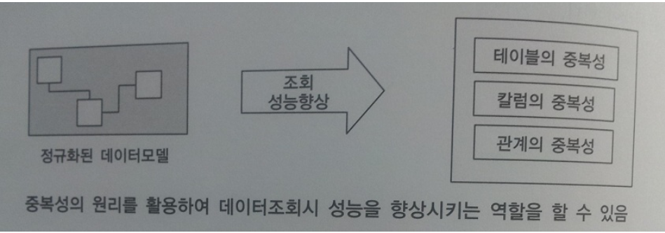
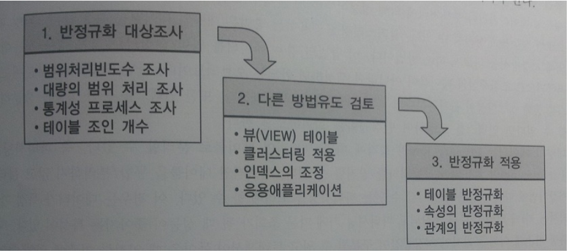
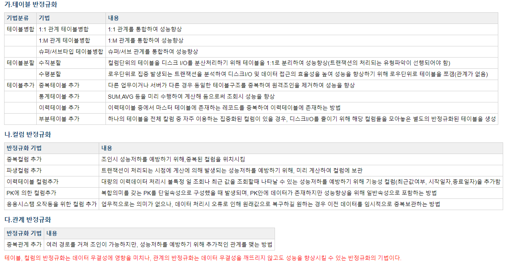
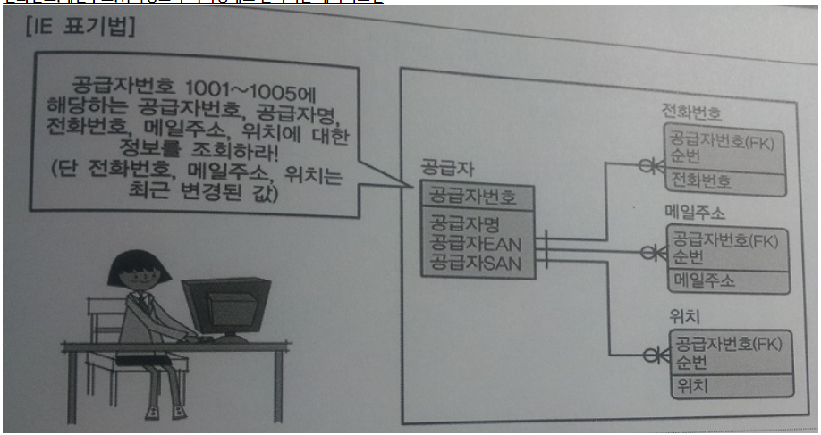
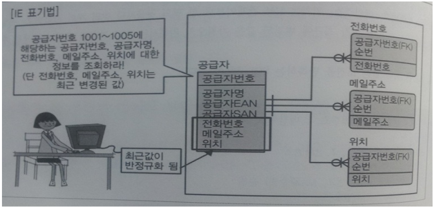
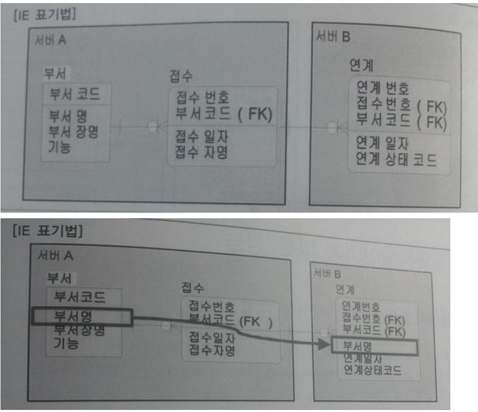

# 반정규화와 성능
***

## 1. 반정규화를 통한 성능향상 전략

* 반정규화의 정의
  * 
  * 반정규화(=역정규화, De-Normalization) 용어는 반대하다의 의미를 가진다.
  * 정규화된 엔터티, 속성, 관계에 대해 시스템의 성능향상과 개발과 운영의 단순화를 위해
    중복, 통합, 분리 등을 수행하는 데이터 모델링의 기법을 의미한다.
  * 반정규화는 성능을 향상시키기 위해 정규화된 데이터 모델에서 중복, 통합, 분리 등을 수행하는 모든 과정을 의미한다.
  * 반정규화를 적용하는 이유는 데이터를 조회할 때 디스크 I/O량이 많아서 성능이 저하되거나
    경로가 너무 멀어 조인으로 인한 성능저하가 예상되거나 칼럼을 계산하여 읽을 때 성능이 저하될 것이
    예상되는 경우 반정규화를 수행하게 된다.
  * 그러나 정규화만을 수행하면 엔터티의 개수가 증가하고 관계가 많아져 일부 여러개의 조인이 걸려야만
    데이터를 가져오는 경우가 있다.
  * 정규화의 함수적 종속관계는 위반하지 않지만 데이터의 중복성을 증가시켜야만 데이터조회의 성능을 향상시키는 경우가 있습니다.
  * 반정규화를 기술적으로 수행하지 않는 경우는 다음과 같다.
    * 성능이 저하된 데이터베이스가 생성될 수 있는 경우
    * 수정에 따른 노력비용이 많이 들 경우

* 반정규화의 적용방법
  * 
  * 보통 프로젝트에서는 칼럼 중복을 통해서만 반정규화를 수행하게 된다.
  * 칼럼의 반정규화가 많은 이유는 개발을 하다가 SQL문장 작성이 복잡해지고 그에 따라 SQL단위 성능 저하가
    예상이 되어 다른 테이블에서 조인하여 가져와야 할 칼럼을 기준이 되는 테이블에 중복하여 SQL문장을 단순하게
    처리하도록 하기 위해 요청하는 경우가 많다.
  * 테이블의 반정규화와 관계의 반정규화를 종합적으로 고려하여 적용해야 한다.
  * 기본적으로 데이터 무결성이 깨질 가능성이 많이 있기 때문에 Trade-Off 관계 즉,
    마치 저울추가 양쪽에 존재하여 한쪽이 무거워지면 다른 쪽은 위로 올라가는 것처럼 정규화만을 강조하다 보면
    성능의 이슈가 발생될 수 있고 반정규화를 과도하게 적용하다 보면 데이터 무결성이 깨질 수 있는 위험이 증가하게 되는 것이다.

  * 적용방법으로는 반정규화 대상조사 -> 다른 방법유도 검토 -> 반정규화 적용
    * 반정규화 대상조사
      * 범위처리빈도수 조사 - 테이블에 접근하는 프로세스의 수가 많고 항상 일정한 범위만을 조회하는가?
      * 대량의 범위 처리 조사 - 대량의 데이터인가?
      * 통계성 프로세스 조사 - 통계테이블이 필요한가?
      * 테이블 조인 개수 - 지나치게 많은 조인(JOIN)

    * 다른 방법유도 검토
      * 뷰(VIEW) 테이블 - 지나치게 많은 조인(JOIN)이 걸려 데이터를 조회하는 작업이 어려운 경우
      * 클러스터링 적용 - 대량의의 데이터처리나 부분처리의 의해 성능이 저하되는 경우
        * 조회가 대부분이고 인덱스를 통해 성능향상이 불가능하다면 클러스터링을 고려할 만하다.
        * 인덱스를 통해 성능을 충분히 확보 할 수 있다면 인덱스를 조정하여 반정규화를 회피하도록 한다.
      * 인덱스의 조정 - 파티셔닝 기법, PK의 성격에 따라 부분적인 테이블로 분리할 수 있다.
        * 데이터가 특정 기준(파티셔닝 키)에 의해 다르게 저장되고 파티셔닝 키에 따른 조회가 될 때
          성능이 좋아지는 특성이 있다.
      * 응용 어플리케이션

    * 반정규화 적용
      > 반정규활르 하는 대상으로는 테이블, 속성, 관계에 대해 적용할 수 있으며, 테이블, 속성, 관계를 추가할 수도 있고
        분할할 수도 있으며 제거할 수도 있다.

      * 테이블 반정규화
      * 속성의 반정규화
      * 관계의 반정규화
***

## 2. 반정규화의 기법

* 테이블 반정규화
  * 테이블 병합
    * 1:1 관계 테이블병합 - 1:1 관계를 통합하여 성능향상
    * 1:M 관계 테이블병합 - 1:M 관계 통합하여 성능향상
    * 슈퍼 / 서브타입 테이블병합 - 슈퍼 / 서브 관계를 통합하여 성능향상
  * 테이블 분할
    * 수직분할 - 칼럼단위의 테이블을 1:1로 분리하여 성능향상
    * 수평분할 - 로우단위의 테이블을 쪼갠다.
  * 테이블 추가
    * 중복테이블 추가
    * 통계테이블 추가
    * 이력테이블 추가
    * 부분테이블 추가

* 칼럼 반정규화
  * 중복칼럼 추가
  * 파생칼럼 추가
  * 이력테이블 칼럼추가
  * PK에 의한 칼럼 추가
  * 응용시스템 오작동을 위한 칼럼 추가

* 관계 반정규화
  * 중복관계 추가

> 테이블과 칼럼의 반정규화는 데이터 무결성에 영향을 미치게 되나 관계의 반정규화는 데이터 무결성을 깨뜨릴 위험을
  위험을 갖지 않고서도 데이터처리의 성능을 향상시킬 수 있는 반정규화의 기법이 된다.

* 
***

## 3. 정규화가 잘 정의된 데이터 모델에서 성능이 저하될 수 있는 경우

* 
* (101p 참고)공급자번호 1001~1005에 해당하는 공급자번호, 공급자명, 전화번호,
  메일주소, 위치에 대한 정보를 조회하라!(단 전화번호, 메일주소 위치는 최근 변경된 값)
  * 공급자와 전화번호, 메일주소, 위치는 1:M 관계이므로 한 명의 공급자당 여러 개의 전화번호, 메일주소, 위치ㅏ 존재한다.
    따라서 가장 최근에 변경된 값을 가져오기 위해서는 조금 복잡한 조인이 발생될 수 밖에 없다.
    따라서 SQL 구문은
    ```SQL
    SELECT A.공급자명, B.전화번호, C.메일주소, D.위치
    FROM 공급자 A, (SELECT X.공급자번호, X.전화번호
                    FROM 전화번호 X, ())....
    ```
    >SQL구문이 길어진다.

  * 
  * 따라서 최근값이 반정규화 되어서 전화번호, 메일주소, 위치가 가장 최근에 변경된 값에 위치시키면 다음과 같다.
  ```SQL
  SELECT 공급자명, 전화번호, 메일주소, 위치
  FROM 공급자
  WHERE 공급자번호 BETWEEN '1001' AND '1005'
  ```
***

## 4. 정규화가 잘 정의된 데이터 모델에서 성능이 저하된 경우

* 

* 데이터베이스서버가 여러 대인 경우 분리 되어 분산데이터베이스가 구성되어 있을 때
  반정규화를 통해 성능을 향상시킬 수 있는 경우이다.

> 반정규화를 적용할 때 기억해야 할 내용은 데이터를 입력, 수정, 삭제할 때는 성능이 떨어지는 점을
  기억해야 하고 데이터의 무결성 유지에 주의를 해야한다.
