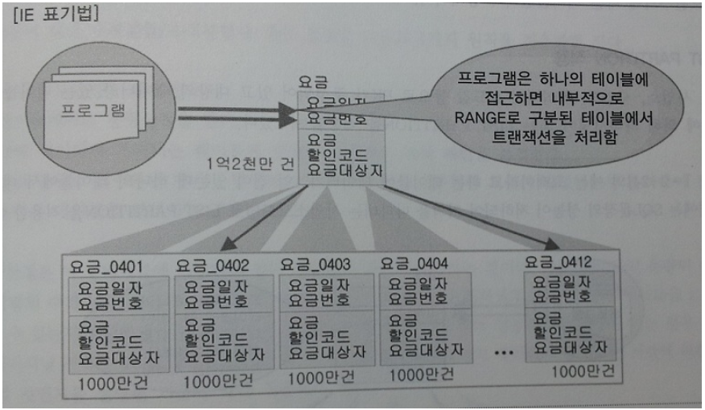
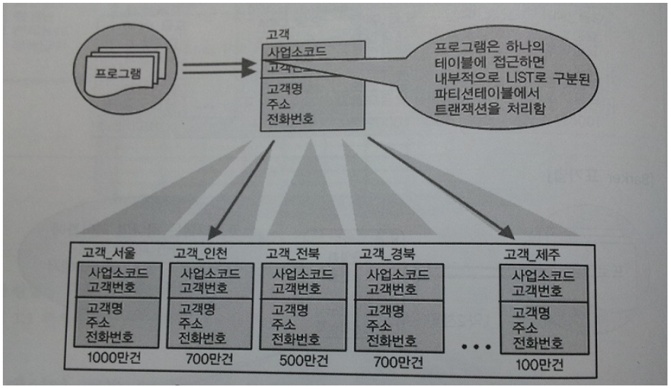

# 대량 데이터에 따른 성능
***

## 1. 대량 데이터발생에 따른 테이블 분할 개요

* 대량의 데이터가 하나의 테이블에 집약되어 있고 하나의 하드웨어 공간에 저장되어 있으면 성능저하를 피하기가 힘들다.

* 일이 처리되는 양이 한군데에 몰리는 현상은 어떤 업무에 있어서 중요한 업무에 해당되는 데이터가 특정 테이블에 있는 경우에
  발생이 되는데 이런 경우 **트랜잭션(시스템에서 사용되는 쪼갤 수 없는 업무처리의 단위이다.)이 분산 처리될 수 있도록
  테이블단위에서 분할의 방법을 적용할 필요가 있다.**
  > 추가적으로 트랜잭션이란, 데이타베이스 처리 작업이 모두 완료되거나 아니면 모두 취소되게 되는 작업의 단위이다.
    지금까지의 하나의 INSERT, UPDATE, DELETE (DML문)등은 (별도의 설정 없이 내부적으로) 하나의 트랜잭션으로 볼 수 있다.
    예를 들어, 하나의 DELETE문으로 10개의 레코드를 삭제할 때, 이는 하나의 트랜잭션이기 때문에,
    5개는 지워지고 중간에 문제가 생겨 나머지 5개는 살아있는 상태가 되지 않는다는 것이다.
    이런 에러 상황에서는 DELETE 자체가 취소되어 지워진 5개가 복원(rollback)된다.
    하나의 SQL문에 대한 트랜잭션보다 좀 더 복잡한 트랜잭션을 쓸 경우는 있는데,
    만약 여러 개의 INSERT, UPDATE, DELETE들을 복합적으로 사용해야 한다면,
    트랜잭션의 시작(BEGIN TRAN)과 끝(COMMIT TRAN)을 명시적으로 표시해 주어야 한다.

* 대량의 데이터가 존해나는 테이블에 많은 트랜잭션이 발생하여 성능이 저하되는 테이블 구조에 대해
  **수평 분할(칼럼단위로 분할) / 수직 분할(로우단위로 분할)** 설계를 통해 성능저하를 예방할 수 있다.
***

## 2. 한 테이블에 많은 수의 칼럼을 가지고 있는 경우

* 1:1관계로 분리하여야 한다.

* **칼럼 수가 적은 테이블에서 데이터 처리를 해야 디스크 I/O 양이 감소하여 성능이 향상된다.**
***

## 3. 대량 데이터 저장 및 처리로 인한 성능

* 테이블에 많은 양의 데이터가 예상될 경우 **파티셔닝** 을 적용하거나 **PK에 의해 테이블을 분할하는 방법** 을 적용할 수 있다.

* 크게 **Range Partition(범위), List Partition(특정값 지정), Hash Partition(해쉬적용), Composite Partition(범위와 해쉬가 복합)** 으로 나눌 수 있다.

* Range Partition - 날짜, 숫자값
  * 
  * 하나의 테이블로는 너무 많은 데이터가 존재하므로 성능이 느린 경우이다.
  * 이 때 요금의 특성상 항상 월단위로 데이터 처리를 하는 경우가 많으므로 **PK인 요금일자의 년+월을 이용하여 12개의 파티션 테이블** 을 만들었다.
  * 프로그램은 하나의 테이블에 접근하면 내부적으로 **Range로 구분** 된 테이블에서 트랜잭션을 처리한다.
  * **가장 많이 사용하는 파티셔닝** 의 기준이 Range Partition이다. 대상 테이블이 날짜 또는 숫자값으로 분리가 가능하고 각 영역별로
    트랜잭션이 분리된다면 Range Partition을 적용한다.
  * 데이터 보관 주기에 따라 **테이블에 데이터를 쉽게 지우는 것이 가능** 하므로 데이터 보관 주기에 다른 테이블관리가 용이하다.
  > Range Partition은 말 그대로 어떤 범위안에 있는 특정 Column Value의 정렬 값(주로 날짜, 숫자값)을 기준으로 분할하는 것이다.
    주로 Historical Data를 관리하는 Table에 많이 적용되어 사용된다.

* List Partition - 특정한 코드값
  * 
  * 지점, 사업소, 사업장, 핵심적인 코드값 등으로 PK가 구성되어 있고 대량의 데이터가 있는 테이블이라면
    **값 각각에 의해 파티셔닝** 이 되는 List Partition을 적용할 수 있다.
  * 대용량 데이터를 특정값에 따라 분리 저장할 수는 있으나 Range Partition과 같이 **데이터 보관 주기에 따라
    쉽게 삭제하는 기능은 제공될 수 없다.**
  > List Partition은 어떤 특정 Column의 특정 Value로 Partitioning을 하겠는 의미이다.
    주로 Cardinality (Distinct value)가 많지 않고 그 Distinct Value별로 분포도가 비슷하며,
    많은 SQL의 Access Path에서 해당 Column의 조건이 많이 들어오는 경우 아주 유용하게 쓰일 수 있다.

* Hash Partition
  * 테이블에 데이터가 정확하게 어떻게 들어갔는지 알 수 없다.
  * 역시나 Range Partition과 같이 데이터 보관 주기에 따라 쉽게 삭제하는 기능은 제공될 수 없다.
