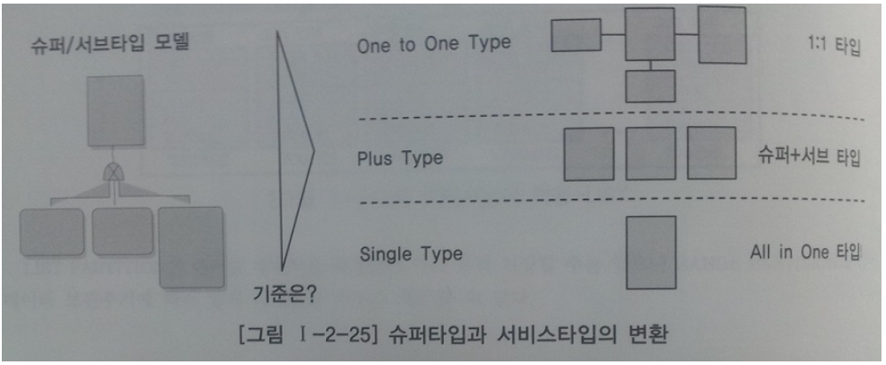
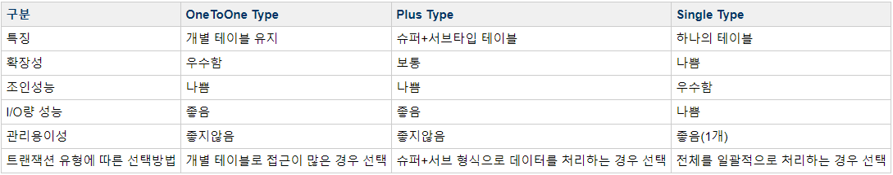
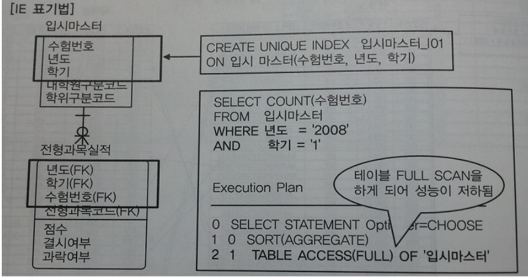
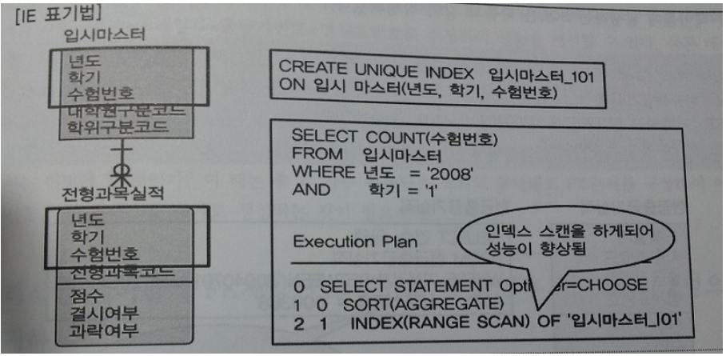
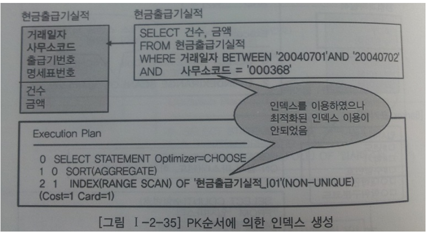

# 데이터베이스 구조와 성능
***

## 1. 슈퍼타입 / 서브타입 모델의 성능고려 방법

* 슈퍼 / 서브타입 데이터 모델의 개요
  * 데이터의 특징을 공통과 차이점의 특징을 고려하여 효과적으로 표현할 수 있다.
    즉, 공통의 부분을 슈퍼타입으로 모델링하고 공통으로부터 상속받아 다른 엔터티와 차이가 있는 속성에 대해서는
    별도의 서브엔터티로 구분하여 업무의 모습을 정확하게 표현하면서 물리적인 데이터 모델로 변환을 할 때 선택의 폭을 넓힐 수 있는 장점이 있다.
  * 분석단계에서 많이 쓰이는 모델이다. 따라서 물리적인 데이터 모델을 설계하는 단계에서는 슈퍼 / 서브타입 데이터 모델을 일정한
    기준에 의해 변환을 해야한다.

* 슈퍼 / 서브타입 데이터 모델의 변환
  * 
  * 슈퍼 / 서브타입에 대한 변환을 잘못하면 성능이 저하되는 이유는 트랜잭션 특성을 고려하지 않고 테이블이 설계되었기 때문입니다.
    3가지 경우의 수로 정리하면,
    * 트랜잭션은 항상 '일괄로 처리'하는데 테이블은 개별로 유지되어 Union연산에 의해 성능이 저하될 수 있습니다.
    * 트랜잭션은 항상 '서브타입 개별로 처리'하는데 테이블은 하나로 통합되어 있어 불필요하게 많은 양의 데이터가 집약되어 있어
      성능이 저하되는 경우가 있습니다.
    * 트랜잭션은 항상 '슈퍼 + 서브 타입을 공통으로 처리'하는데 개별로 유지되어 있거나 하나의 테이블로 집약되어 있어
      성능이 저하되는 경우가 있습니다.
  > 데이터처리의 유연성을 고려하여 1:1관계를 유지하는 것이 바람직하다.

* 슈퍼 / 서브타입 데이터 모델의 변환기술
  * 개별로 발생되는 트랜잭션에 대해서는 '개별 테이블로 구성'
    * 슈퍼타입과 서브타입 각각에 대해 독립적으로 트랜잭션이 발생이 되면 슈퍼타입에도 꼭 필요한 속성만을 가지게 하고
      서브타입에도 꼭 필요한 속성 및 자신이 타입에 맞는 데이터만 가지게 하기 위해서 모두 분리하여 1:1 관계를 갖도록 한다.
  * 슈퍼타입 + 서브타입에 대해 발생되는 트랜잭션에 대해서는 '슈퍼타입 + 서브타입 테이블로 구성'
    * (116p 참고)매수인, 이해관계인에 대한 정보는 배제하고 10만건뿐인 대리인에 대한 데이터만 처리할 경우
      다른 테이블과 같이 데이터가 1천10만 건이 저장되어 있는 곳에서 처리해야 하므로 불필요한 성능저하 현상이 유발된다.
  > 당사자 - 슈퍼타입, 이해관계인, 대리인, 매수인 - 서브타입

  * 전체를 하나로 묶어 트랜잭션이 발생할 때는 하나의 테이블로 구성
    * 항상 통합하여 데이터를 처리한다고 하면 대용량이고 성능향상이 필요하다면 하나의 테이블로 묶어서 만들어 준다.

* 
***

## 2. 인덱스 특성을 고려한 PK / FK 데이터베이스 성능향상

* PK / FK 칼럼 순서와 성능개요
  * 일반적으로 트리구조의 B*Tree구조를 많이 사용한다.
  * 프로젝트에서 PK / FK설계는 업무적 으미로도 매우 중요한 의미를 가지고 있지만 데이터를 접근할 때 경로를
    제공하는 성능의 측면에서도 중요한 의미를 가지고 있기 때문에 성능을 고려한 데이터베이스 설계가 될 수 있도록
    설계단계 말에 칼럼의 순서를 조정할 필요가 있다.
  * 실전 프로젝트에서는 아주 중요한 내용이 바로 'PK순서'이다.
  * 스스로 생성된 PK순서 이외에 ㄷ른 엔터티로부터 상속받아 발생되는 PK순서까지 항상 주의하여 표시하도록 해야한다.
  * PK는 해당 테이블의 데이터를 접근할 가장 빈번하게 사용되는 유일한 인덱스(Unique Index)를 모두 자동 생성한다.
  * 인덱스의 특징은 여러 개의 속성이 하나의 인덱스로 구성되어 있을 때 앞쪽에 위치한 속성의 값이 비교자로 있어야 인덱스가 좋은 효율을 나타낼 수 있다.

* PK칼럼의 순서를 조정하지 않으면 성능이 저하된 이유
  * 칼럼이 제외된 상태에서 데이터를 조회할 경우 데이터를 비교하는 범위가 매우 넓어지게 되어 성능 저하를 유발하게 된다.
  * 인덱스 칼럼에 조회 조건이 들어오지 않을 경우 인덱스 전체를 읽어야만 원하는 데이터를 찾을 수 있게 된다.
  * 정리하면, PK의 순서를 인덱스 특징에 맞게 고려하지 않고 바로 그래도 생성하게 되면, 테이블에 접근하는 트랜잭션의 특징에
    효율적이지 않은 인덱스가 생성되어 있으므로 인덱스의 범위를 넓게 이용하거나 Full Scan을 유발하게 되어 성능이 저하된다고 정리할 수 있다.
  * 이미 만들어진 PK 인덱스가 전혀 사용되지 않는다면 입력, 수정, 삭제시 불필요한 인덱스로 인해 더 성능이 저하되어 좋지 않다.

* PK순서를 잘못 지정하여 성능이 저하된 경우 - 간단한 오류
  * 
  * 

* PK순서를 잘못 지정하여 성능이 저하된 경우 - 복잡한 오류
  * 
***

## 3. 물리적인 테이블에 FK제약이 걸려있지 않을 경우 인덱스 미생성으로 성능저하

* 물리적인 테이블에 FK를 사용하지 않아도 데이터 모델 관계에 의해 상속받은 FK속성들은 SQL WHERE절에서 조인으로 이용되는 경우가 많이 있으므로
  FK 인덱스를 생성해야 성능이 좋은 경우가 빈번하다.
