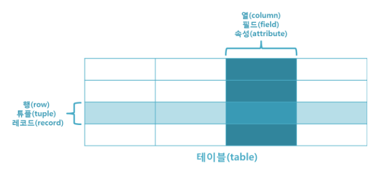
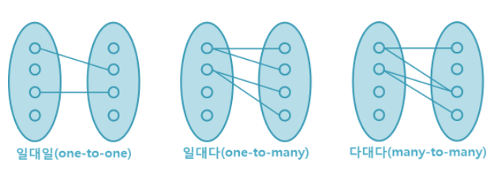
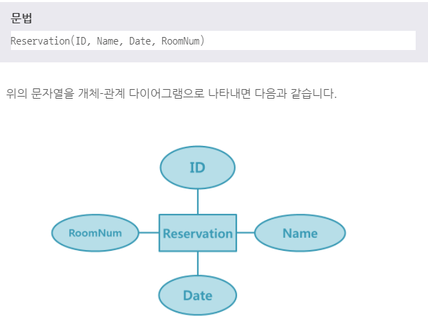

# 관계형 데이터베이스
***

## 1. 관계형 데이터베이스(Relational Database)란?

* 관계형 데이터베이스란 테이블(table)로 이루어져 있으며, 이 테이블은 키(Key)와 값(Value)의 관계를 나타낸다.
  이처럼 데이터의 종속성을 관계(Relationship)로 표현하는 것이 관계형 데이터베이스의 특징이다.

* 

* 테이블은 이름을 가지고 있으며, 행(row)과 열(column) 그리고 거기에 대응하는 값을 가진다.
***

## 2. 관계형 데이터베이스의 특징

* 데이터의 분류, 정렬, 탐색 속도가 빠르다.

* 오랫동안 사용된 만큼 신뢰성이 높고, 어떤 상황에서도 데이터의 무결성을 보장해 준다.

* 기존에 작성된 스키마를 수정하기가 어렵다.

* 데이터베이스의 부하를 분석하는 것이 어렵다.
***

## 3. 관계형 데이터베이스 용어

* 테이블(Table)
  * 데이터는 관계형 데이터베이스의 기본 단위인 테이블 형태로 저장된다.
  * 테이블에는 각각의 칼럼이 되어 있으며, 반드시 하나 이상의 칼럼을 가져야 한다.
  * 테이블(TABLE)은 데이터를 저장하는 객체(Object)로서 관게형 데이터베이스의 기본 단위이다.
  * 모든 데이터를 하나의 테이블로 저장하지 않고 복수의 테이블로 분할하여 저장하고 있다. 분할된 테이블은 그 칼럼의 값에 의해 연결된다.
    이렇게 테이블을 분할하여 데이터의 불필요한 중복을 줄이는 것을 **정규화(Normalization)** 라고 한다.
  * 각 행을 한 가지 의미로 특정할 수 있는 한 개 이상의 칼럼을 **기본키(Primary Key)** 라고 한다.
  * 다른 테이블의 기본 키로 사용되면서 테이블과의 관계를 연결하는 역할을 하는 칼럼을 **외부기(Foreign Key)** 라고 한다.

* 열(column) : 각각의 열은 유일한 이름을 가지고 있으며, 자신만의 타입을 가지고 있다.

* 행(row) : 행은 관계된 데이터의 묶음을 의미한다. 한 테이블의 모든 행은 같은 수의 열을 가지고 있다. 이러한 행은 튜플(tuple) 또는 레코드(record)라고 한다.

* 값(value) : 테이블은 각각의 행과 열에 대응하는 값을 가지고 있다. 이러한 값은 열의 타입에 맞는 값이어야 한다.

* 키(Key) : 테이블에서 행의 식별자로 이용되는 열을 키(Key) 또는 기본 키(Primary Key)라고 한다. 즉, 테이블에 저장된 레코드를 고유하게 식별하는 후보 키(Candidate Key) 중에서 데이터베이스 설계자가 지정한 속성을 의미한다.

* 관계(Relationship)
  * 일대일(One-to-One) 관계, 일대다(One-to-Many) 관계, 다대다(Many-to-Many) 관계가 있다.
  * 관게형 데이터베이스에서는 이러한 관계를 나타내기 위해 외래 키(Foreign Key)라는 것을 사용한다.
  * 외래 키는 한 테이블의 키 중에서 다른 테이블의 행(row)을 식별할 수 있는 키를 의미한다.
  * 

* 스키마(Schema)
  * 스키마는 테이블을 디자인하기 위한 청사진이라고 말할 수 있다.
  * 이러한 스키마는 테이블의 각 열에 대한 항목과 타입뿐만 아니라 키본 키와 외래 키도 나타내야 한다.
  * 스키마는 개체-관계 다이어그램(ERD, Entity-Relationship Diagram)이나 문자열로 표현할 수 있다.
  * 
