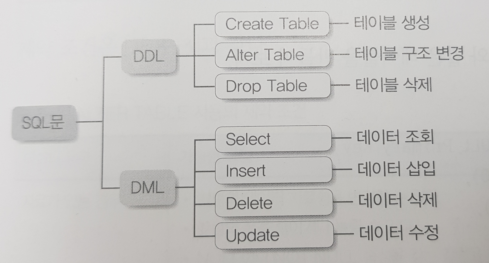

# MySQL 문법
***

## 1. SQL(Structured Query Language)

* 관계형 데이터베이스에서 데이터 정의, 데이터 조작, 데이터 제어를 하기 위해 사용하는 언어이다.

* 일반적인 개발 언어처럼 독립된 하나의 개발 언어이다.

* 일반적인 프로그래밍 언어와는 달리 SQL은 관계형 데이터베이스에 대한 전담 접속(다른 언어는 관계형 데이터베이스에 접속할 수 없다)용도로
  사용되며 세미콜론(;)으로 분리되어 있는 SQL 문장단위로 독립되어 있다.

* SQL 문장들의 종류
  * 기본 SQL문
    * 
  * 데이터 조작어(DML : Data Manipulation Language)
    * SELECT : 데이터베이스에 들어 있는 데이터를 조회하거나 검색하기 위한 명령어, RETRIEVE라고도 한다.
    * INSERT, UPDATE, DELETE : 데이터베이스의 테이블에 들어 있는 데이터에 변형을 가하는 종류의 명렁어
  * 데이터 정의어(DDL : Data Definition Language)
    * CREATE, ALTER, DROP, RENAME : 테이블과 같은 데이터 구조를 정의하는데 사용되는 명령어들로 생성하거나 변경하거나 삭제하거나
      이름을 바꾸는 데이터 구조와 관련된 명령어
  * 데이터 제어어(DCL : Data Control Language)
    * GRANT, REVOKE : 데이터베이스에 접근하고 객체들을 사용하도록 권한을 주고 회수하는 명령어
  * 트랜잭션 제어어(TCL : Transaction Control Language)
    * COMMIT, ROLLBACK : 논리적인 작업의 단위를 묵어서 작업단위(트랜잭션) 별로 제어하는 명령어
***

## 2. 데이터베이스 자료형

* 

* 

* 

* 
***

## 3. ERD(Entity Relationship Diagram)

* 관게의 의미를 직관적으로 표현할 수 있는 좋은 수단

* 구성 요소는 엔터티(Entity), 관계(Relationship), 속성(Attribute) 3가지이다.
