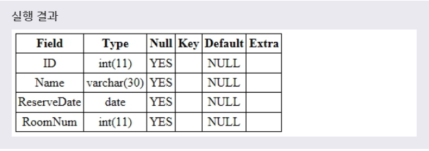
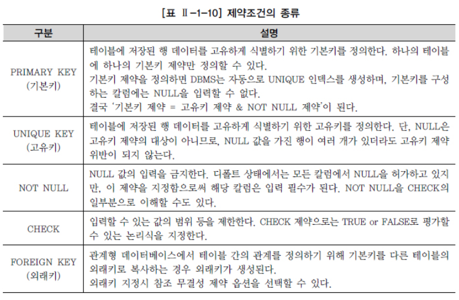

# CREATE
> CREATE 문을 사용하여 데이터베이스와 테이블을 만들 수 있다.

> CREATE DATABASE

> CREATE TABLE
***

## 1. 데이터베이스 생성

* CREATE DATABASE 문은 새로운 데이터베이스를 생성한다.

* 문법
  ```SQL
  CREATE DATABASE 데이터베이스이름;
  ```

* 예제
  ```SQL
  CREATE DATABASE HOTEL;
  ```
***

## 2. 데이터베이스의 선택

* 데이터베이스를 생성한 후에, 해당 데이터베이스를 사용하기 위해서는 우선 데이터베이스를 선택해야 한다.

* MySQL에서는 USE 문을 사용하여 데이터베이스를 선택할 수 있다.

* 문법
  ```SQL
  USE 데이터베이스이름;
  ```

* 예제
  ```SQL
  USE HOTEL;
  ```

> 유닉스 환경의 MySQL에서는 데이터베이스 이름의 대소문자를 구분한다.
  그러나 윈도우 환경의 MySQL에서는 데이터베이스의 이름에 대소문자를 구분하지 않는다.
  하지만 될 수 있으면 언제나 데이터베이스의 이름은 대소문자를 구분하여 사용하는 것이 가독성에 좋다.
***

## 3. 테이블 생성

* CREATE TABLE 문은 새로운 테이블을 생성해준다.

* 문법
  ```SQL
  CREATE TABLE 테이블이름(
    필드이름1 필드타입1,
    필드이름2 필드타입2,
    ...
  );
  ```
  테이블을 생성하기 위해서는 **테이블 이름, 필드(FIELD) 목록과 각 필드의 타입을 명시해야한다.** 여기서 필드의 타입이란 해당 필드에 저장될 데이터가 가질 수 있는 타입을 의미한다.

* 예제
  ```SQL
  CREATE TABLE RESERVATION(
    ID INT,
    NAME VARCHAR(30),
    RESERVEDATE DATE,
    ROOMNUM INT
  );
  ```

* 

* 생성된 테이블 목록은 **'SHOW TABLES'** 구문을 통해 확인할 수 있으며,
  해당 테이블의 상세 정보는 **'DESCRIBE 테이블명'** 이나 **'DESC 테이블명'** 구문을 통해 확인할 수 있다.

* 테이블 생성 시에 주의해야 할 몇 가지 규칙
  * 테이블 명은 가능한 **단수형** 을 권고한다.
  * 테이블 명은 **다른 테이블의 이름과 중복되지 않아야** 한다.
  * 한 테이블 내에서는 **칼럼명이 중복되게 지정될 수 없다.**
  * 테이블 이름을 지정하고 각 칼럼들은 **괄호 "()"** 로 묶어 지정한다.
  * 각 칼럼들은 **콤마 ","** 로 구분되고, 테이블 생성문의 끝은 항상 **세미콜론 ";"** 으로 끝난다.
  * **칼럼 뒤에 데이터 유형** 은 반드시 지정되어야 한다.
  * 테이블명과 칼럼명은 **반드시 문자로 시작** 해야 한다.
  * 테이블 **생성 시, 대/소문자 구분은 하지 않는다.**(하도록 만들 수는 있다.)
  * 문자 데이터 유형은 반드시 가질 수 잇는 **최대 길이를 표시** 해야 한다.
  * **마지막 칼럼은 콤마를 찍지 않는다.**
  * 칼럼에 대한 **제약조건이 있으면 CONSTRAINT** 를 이용하여 추가할 수 있다.
***

## 4. 제약조건(CONSTRAINT)

* 제약조건이란 **데이터의 무결성을 유지하기 위한 데이터베이스의 보편적인 방법으로 테이블의 특정 칼럼에 설정하는 제약** 이다. 지키기 위해 데이터를 입력받을 때 실행되는 **검사 규칙** 을 의미한다. 이러한 제약조건은 CREATE 문으로 테이블을 생성할 때나, ALTER 문으로 필드를 추가할 때도 설정할 수 있다.

* 

* 추가적으로, 세 가지를 덧붙이자면
  * UNIQUE : 해당 필드는 서로 다른 값을 가져야한다.
  * NULL : '아직 정의되지 않은 미지의 값', '현재 데이터를 입력하지 못하는 경우'를 의미한다.
  * DEFAULT : 데이터 입력 시에 칼럼의 값이 지정되어 있지 않을 경우 기본값(DERAULT)을 사전에 설정할 수 있다. 데이터 입력시 명시된 값을 지정하지 않은 경우에 NULL 값이 입력되고, DEFAULT 값을 정의했다면 해당 칼럼에 NULL 값이 입력되지 않고 사전에 정의된 기본 값이 자동으로 입력된다.
