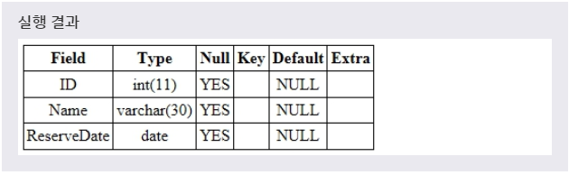

# ALTER
> ALTER 문을 사용하여 데이터베이스와 테이블의 내용을 수정할 수 있다.

> ALTER DATABASE

> ALTER TABLE
***

## 1. 데이터베이스 수정

* ALTER DATABASE 문은 데이터베이스의 전체적인 특성을 수정할 수 있게 해준다.
  이러한 데이터베이스의 특성은 데이터베이스 디렉터리의 DB.OPT 파일에 저장되어 있다.

* 문법
  ```SQL
  ALTER DATABASE 데이터베이스이름 CHARACTER SET=문자집합이름;

  ALTER DATABASE 데이터베이스이름 COLLATE=콜레이션이름;
  ```
  > 콜레이션(COLLATION)이란 데이터베이스에서 검색이나 정렬과 같은 작업을 할 때 사용하는 비교를 위한 규칙의 집합을 의미합니다.

* 예제
  ```SQL
  ALTER DATABASE JOINANDJOIN CHARACTER SET=EUCKR_BIN COLLATE=EUCKR_KOREAN_CI;
  ```

* CHARACTER SET과 COLLATE
  * CHARACTER SET
    * utf8 : UTF-8 유니코드를 지원하는 문자셋(1~3byte)
    * euckr : 한글을 지원하는 문자셋(1~2바이트)
  * COLLATE
    * utf8_bin
    * utf8_general_ci(기본 설정)
    * euckr_bin
    * euckr_korean_ci

> COLLATE에서 ci는 case-insensitive를 의미하며, 대소문자를 구분하지 않게 설정된다.
***

## 2. 테이블 수정

* ALTER TABLE 문은 테이블에 필드를 추가, 삭제하거나 필드의 타입을 변경할 수 있게 해준다.
  * ADD
  * DROP
  * MODIFY COLUMN

* 새로운 필드 추가(ADD)
  * ALTER TABLE 문과 함께 ADD 문을 사용하면, 테이블에 필드를 추가할 수 있다.
  * 문법
    ```SQL
    ALTER TABLE 테이블이름 ADD 필드이름 필드타입;
    ```
  * 예제
    ```SQL
    ALTER TABLE TEST ADD PHONE INT;
    ```
  * 실행결과
    * 

* 기존 필드 삭제(DROP)
  * ALTER TABLE 문과 함께 DROP 문을 사용하면, 테이블의 필드를 삭제할 수 있다.
  * 문법
    ```SQL
    ALTER TABLE 테이블이름 DROP 필드이름;
    ```
  * 예제
    ```SQL
    ALTER TABLE TEST DROP ROOMNUM;
    ```
  * 실행결과
    * 

* 필드 타입 변경(MODIFY COLUMN)
  * ALTER TABLE 문과 함께 MODIFY COLUMN 문을 사용하면, 테이블의 필드 타입을 변경할 수 있습니다.
  * 문법
    ```SQL
    ALTER TABLE 테이블이름
    MODIFY COLUMN 필드이름 필드타입;
    ```
  * 예제
    ```SQL
    ALTER TABLE TEST
    MODIFY COLUMN RESERVEDATE VARCHAR(20);
    ```
  * 실행결과
    * 

* 테이블 이름 변경(RENAME)
  * RENAME 멍령어를 사용하여 테이블의 이름을 변경할 수 있다.
  * 문법
    ```SQL
    RENAME 테이블이름 TO 바꿀테이블이름
    ```
  * 예제
    ```SQL
    RENAME TABLE TEST TO TEST1;
    ```

* 칼럼을 변경 시에 고려해야할 점
  * 해당 칼럼의 크기를 늘릴 수는 있지만 줄이지는 못한다. 이는 기존의 데이터가 훼손될 수 있기 때문이다.
  * 해당 칼럼이 NULL 값만 가지고 있거나 테이블에 아무 행도 없으면 칼럼의 폭을 줄일 수 있다.
  * 해당 칼럼이 NULL 값만을 가지고 있으면 데이터 유형을 번경할 수 있다.
  * 해당 칼럼의 DEFAULT 값을 바꾸면 변경 작업 이후 발생하는 행 삽입에만 영향을 미치게 된다.
  * 해당 칼럼에 NULL 값이 없을 경우에만 NOT NULL 제약조건을 추가할 수 있다.
