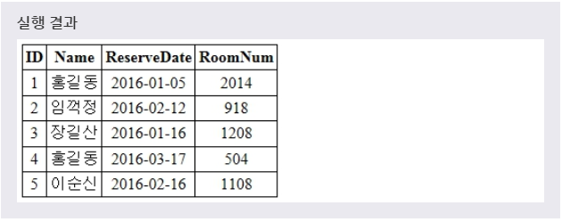
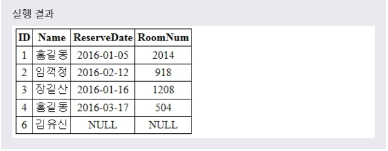

# INSERT
> INSERT INTO 문을 사용하여 테이블에 새로운 레코드를 추가할 수 있습니다.
***

## 1. 테이블에 레코드 추가

* INSERT INTO 문과 함께 VALUES절을 사용하여 해당 테이블에 새로운 레코드를 추가할 수 있다.

* 문법
  ```SQL
  INSERT INTO 테이블이름(필드이름1, 필드이름2, 필드이름3, ...)
  VALUES (데이터값1, 데이터값2, 데이터값3, ...);

  INSERT INTO 테이블이름
  VALUES (데이터값1, 데이터값2, 데이터값3, ...);
  ```

* 또한, 두 번째 문법처럼 필드의 이름을 생략할 수 있으며, 이 경우에는 데이터베이스의 스키마와 같은 순서대로 필드의 값이 자동 대입됩니다. 이때 생략할 수 있는 필드는 다음과 같습니다.
  * NULL을 저장할 수 있도록 설정된 필드
  * DEFAULT 제약 조건이 설정된 필드
  * AUTO_INCREMENT 키워드가 설정된 필드

* 예제1
  ```SQL
  INSERT INTO TEST(ID, NAME, RESERVEDATE, ROOMNUM)
  VALUES (5, '이순신', '2016-02-16', 1108);
  ```

* 실행결과
  * 

> 데이터의 값이 문자열이면 반드시 따옴표('')를 사용해야 한다.

* 예제2
  반드시 모든 필드의 값을 가져야 할 필요는 없습니다.
  ```SQL
  INSERT INTO TEST(ID, NAME)
  VALUES (6, '김유신');
  ```

* 실행결과
  * 
