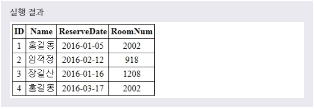
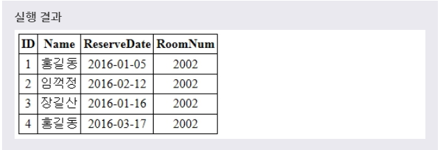

# UPDATE
> UPDATE 문을 사용하여 레코드의 내용을 수정할 수 있다.
***

## 1. 레코드 수정

* 문법
  ```SQL
  UPDATE 테이블이름
  SET 필드이름1=데이터값1, 필드이름2=데이터값2, ...
  WHERE 필드이름=데이터값;
  ```
  UPDATE 문은 해당 테이벌에서 WHERE 절의 조건을 만족하는 레코드의 값만을 수정합니다.

* 예제1
  ```SQL
  UPDATE RESERVATION
  SET ROOMNUM = 2002
  WHERE NAME = '홍길동';
  ```
  풀어서 말하면, **'NAME = '홍길동'에서 ROOMNUM에 2002를 넣어줘. 그 테이블은 바로 RESERVATION이고, 이 테이블에서 변경하겠다.'** 라는 뜻이다.

* 

* 만약 **WHERE 절을 생략** 하면, 해당 테이블의 모든 레코드의 ROOMNUM 필드의 값이 2002로 변경됩니다.

* 예제2
  ```SQL
  UPDATE RESERVATION
  SET ROOMNUM = 2002;
  ```

* 
