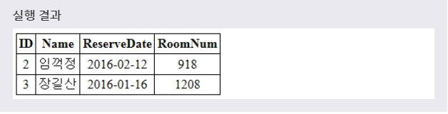

# DELETE
> DELETE 문을 사용하여 테이블의 레코드를 삭제할 수 있다.
***

## 1. 레코드 삭제

* 문법
  ```SQL
  DELETE FROM 테이블이름
  WHERE 필드이름=데이터값;
  ```
  DELETE 문은 해당 테이블에서 WHERE 절의 조건을 만족하는 레코드만을 삭제합니다. 즉, 명시된 필드와 그 값이 일치하는 레코드만을 테이블에서 삭제해 줍니다.

* 만약 WHERE 절을 생략하면, 해당 테이블에 저장된 **모든 데이터가 삭제** 됩니다.
  ```SQL
  DELETE FROM 테이블이름;
  ```
  이때 테이블에 저장된 모든 데이터가 삭제되더라도 **테이블은 여전히 남아있게 됩니다.** 해당 테이블까지 삭제하고 싶을 때는 **DROP TABLE** 문을 사용해야 합니다.

* 예제
  ```SQL
  DELETE FROM RESERVATION
  WHERE NAME = '홍길동';
  ```
  풀어서 말하면, **'NAME = '홍길동'을 가진 데이터들을 RESERVATION 테이블에서 다 삭제하겠다.'** 라는 뜻이다.

* 
