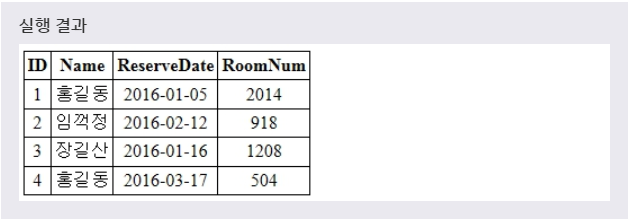
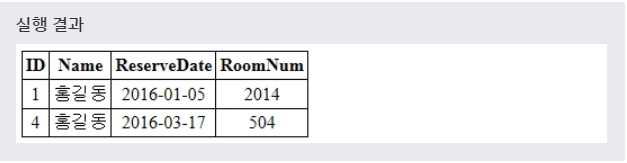
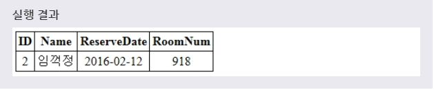
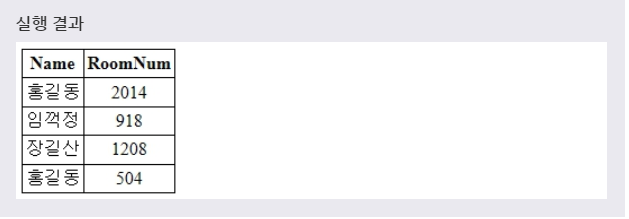
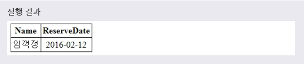
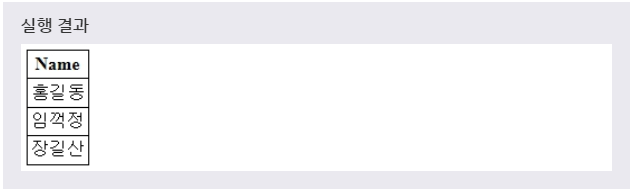
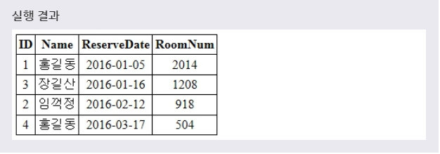
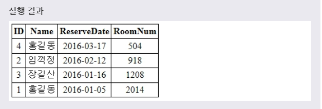
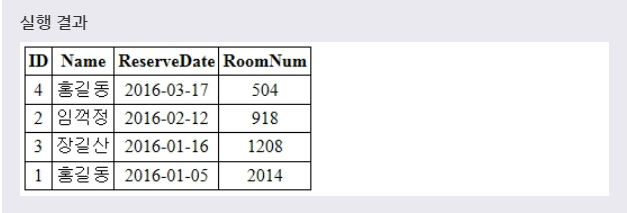
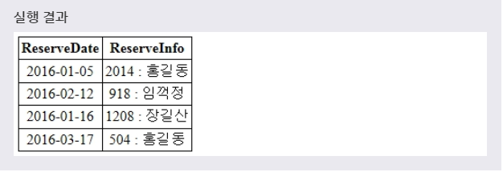

# SELECT
> SELECT 문을 사용하여 테이블의 레코드를 선택할 수 있습니다.
***

## 1. 레코드 선택

* 문법
  ```SQL
  SELECT 필드이름
  FROM 테이블이름
  [WHERE 조건];
  ```
  FROM 절은 레코드를 선택할 테이블의 이름을 명시한다. 해당 테이블에서 선택하고 싶은 필드의 이름을 SELECT 키워드 바로 뒤에 명시하면 된다.
  이때 **WHERE 절** 을 사용하면, 선택할 레코드의 조건을 좀 더 상세히 설정할 수 있다.

* WHERE 절의 FROM 절 다음에 위치하며, **조건식** 은 아래 내용으로 구성된다.
  * COLUMN명(보통 조건식의 좌측에 위치)
  * 비교 연산자
  * 문자, 숫자 표현식(보통 조건식의 우측에 위치)
  * 비교 칼럼명(JOIN 사용시)
***

## 2. 테이블의 모든 필드 선택

* SELECT 문과 함께 **별표 * 기호를 사용** 하면, 해당 테이블의 모든 필드를 선택할 수 있다.

* 문법
  ```SQL
  SELECT *
  FROM 테이블이름;
  ```
  이 방식은 해당 테이블의 '모든 필드'를 선택해야 할 경우에 유용하게 사용할 수 있다.

* 예제
  ```SQL
  SELECT *
  FROM RESERVATION;
  ```
  풀어서 말하면, **'RESERVATION 테이블로부터 모든 필드를 선택하겠다.'** 라는 뜻이다.

* 
***

## 3. 특정 조건의 레코드 선택

* SELECT 문과 함께 WHERE 절을 사용하면, 검색할 레코드의 조건을 설정할 수 있습니다. 이러한 WHERE 절은 테이블의 크기가 매우 크거나, 특정 조건에 맞는 레코드만을 선택하고 싶을 때 유용하게 사용한다.

* 예제1
  ```SQL
  SELECT *
  FROM RESERVATION
  WHERE NAME = '홍길동';
  ```
  풀어서 말하면, **'RESERVATION 테이블로부터 NAME이 홍길동인 사람 중에서 모든 필드를 선택하겠다.'** 라는 뜻이다.

* 

* 이러한 WHERE 절에는 여러 개의 조건을 같이 명시할 수도 있다. 이때 **여러 개의 조건은 AND나 OR 연산자를 이용** 하여 연결한다.

* 예제2
  ```SQL
  SELECT *
  FROM RESERVATION
  WHERE ID <= 3 AND RESERVEDATE > '2016-02-01';
  ```
  풀어서 말하면, **'RESERVATION 테이블로부터 ID값이 3이하이면서 RESERVEDATE 필드의 값이 2016년 2월 1일 이후인 레코드만 선택하겠다.'** 라는 뜻이다.

* 
***

## 4. 특정 필드만 선택

* SELECT 키워드 다음에 필드 이름을 명시하면, 해당 테이블의 특정 필드만을 불러올 수 있다. 이때 **쉼표(,)를 사용** 하여 여러 개의 필드 이름을 한 번에 명시할 수 있다.

* 예제1
  ```SQL
  SELECT NAME, ROOMNUM
  FROM RESERVATION;
  ```
  풀어서 말하면, **'RESERVATION 테이블로부터 NAME과 ROOMNUM의 필드값만 선택하겠다.'** 라는 뜻이다.

* 

* 예제2
  * 이때에도 WHERE 문을 사용하여 **특정 조건을 만족하는 레코드만을 선택** 할 수 있다.
  ```SQL
  SELECT NAME, RESERVEDATE
  FROM RESERVATION
  WHERE ID <= 3 AND RESERVEDATE > '2016-02-01';
  ```
  풀어서 말하면, **'RESERVATION 테이블로부터 ID 값이 3이하이면서 RESERVEDATE 필드의 값이 2016년 2월 1일 이후인 레코드의 NAME 필드와 RESERVEDATE 필드만을 선택하겠다.'** 라는 뜻이다.

* 
***

## 5. 중복되는 값 제거

* 만약 같은 필드에 중복되는 값을 가지는 레코드가 있다면, **DISTINCT** 키워드를 사용하여 그 값이 한 번만 선택되도록 설정할 수 있다.

* 예제
  ```SQL
  SELECT DISTINCT NAME
  FROM RESERVATION;
  ```
  풀어서 말하면, **'RESERVATION 테이블로부터 DISTINCT(분명한, 뚜렷한) NAME 즉, 중복된 값은 단 한 번만 선택하겠다.'** 라는 뜻이다.

* 
***

## 6. 선택한 결과의 정렬

* SELECT 문으로 선택한 결과를 **ORDER BY 절** 을 사용하여 정렬할 수 있다. ORDER BY 절은 기본 설정은 **오름차순** 이며, **ASC 키워드를 사용하여 직접 오른차순을 명시** 할 수도 있다.

* 예제1
  ```SQL
  SELECT *
  FROM RESERVATION
  ORDER BY RESERVEDATE;
  ```
  풀어서 말하면, **'RESERVATION 테이블로부터 RESERVEDATE필드의 오름차순으로 정렬하여 선택하겠다.'** 라는 뜻이다.

* 

* 만약 **내림차순** 으로 정렬하고자 할 때는 맨 마지막에 **DESC** 키워드를 추가하면 된다.

* 예제2
  ```SQL
  SELECT *
  FROM RESERVATION
  ORDER BY RESERVEDATE DESC;
  ```
  풀어서 말하면, **'RESERVATION 테이블로부터 RESERVEDATE필드의 내림차순으로 정렬하여 선택하겠다.'** 라는 뜻이다.

* 
***

> PHP에서 문자역 타입을 데이터로 가지는 필드를 정렬할 때는 기본적으로 대소문자를 구분하지 않는다. 하지만 **대소문자까지 구분하여 정렬하고 싶을 때는 ORDER BY BINARY 절을 사용** 하면 된다. 또한 여러 필드의 데이터를 쉼표(,)를 사용하여 한 번에 정렬할 수도 있다.

* 예제3
  ```SQL
  SELECT *
  FROM RESERVATION
  ORDER BY RESERVEDATE DESC, ROOMNUM ASC;
  ```
  풀어서 말하면, **'RESERVATION 테이블로부터 RESERVEDATE필드의 내림차순으로 정렬한 뒤에, 또다시 ROOMNUM 필드의 오름차순으로 정렬하여 선택하겠다.'** 라는 뜻이다.

* 
***

## 7. 별칭(ALIAS)을 이용한 처리

* MySQL에서는 테이블과 필드에 임시로 별칭(ALIAS)을 부여하고, 해당 별칭을 SELECT 문에서 사용할 수 있다. 이러한 별칭(ALIAS)은 **복잡한 테이블 이름이나 필드의 이름을 좀 더 읽기 쉽도록 만들어준다.**

* 문법
  ```SQL
  SELECT 필드이름 AS 별칭
  FROM 테이블이름;

  SELECT 필드이름
  FROM 테이블이름 AS 별칭;
  ```
  첫 번째 문법은 해당 필드에 새로운 별칭을 부여하고, 두 번째 문법은 해당 테이블에 새로운 별칭을 부여하는 문법이다.

* 예제
  ```SQL
  SELECT RESERVEDATE, CONCAT(ROOMNUM, " : ", NAME) AS RESERVEINFO
  FROM RESERVATION;
  ```
  풀어서 말하면, **'RESERVATION 테이블로부터 RESERVEINFO라는 별칭으로 ROOMNUM:NAME로 결합하여 하나의 문자열로 반환하는 RESERVEDATE모든 필드를 선택하겠다.'** 라는 뜻이다.

  > CONCAT()함수는 인수로 전달받은 문자열을 모두 결합하여 하나의 문자열로 반환하는 함수이다.

* 
