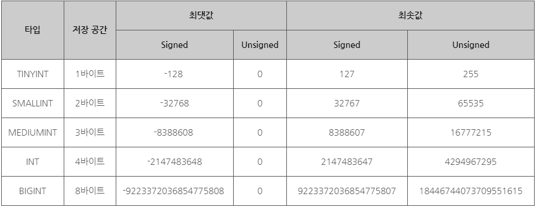
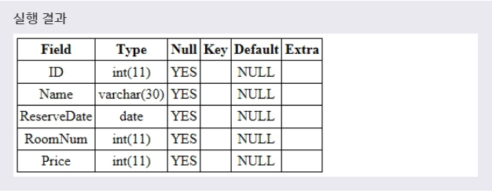
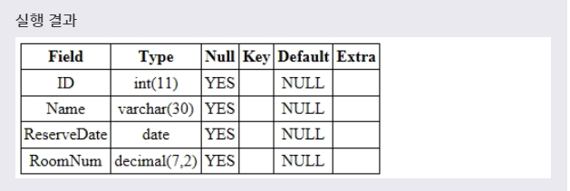
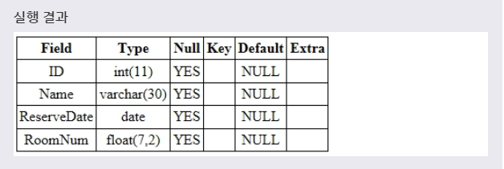
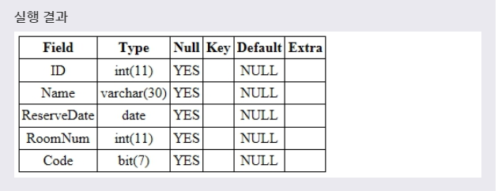

# 숫자 타입
***

## 1. 타입(data type)

* MySQL에서 테이블을 정의할 때는 필드별로 저장할 수 있는 타입까지 명시해야 한다.

* MySQL에 제공하는 기본 타입은 다음과 같다.
  * 숫자 타입
  * 문자열 타입
  * 날짜와 시간 타입
***

## 2. 숫자 타입(NUMERIC TYPES)

* MySQL은 SQL 표준에서 지원하는 모든 숫자 타입을 제공한다. MySQL에서 제공하는 숫자 타입은 다음과 같다.
  * 정수 타입(INTERGER TYPES)
  * 고정 소수점 타입(FIXED-PRINT TYPES)
  * 부동 소수점 타입(FLOATING-POINT TYPES)
  * 비트값 타입(BIT-VALUE TYPE)
***

## 3. 정수 타입(INTERGER TYPES)

* MySQL은 SQL 표준 정수 타입인 **INTERGER(또는 INT)** 와 **SMALLINT** 를 제공한다. 또한, 표준 정수 타입의 범위를 더욱 확장한 **TINYINT, MEDIUMINT, BIGINT** 까지 제공하고 있다.

* 각 정수 타입에 따라 요구되는 저장 공간과 표현할 수 있는 최댓값과 최솟값까지 달라진다. 또한, 정수 타입은 음수까지 표현할 수 있는 **SIGNED** 타입과 양수만을 표현할 수 있는 **UNSIGNED** 타입으로도 구분된다.

* MySQL 정수 타입에 따른 표현할 수 있는 최댓값, 최솟값과 요구되는 저장 공간의 크기는 다음과 같다.
  * 

* 예제
  ```SQL
  ALTER TABLE TEST
  ADD PRICE INT;
  ```
  풀어서 말하면, **'TEST 테이블에 4바이트의 정수를 저장할 수 있는 PRICE 필드를 추가하겠다.'** 라는 뜻이다.

* 실행결과
  * 
  * 그리고서 INSERT INTO 문을 사용하여 PRICE 필드 값으로 1000을 가지는 새로운 레코드를 추가할 수 있다.
***

## 4. 고정 소수점 타입(FIXED-POINT TYPES)

* MySQL에서 고정 소수점 타입인 **DECIMAL** 은 실수의 값을 정확하게 표현하기 위해 사용된다. DECIMAL에서 사용하는 고정 소수점 방식은 실수를 표현할 때 소수부의 자릿수를 고정하여 표현한다. 즉, 소수부의 자릿수를 미리 정해 놓고, 고정된 자릿수로만 소수 부분을 표현하는 방식이다.

* MySQL에서 DECIMAL 타입은 NUMERIC을 구현하여 만들어졌다. 따라서 대부분의 경우 DECIMAL 대신 NUMERIC을 사용해도 똑같이 동작할 것이다.

* 문법
  ```SQL
  DECIMAL(M, D);
  ```
  **M** 은 소수 부분을 포함한 실수의 총 자릿수를 나타내며, 최댓값은 65이다.
  **D** 는 소수 부분의 자릿수를 나타내며, D가 0이면 소수 부분을 가지지 않는다.

* 예제
  ```SQL
  ALTER TABLE TEST
  MODIFY COLUMN ROOMNUM DECIMAL(7, 2);
  ```
  풀어서 말하면, **'TEST 테이블에 ROOMNUM 필드 타입을 고정 소수점 타입으로 변경하겠다.'** 라는 뜻이다.

* 실행결과
  * 
  * 위의 예제에서 ROOMNUM 필드는 **-99999.99부터 99999.99** 까지의 실수를 저장할 수 있도록 변경된다.
  * 그리고서 INSERT INTO 문을 사용하여 ROOMNUM 필드 값으로 99999.99를 가지는 새로운 레코드를 추가할 수 있다.
***

## 5. 부동 소수점 타입(FLOATING-POINT TYPES)

* MySQL에서 부동 소수점 타입인 FLOAT과 DOUBLE은 실수의 값을 대략적으로 표현하기 위해 사용된다. MySQL은 Ieeee 754 표준에 따라 FLOAT는 4바이트를 사용하며, DOUBLE은 8바이트를 사용한다.

* SQL 표준에서 FLOAT는 정밀도에 필요한 최소한의 비트 수를 명시할 수 있다.
  * 문법
    ```SQL
    FLOAT(P);
    ```
    P가 0부터 24까지의 값을 가질 때는 FLOAT 값으로 취급되며, 25부터 53까지의 값을 가질 때는 DOUBLE 값으로 취급된다.

* MySQL은 FLOAT과 DOUBLE을 고정 소수점 타입과 같이 사용할 수 있는 비표준 문법도 지원한다.
  * 문법
    ```SQL
    FLOAT(M, D)
    DOUBLE(M, D);
    ```
    M은 소수 부분을 포함한 실수의 총 자릿수를 나타내며, D는 소수 부분의 자릿수를 나타낸다.

* 예제
  ```SQL
  ALTER TABLE TEST
  MODIFY COLUMN ROOMNUM FLOAT(7, 2);
  ```
  풀어서 말하면, **'TEST 테이블에 ROOMNUM 필드 타입을 부동 소수점 타입으로 변경하겠다.'** 라는 뜻이다.

* 실행결과
  * 
  * 위의 예제에서 ROOMNUM 필드는 **-99999.99부터 99999.99** 까지의 실수를 저장할 수 있도록 변경된다.
  * ROOMNUM 필드 값으로 99999.009를 입력하면, 실수의 총 자릿수가 명시한 7자리를 초과하게 된다. 따라서 이 값은 7자리로 맞춰지기 위해 반올림되어 99999.01로 **자동 변환** 되어 저장된다.
***

## 6. 비트값 타입(BIT-VALUE TYPE)

* MySQL에서 비트값 타입인 BIT는 비트의 값을 저장하기 위해 사용된다. 즉, 0과 1로 구성되는 바이너리(BINARY) 값을 저장할 수 있다.
  * 문법
    ```SQL
    BIT(M);
    ```
    M의 범위는 1부터 64까지 설정할 수 있으며, 명시한 M 비트의 값을 저장할 수 있게 된다.
    만약 명시한 M 비트보다 짧은 길이의 비트 값을 입력하면, 입력한 값 앞에 0을 추가하여 자동으로 길이를 맞추게 된다.

* 예제
  ```SQL
  ALTER TABLE TEST
  ADD CODE BIT(7);
  ```
  풀어서 말하면, **'TEST 테이블에 BIT(7) 타입을 저장할 수 있는 CODE 필드를 추가하겠다.'** 라는 뜻이다.

* 실행결과
  * 
  * CODE 필드의 값인 B'100'과 B'100001'은 각각 B'0000100'과 B'0100001'로 **자동 변환** 되어 저장된다.
