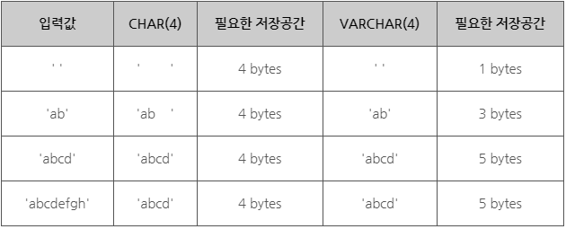
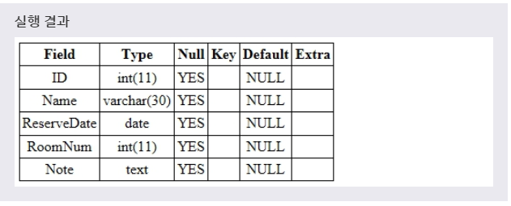
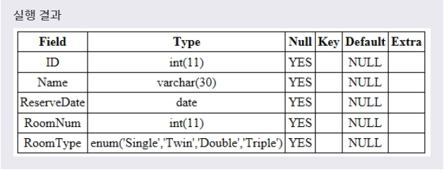
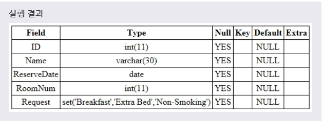

# 문자열 타입
> MySQL은 다양한 형태의 문자열 타입을 제공한다.

> 1. CHAR와 VARCHAR

> 2. BINARY와 VARBINARY

> 3. BLOB과 TEXT

> 4. ENUM

> 5. SET
***

## 1. CHAR와 VARCHAR

* CHAR와 VARCHAR는 둘다 문자열 데이터를 저장할 수 있는 타입니다. 하지만 저장 방식과 추출 방식 그리고 최대 길이를 다루는 방식에서 차이점을 가진다.

* **CHAR** 는 문자열을 길이가 한 번 설정되면 그대로 고정되는 **고정 길이의 문자열** 이고, **VARCHAR** 는 문자열을 길이가 고정되지 않는 **가변 길이의 문자열** 이다.

* 문법
  ```SQL
  CHAR(M);

  VARCHAR(M);
  ```
  M은 저장할 수 있는 문자열의 최대 길이를 나타낸다. 이때 CHAR는 0부터 255까지 설정할 수 있으며, VARCHAR는 0부터 65,535까지 설정할 수 있다. CHAR는 설정한 크기보다 작은 길이의 문자열이 입력되면, **나머지 공간을 공백으로 채워** 길이를 M과 같게 만든다. 하지만 VARCHAR는 **실제 입력된 문자열의 길이만큼만 저장** 하고 사용한다.

* 예제
  ```SQL
  ALTER TABLE TEST ADD NOTE CHAR(4);
  INSERT INTO Note VALUES(' ');
  INSERT INTO Note VALUES('ab');
  INSERT INTO Note VALUES('abcd');
  INSERT INTO Note VALUES('abcdefgh');

  ALTER TABLE TEST MODIFY COLUMN NOTE VARCHAR(4);
  INSERT INTO Note VALUES(' ');
  INSERT INTO Note VALUES('ab');
  INSERT INTO Note VALUES('abcd');
  INSERT INTO Note VALUES('abcdefgh');
  ```
  저장공간은 다음과 같다.
  * 
***

## 2. BINARY와 VARBINARY

* BINARY와 VARBINARY는 각각 CHAR와 VARCHAR과 거의 비슷하다. 다만 BINARY와 VARBINARY는 문자 집합이 아닌 바이너리(BINARY) 데이터를 저장할 때 사용된다는 점만 다르다.

* 문법
  ```SQL
  BINARY(M);

  VARBINARY(M);
  ```
***

## 3. BLOB과 TEXT

* BLOB은 Binary Large Object를 의미하며, 다양한 크기의 바이너리 데이터를 저장할 수 있는 타입이다. 저장할 수 있는 데이터의 최대 크기에 따라 TINYBLOB, BLOB, MEDIUMBLOB, LONGBLOB로 구분된다.

* TEXT는 VARCHAR와 비슷하지만, VARCHAR와는 달리 **기본값을 가질 수 없습니다.** 또한, TEXT는 BLOB과도 비슷하지만, BLOB과는 달리 **문자열의 대소문자를 구분** 한다. 저장할 수 있는 데이터의 최대 크기에 따라 TINYTEXT, TEXT, MEDIUMTEXT, LONGTEXT로 구분된다.

* 예제
  ```SQL
  ALTER TABLE TEST
  ADD COLUMN NOTE TEXT;
  ```

* 실행결과
  * 
  그리고서 INSERT INTO 문을 사용하여 NOTE 필드 값으로 'MySQL 자료형 수업입니다.'라는 문자열을 가지는 새로운 레코드를 추가할 수 있다.
***

## 4. ENUM

* ENUM은 미리 정의한 집합 안의 요소 중 하나만을 저장할 수 있는 타입이다. ENUM을 사용하면 **가독성을 높일 수 있으며, 특정 숫자에 문자열로 의미를 부여** 할 수 있다. ENUM 목록 집합은 최대 65,535개의 ENUM 데이터를 포함할 수 있다. 이렇게 설정된 ENUM 데이터는 **내부적으로 정수로 변환** 되어 인식된다.

* 문법
  ```SQL
  ENUM('데이터값1', '데이터값2', ...);
  ```

* 예제
  ```SQL
  ALTER TABLE TEST
  ADD COLUMN ROOMTYPE ENUM('SINGLE', 'TWIN', 'DOUBLE', 'TRIPLE');
  ```
  풀어서 말하면, **'TEST 테이블에 4개의 값 중 하나를 가질 수 있는 ENUM 형인 ROOMTYPE 필드를 추가하겠다.'** 라는 뜻이다.

* 실행결과
  * 
  그리고서 INSERT INTO 문을 사용하여 ROOMTYPE 필드 값으로 각각 문자열 'SINGLE'과 정수 2를 가지는 새로운 레코드를 추가할 수 있다.

* 위의 예제에서 ENUM 목록 집합의 각 데이터는 내부적으로 0부터 시작하여 1씩 증가하며 각각 대응된다. 단, 0은 빈 문자열('')과 대응되며, 1부터 집합의 첫 번째 요소와 대응된다. 따라서 'Single'은 그대로 'Single'이라는 문자열로 저장되지만, 정수 2는 문자열인 'Twin'으로 변환되어 저장될 것이다.
***

## 5. SET

* SET은 미리 정의한 집합 안의 요소 중 여러 개를 동시에 저장할 수 있는 타입이다. SET 목록 집합은 최대 64개의 SET 데이터를 포함할 수 있다.

* 문법
  ```SQL
  SET('데이터값1', '데이터값2', ...);
  ```

* 예제
  ```SQL
  ALTER TABLE TEST
  ADD COLUMN REQUEST SET('BREAKFAST', 'EXTRA BED', 'NON-SMOKING');
  ```
  풀어서 말하면, **'TEST 테이블에 3개의 값 중 여러개를 가질 수 있는 SET형인 REQUEST 필드를 추가하겠다.'** 라는 뜻이다.

* 실행결과
  * 
  그리고서 INSERT INTO 문을 사용하여 REQUEST 필드 값으로 'BREAKFAST,EXTRA BED'라는 문자열을 가지는 새로운 레코드를 추가할 수 있다.

* 이처럼 SET 타입으로 설정된 Request 필드에는 SET 목록 집합인 'Breakfast', 'Extra Bed', 'Non-smoking'라는 문자열 중 한 가지 이상의 값을 저장할 수 있다. 단, 여러 개의 값을 저장할 경우에는 예제처럼 쉼표를 사용하여 값 사이를 구분해줘야 한다.
