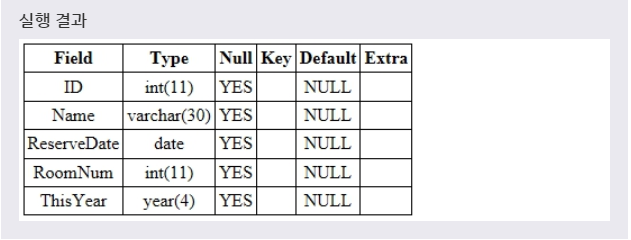

# 날짜와 시간 타입
> MySQL은 날짜와 시간에 관한 다양한 형태의 타입을 제공한다.

> 1. DATE, DATETIME, TIMESTAMP

> 2. TIME

> 3. YEAR
***

## 1. DATE, DATETIME, TIMESTAMP

* DATE는 **날짜를 저장** 할 수 있는 타입이다. 기본 형식은 'YYYY-MM-DD'이며, 이때 저장할 수 있는 날짜의 범위는 '1000-01-01'부터 '9999-12-31'까지이다.

* DATETIME는 **날짜와 함께 시간까지 저장** 할 수 있는 타입이다. 기본 형식은 'YYYY-MM-DD HH:MM:SS'이며, 이때 저장할 수 있는 범위는 '1000-01-01 00:00:00'부터 '9999-12-31 23:59:59'까지이다.

* TIMESTAMP는 **날짜와 시간을 나타내는 타임스탬프를 저장** 할 수 있는 타입이다. TIMESTAMP 타입의 필드는 사용자가 별다른 입력을 주지 않으면, 데이터가 마지막으로 입력되거나 변경된 시간이 저장된다. 따라서 데이터의 최종 변경 시각을 저장하고 확인하는 데 유용하게 사용된다. 이때 저장할 수 있는 범위는 '1970-01-01 00:00:01' UTC부터 '2038-01-19 03:14:07' UTC까지이다.

* 입력받은 데이터가 유효한 날짜와 시간이 아니면, 세 타입 모두 0을 저장한다.

* 예제
  ```SQL
  ALTER TABLE TEST
  MODIFY COLUMN RESERVEDATE DATETIME;
  ```
  풀어서 말하면, **'TEST 테이블에 RESERVEDATE 필드의 타입을 DATETIME 타입으로 변경하겠다.'** 라는 뜻이다.

* 
* INSERT INTO 문을 사용하여 RESERVEDATE 필드 값으로 날짜와 시간을 표현하는 문자열인 '2017-01-01 01:23:45'를 가지는 새로운 레코드를 추가할 수 있다.
***

## 2. TIME

* TIME은 시간을 저장할 수 있는 타입이다. 기본 형식은 'HH:MM:SS'나 'HHH:MM:SS'이며, 이때 저장할 수 있는 시간의 범위는 '-838:59:59'부터 '838:59:59'까지이다.

* 범위를 초과한 시간은 '-838:59:59'이나 '838:59:59'로 자동 변환되어 저장된다. 또한, 유효하지 않은 시간은 '00:00:00'로 저장된다.

* 예제
  ```SQL
  ALTER TABLE TEST
  ADD COLUMN CHECKIN TIME;
  ```
  풀어서 말하면, **'TEST 테이블에 TIME 타입인 CHECKIN 필드를 추가하겠다.'** 라는 뜻이다.

* 
* INSERT INTO 문을 사용하여 CHECKIN 필드 값으로 시간을 표현하는 문자열인 '01:23:45'을 가지는 새로운 레코드를 추가할 수 있다.
***

## 3. YEAR

* YEAR는 연도를 저장할 수 있는 타입이다. YEAR(2)는 2자리의 연도를 저장할 수 있으며, YEAR(4)는 4자리의 연도를 저장할 수 있다.

* YEAR는 연도를 나타내는 숫자와 문자열을 모두 저장할 수 있으나, 저장되는 결과가 다음과 같이 조금씩 다르다.
  * 4자리 숫자로 저장하면, 저장할 수 있는 범위는 1901년부터 2155년까지가 된다.
  * 4자리 문자열로 저장하면, 저장할 수 있는 범위는 1901년부터 2155년까지가 된다.
  * 1자리 또는 2자리 숫자로 저장하면, 1부터 69까지는 2001년부터 2069년까지가 되고, 70부터 99까지는 1970년부터 1999년까지가 된다.
  * 1자리 또는 2자리 문자열로 저장하면, '0'부터 '69'까지는 2000년부터 2069년까지가 되고, '70'부터 '99'까지는 1970년부터 1999년까지가 된다.
  * 숫자 0을 저장하면, 2000년이 아닌 0000년으로 저장되므로, 2000년은 반드시 문자열 '0' 또는 '00'으로 입력해야 한다.
  * 이때 유효하지 않은 연도는 '0000'으로 저장된다.

* 예제
  ```SQL
  ALTER TABLE TEST
  ADD COLUMN THISYEAR YEAR;
  ```
  풀어서 말하면, **'TEST 테이블에 YEAR 타입인 THISYEAR 필드를 추가하겠다.'** 라는 뜻이다.

* 
* INSERT INTO 문을 사용하여 THISYEAR 필드 값으로 2016를 가지는 새로운 레코드를 추가할 수 있다.

> YEAR(2)는 MySQL 5.7.5 버전부터는 지원하지 않으므로, 연도를 저장할 때는 YEAR(4)를 사용하는 것이 좋다.
