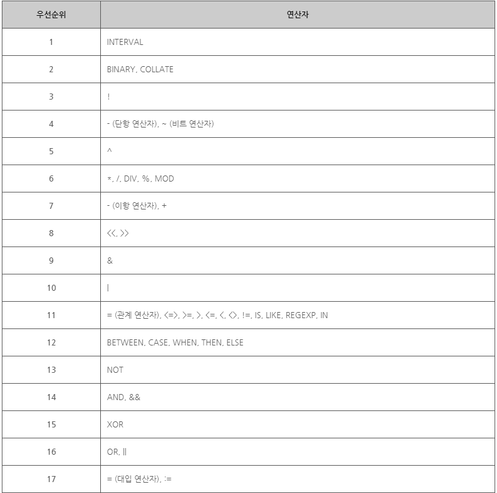

# 연산자
> MySQL은 대부분의 프로그래밍 언어에서 지원하는 기본적인 연산자를 모두 제공한다. 이러한 연산자를 사용하여 데이터를 추출하고 처리할 수 있다.
***

## 1. 산술 연산자

* 산술 연산자(ARITHMETIC OPERATOR)
  * 산술 연산자는 사칙연산을 다루는 가장 기본적이면서도 많이 사용하는 연산자이다. 산술 연산자는 모두 두개의 피연산자를 가지는 이항 연산자이다.

  * 

  * 예제
    ```SQL
    SELECT 504.7 + 13,
    504.7 * 0.9,
    504.7 / 2,
    504.7 DIV 2,
    504.7 % 2;
    ```

  * 

* 연산자의 우선순위(OPERATOR PRECEDENCE)
  * 연산자의 우선순위는 수식 내에 여러 연산자가 함께 등장할 때, 어느 연산자가 먼저 처리될 것인가를 결정한다.

  * MySQL에서 연산자의 우선순위는 다음과 같다.
    * 
    * 위의 표에서 나온 순서대로 우선순위가 빠른 연산자가 먼저 실행된다.

    > 위의 표를 모두 외우기보다는 필요할 때마다 참조하는 것이 좋다.
***

## 2. 대입 연산자

* 대입 연산자(ASSIGNMENT OPERATOR)
  * 대입 연산자는 변수에 값을 대입할 때 사용하는 이항 연산자이다.

  * 

  * MySQL에서 '=' 연산자는 두 가지 의미로 해석된다. 우선 SET 문이나 UPDATE 문의 SET 절에서 사용되면 왼쪽 피연산자에 오른쪽 피연산자를 대입하는 대입 연산자로 해석된다. SET 문이나 UPDATE 문의 SET 절 이외에서 사용되면, 왼쪽 피연산자와 오른쪽 피연산자를 비교하는 비교 연산자로 해석된다.

  * 이처럼 '=' 연산자는 상황에 따라 다르게 해석될 수 있으므로, 작성자의 의도와는 다르게 해석될 여지가 있다. 따라서 MySQL에서는 언제나 대입 연산자로만 해석되는 두 번째 대입 연산자(:=)를 별도로 제공하고 있다. 첫 번째 대입 연산자(=)와 달리 두 번째 대입 연산자(:=)는 절대로 비교 연산자로 해석되지 않는다.

  * 예제
    ```SQL
    UPDATE TEST
    SET ROOMNUM = 504;
    ```

  * 
***

## 3. 비교 연산자

* 비교 연산자(COMPARISON OPERATOR)
  * 비교 연산자는 피연산자 사이의 상대적인 크기를 판단하여, 참(TRUE)이면 1를 반환하고 거짓(FALSE)이면 0을 반환한다.

  * 

  * 예제
    ```SQL
    SELECT 3 = 3,      // 3과 3이 같은지를 비교함.
    0 = NULL,          // 0과 NULL이 같은지를 비교함.
    1 IS TRUE,         // 1과 TRUE가 같은지를 비교함.
    1 IS NULL,         // 1과 NULL이 같은지를 비교함.
    3 BETWEEN 2 AND 7, // 3이 2보다 크거나 같고, 7보다 작거나 같은지를 비교함.
    5 IN (2, 3, 4, 5); // 5가 2, 3, 4, 5중에 포함되는지를 비교함.
    ```

  * 

  > 대부분의 프로그래밍 언어에서 동등 연산자는 '=='로 사용한다. 하지만 MySQL에서는 대입 연산자와 같은 모양인 '='로 사용한다는 점을 주의해야 한다.
***

## 4. 논리 연산자

* 논리 연산자(LOGICAL OPERATOR)
  * 논리 연산자는 논리식을 판단하여, 참(TRUE)이면 1를 반환하고 거짓(FALSE)이면 0을 반환한다.

  * 

  * 예제
    ```SQL
    SELECT NOT 0, // 피연산자가 0이면 1을 반환하고, 1이면 0을 반환함.
    1 AND 1,      // 피연산자가 모두 1일때만 1을 반환하고, 나머지 경우에는 0을 반환함.
    0 OR 0,       // 피연산자가 모두 0일때만 0을 반환하고, 나머지 경우에는 1을 반환함.
    1 XOR 0;      // 피연산자가 서로 다르면 1을 반환하고, 서로 같으면 0을 반환함.
    ```

  * 
***

## 5. 비트 연산자

* 비트 연산자(BITWISE OPERATOR)
  * 비트 연산자는 논리 연산자와 비슷하지만, 비트(BIT) 단위로 논리 연산을 수행한다. 또한, 비트 단위로 전체 비트를 왼쪽이나 오른쪽으로 이동시킬 때도 사용한다.

  * 

  * 예제
    ```SQL
    SELECT b'1000' & b'1111', // 첫 번째 비트만이 둘 다 1이므로, 연산 결과는 b'1000'이 됨.
    b'1000' | b'1111',        // 모든 비트에 하나라도 1이 포함되어 있으므로, 연산 결과는 b'1111'이 됨.
    b'1000' ^ b'1111',        // 첫 번째 비트를 제외한 모든 비트가 서로 다르므로, 연산 결과는 b'0111'이 됨.
    b'1100' >> 1,             // 모든 비트를 1비트씩 오른쪽으로 이동시키므로, 연산 결과는 b'0110'이 됨.
    b'1100' >> 2;             // 모든 비트를 2비트씩 오른쪽으로 이동시키므로, 연산 결과는 b'0011'이 됨.
    ```

  * 

  > MySQL에서는 '0'과 '1'로만 이루어진 문자열 앞에 'B'를 붙여 2진수를 표현할 수 있다.
