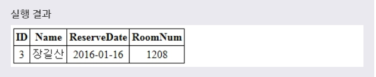
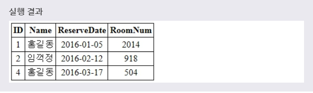
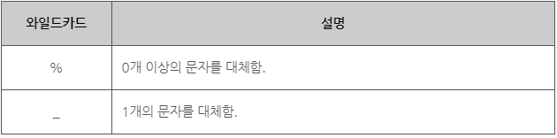
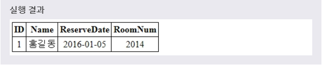
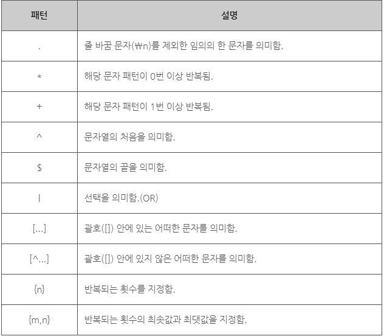
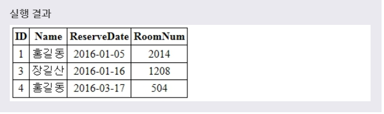
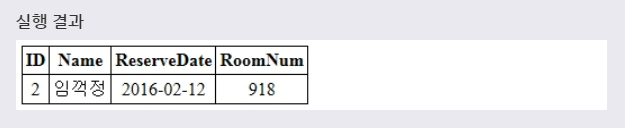

# 패턴 매칭
> MySQL은 데이터의 특정 패턴을 검색하기 위한 다음과 같은 패턴 매칭 연산자를 제공한다.

> 1. LIKE

> 2. REGEXP

> 또한, 임의의 문자나 문자열을 대체하기 위해서 와일드카드(WILDCARD) 문자를 사용할 수도 있다.
***

## 1. LIKE

* LIKE 연산자는 특정 패턴을 포함하는 데이터만을 검색하기 위해 사용한다.

* 예제1
  ```SQL
  SELECT * FROM TEST
  WHERE NAME LIKE '장%';
  ```

* 

> '%'는 0개 이상의 문자라는 의미의 와일드카드(WILDCARD) 문자이다.

* 만약 특정 패턴을 포함하지 않는 데이터를 검색하고 싶을 때는 NOT LIKE 연산자를 사용하면 된다.

* 예제2
  ```SQL
  SELECT * FROM TEST
  WHERE NAME NOT LIKE '장%';
  ```

* 
***

## 2. 와일드카드(WILDCARD)

* 와일드카드(WILDCARD)란 문자열 내에서 임의의 문자나 문자열을 대체하기 위해 사용되는 기호이다.

* 

* 예제
  ```SQL
  SELECT * FROM TEST
  WHERE ROOMNUM LIKE '20__';
  ```
  풀어서 말하면, **'TEST 테이블에 ROOMNUM 필드의 값이 20으로 시작하고, 바로 뒤에 두 자리 숫자가 더 나오는 레코드를 선택하겠다.'** 라는 뜻이다.

* 
***

## 3. REGEXP

* LIKE 연산자보다 더욱 복잡한 패턴을 검색하고 싶을 때는 REGEXP 연산자를 사용할 수 있다. REGEXP 연사자는 정규 표현식을 토대로 하는 패턴 매칭 연산이다.

* 

* 예제1
  ```SQL
  SELECT * FROM TEST
  WHERE NAME REGEXP '^홍|산$';
  ```
  풀어서 말하면, **'TEST 테이블에 NAME 필드의 값이 '홍'으로 시작하거나, '산'으로 끝나는 레코드를 선택하겠다.'** 라는 뜻이다.

* 

* 만약 해당 패턴과 일치하지 않는 데이터를 찾고 싶다면 **NOT REGEXP** 연산자를 사용하면 된다.

* 예제2
  ```SQL
  SELECT * FROM TEST
  WHERE NAME NOT REGEXP '^홍|산$';
  ```
  풀어서 말하면, **'TEST 테이블에 NAME 필드의 값이 '홍'으로 시작하지 않고, '산'으로 끝나지도 않는 레코드를 선택하겠다.'** 라는 뜻이다.

* 
