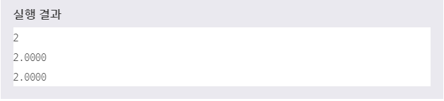

# 타입 변환
> MySQL은 비교나 검색을 수행할 때 데이터의 타입이 서로 다를 경우 내부적으로 타입이 같아지도록 자동 변환하여 처리한다. 하지만 사용자가 직접 명시적으로 타입을 변환할 수 있도록 다양한 연산자와 함수도 같이 제공하고 있다.

> 1. BINARY

> 2. CAST()

> 3. CONVERT()
***

## 1. BINARY

* BINARY 연산자는 뒤에 오는 문자열을 바이너리 문자열로 변환한다. BINARY 연산자를 이용하면 문자가 아닌 바이트를 기준으로 하여 비교나 검색 작업을 수행할 수 있다.

* 예제
  ```SQL
  SELECT BINARY 'a' = 'A',
  'a' = 'A';
  ```

* 
* BINARY 'a' = 'A'는 대소문자 구별을 하여 'a' -> 97, 'A' -> 65로 인식하여 0을 출력하지만, 그냥 'a' = 'A'는 MySQL에서는 대소문자 구별을 따로 하지 않으므로 같다고 보기 때문에 1을 출력한다.

* 위의 예제처럼 BINARY 연산자를 이용하여 문자를 비교하면, 비교하려는 문자의 바이트 값을 비교하게 된다. 따라서 문자 'a'와 'A'가 서로 다른 값으로 인식된다.
***

## 2. CAST()

* CAST() 함수는 인수로 전달받은 값을 명시된 타입으로 변환하여 반환한다. 이때 변환하고자 하는 타입을 AS 절을 이요하여 직접 명시할 수 있다.

* 문법
  ```SQL
  CAST(EXPR AS TYPE);
  ```

* AS 절에서 사용할 수 있는 타입은 다음과 같다.
  * BINARY
  * CHAR
  * DATE
  * DATETIME
  * TIME
  * DECIMAL
  * JSON (MySQL 5.7.8부터 제공됨)
  * NCHAR
  * SIGNED [INTEGER]
  * UNSIGNED [INTEGER]

* 예제
  ```SQL
  SELECT 4 / '2',
  4 / 2,
  4 / CAST('2' AS UNSIGNED);
  ```

* 

* 위의 예제에서 문자열 타입의 데이터를 묵시적으로 타입 변환하여 수행한 나눗셈 연산의 결과는 정수 타입으로 반환된다. 하지만 정수 타입끼리 나눗셈 연산을 한 결과는 실수 타입으로 반환됨을 볼 수 있다. 따라서 문자열 타입의 데이터를 CAST() 함수를 사용하여 명시적으로 타입 변환해야만 제대로 된 나눗셈 연산 결과를 얻을 수 있음을 확인할 수 있다.
***

## 3. CONVERT()

* CONVERT() 함수도 CAST() 함수처럼 인수로 전달받은 값을 명시된 타입으로 변환하여 반환하다. CONVERT() 함수는 두 번째 인수로 변환하고자 하는 타입을 직접 전달할 수 있다.

* 문법
  ```SQL
  CONVERT(EXPR, TYPE)

  CONVERT(EXPR USING TRANSCODING_NAME)
  ```
  USING 절은 서로 다른 문자셋(CHARACTER SET) 간의 데이터 변환을 위해 사용된다. 이때 사용할 수 있는 타입은 CAST() 함수와 같다.

* 예제
  ```SQL
  SELECT CONVERT('ABC' USING UTF8);
  ```

* 실행결과 - 'ABC'
