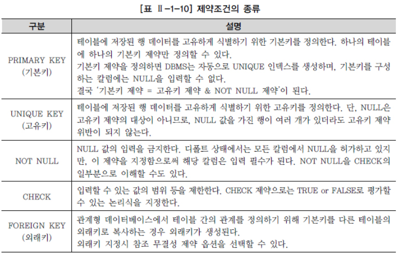
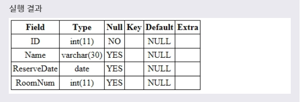
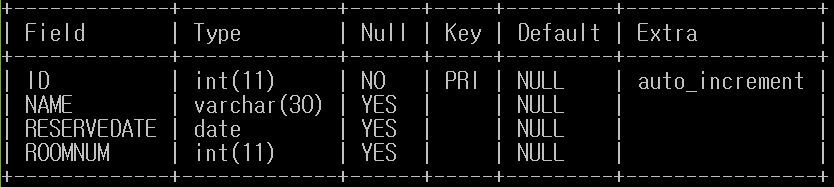
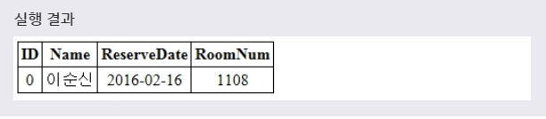
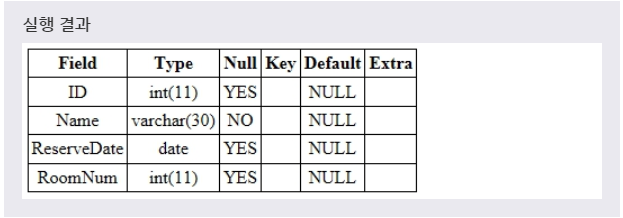

# NOT NULL
***

## 1. 제약조건(CONSTRAINT)

* 제약조건(CONSTRAINT)이란 **데이터의 무결성(변경할 수 없도록 보호하는 성질)** 을 지키기 위해 데이터를 입력받을 때 실행되는 검사 규칙을 의미한다. 이러한 제약조건은 CREATE 문으로 테이블을 생성할 때나, ALTER 문으로 필드를 추가할 때도 설정할 수 있다.

* MySQL에서 사용할 수 있는 제약조건은 다음과 같다.
  * NOT NULL
  * UNIQUE
  * PRIMARY KEY
  * FOREIGN KEY
  * DEFAULT

*   
***

## 2. NOT NULL

* NOT NULL 제약 조건을 설정하면, 해당 필드는 NULL 값을 저장할 수 없게 된다. **즉, 이 제약 조건이 설정된 필드는 무조건 데이터를 가지고 있어야 한다.** NOT NULL 제약 조건은 CREATE 문으로 테이블을 생성할 때나, 나중에 ALTER 문으로 추가할 수도 있다.
***

## 3. CREATE 문으로 NOT NULL 설정

* CREATE 문으로 테이블을 생성할 때 해당 필드의 타입 뒤에 NOT NULL을 명시하면, 해당 필드는 NULL 값을 가질 수 없게 된다.

* 문법
  ```SQL
  CREATE TABLE RESERVATION(
    필드이름 필드타입 NOT NULL,
    ...
  );
  ```

* 예제1
  ```SQL
  CREATE TABLE RESERVATION(
    ID INT NOT NULL,
    NAME VARCHAR(30),
    RESERVEDATE DATE,
    ROOMNUM INT
  );
  ```
  CREATE TABLE 문을 사용하여 RESERVATION 테이블을 생성하면서, ID 필드에 NOT NULL 제약 조건을 설정한다.

* 
* INSERT INTO 문을 사용하여 새로운 레코드를 하나 추가할 수 있다. 위의 예제에서는 이제부터 RESERVATION 테이블에 INSERT 문으로 새로운 레코드를 추가할 때 **ID 필드의 값으로 NULL을 사용할 수 없다.**
* **NOT NULL 제약 조건** 이란 해당 필드에 NULL 값을 저장할 수 없도록 설정하는 것으로, **해당 필드를 생략하지 못하도록 하는 제약조건이다.**
* 또한
  ```SQL
  INSERT INTO RESERVATION(NAME, RESERVEDATE, ROOMNUM)
  VALUES('이순신', '2017-01-01', 1108);
  ```
  이러한 INSERT INTO문 작성 시, **'Field 'ID' doesn't have a default value'** 라는 에러가 뜨면서 ID 필드가 없으면 안된다고 나온다. 따라서 무조건 정해진 필드 값을 넣어 주어야 한다.

* 추가적으로 **AUTO_INCREMENT PRIMARY KEY** 문을 사용하여 테이블을 생성하면 ID 필드가 없이 INSERT 문을 사용할 수 있다. 따라서 INSERT INTO문으로 레코드를 저장할 때 NOT NULL 제약 조건이 설정된 필드의 값을 생략할 수 있다.

* 예제2
  ```SQL
  CREATE TABLE RESERVATION(
    ID INT NOT NULL AUTO_INCREMENT PRIMARY KEY,
    NAME VARCHAR(30),
    RESERVEDATE DATE,
    ROOMNUM INT
  );
  ```

* 
* 테이블 생성이 완료 되었다. 이어서 데이터를 추가해보겠다.

* 예제3
  ```SQL
  INSERT INTO RESERVATION(NAME, RESERVEDATE, ROOMNUM)
  VALUES('이순신', '2017-01-01', 1108);
  ```
  ID 필드에 NOT NULL 제약조건과 AUTO_INCREMENT문이 설정된 RESERVATION 테이블에 ID 필드가 생략된 레코드를 저장한다. **AUTO_INCREMENT PRIMARY KEY** 문을 사용하면 ID필드를 따로 정해주지 않으면 0번부터 오름차순으로 데이터가 저장이 된다.

* 
* 이처럼 NOT NULL 제약조건이 설정된 필드의 값이 생략된 레코드도 정상적으로 저장되는 것을 확인할 수 있다.
***

## 4. ALTER 문으로 NOT NULL 설정

* ALTER 문으로 테이블에 새로운 필드를 추가하거나 수정할 때도 NOT NULL 제약 조건을 설정할 수 있다.

* 문법1
  ```SQL
  ALTER TABLE 테이블이름
  ADD 필드이름 필드타입 NOT NULL;
  ```
  테이블에 **새로운 필드를 추가할 때 NOT NULL 제약 조건을 설정** 하는 문법이다.

* 문법2
  ```SQL
  ALTER TABLE 테이블이름
  MODIFY COLUMN 필드이름 필드타입 NOT NULL;
  ```
  **기존 필드에 NOT NULL 제약 조건을 설정** 하는 문법이다.

* 예제1
  ```SQL
  ALTER TABLE RESERVATION
  MODIFY COLUMN NAME VARCHAR(30) NOT NULL;
  ```
  풀어서 말하면, **RESERVATION 테이블로부터 기존에 있던 NAME 필드에 NOT NULL 제약 조건을 설정하겠다.** 라는 뜻이다.

* 
