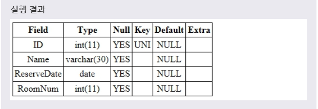
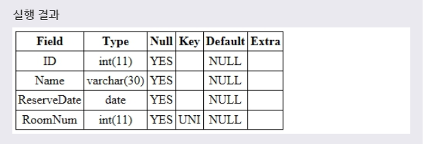
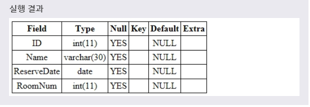

# UNIQUE
***

## 1. UNIQUE

* UNIQUE 제약 조건을 설정하면, 해당 필드는 서로 다른 값을 가져야만 한다. 즉, 이 제약 조건이 설정된 필드는 중복된 값을 저장할 수 없게 된다. 또한 UNIQUE 제약 조건을 설정하면, 해당 필드는 자동으로 인덱스(INDEX)로 만들어진다.(인덱스에 대한 더 자세한 내용은 7장 INDEX에서 다루겠다.) UNIQUE 제약 조건은 CREATE 문으로 테이블을 생성할 때나, 나중에 ALTER 문으로 추가할 수도 있다.
***

## 2. CREATE 문으로 UNIQUE 설정

* CREATE 문에서 테이블을 생성할 때 다음과 같이 UNIQUE 제약 조건을 설정할 수 있다. CREATE 문으로 테이블을 생성할 때 해당 필드의 타입 뒤에 UNIQUE를 명시하면, 해당 필드에는 더는 중복된 값을 저장할 수 없게 된다.

* 문법
  ```SQL
  CREATE TABLE TEST(
    필드이름 필드타입 UNIQUE,
    ...
  );
  ```

  ```SQL
  CREATE TABLE TEST(
    필드이름 필드타입,
    ...
    [CONSTRAINT 제약조건이름] UNIQUE (필드이름)
  );
  ```
  위의 두 문법은 모두 해당 필드에 UNIQUE 제약 조건을 설정한다. 이때 두 번째 문법을 사용하면, 해당 제약 조건에 이름을 설정할 수 있다.

* 예제
  ```SQL
  CREATE TABLE TEST(
    ID INT UNIQUE,
    NAME VARCHAR(30),
    RESERVEDATE DATE,
    ROOMNUM INT
  );
  ```

* 
  * 이제부터 TEST 테이블에 새로운 레코드를 저장할 때 **ID 필드의 값이 기존에 저장된 ID 값과 중복되는 값을 가지는 레코드는 저장할 수 없다.**
***

## 3. ALTER 문으로 UNIQUE 설정

* ALTER 문으로 테이블에 새로운 필드를 추가하거나 수정할 때도 UNIQUE 제약 조건을 설정할 수 있다.

* 문법1
  ```SQL
  ALTER TABLE 테이블이름
  ADD 필드이름 필드타입 UNIQUE;

  ALTER TABLE 테이블이름
  ADD [CONSTRAINT 제약조건이름] UNIQUE (필드이름);
  ```
  테이블에 **새로운 필드를 추가할 때 UNIQUE 제약 조건을 설정** 하는 문법이다.

* 문법2
  ```SQL
  ALTER TABLE 테이블이름
  MODIFY COLUMN 필드이름 필드타입 UNIQUE;

  ALTER TABLE 테이블이름
  MODIFY COLUMN [CONSTRAINT 제약조건 이름] UNIQUE (필드이름);
  ```
  **기존 필드에 NOT NULL 제약 조건을 설정** 하는 문법이다.

* 위의 두 문법은 모두 해당 필드에 UNIQUE 제약 조건을 설정한다. 이때 두 번째 문법을 사용하면, 해당 제약 조건에 이름을 설정할 수 있다.

* 예제1
  ```SQL
  ALTER TABLE TEST
  ADD CONSTRAINT RESERVEDROOM UNIQUE (ROOMNUM);
  ```
  풀어서 말하면, **TEST 테이블로부터 ROOMNUM 필드에 RESERVEDROOM이라는 이름을 가지는 UNIQUE 제약 조건을 설정하여 추가하겠다.** 라는 뜻이다.

* 
  * 위의 예제에서는 이제부터 TEST 테이블에 INSERT INTO 문으로 레코드를 저장할 때 ROOMNUM 필드의 값이 기존에 저장된 ROOMNUM 값과 중복되어서는 안된다.

* 문법3
  ```SQL
  ALTER TABLE 테이블이름
  DROP INDEX 제약조건이름;
  ```
  제약 조건에 이름을 설정하면, 다음과 같이 이름을 사용하여 해당 **제약 조건을 삭제** 할 수 있다.

* 예제2
  ```SQL
  ALTER TABLE TEST
  DROP INDEX RESERVEDROOM;
  ```
  풀어서 말하면, **TEST 테이블로부터 RESERVEDROOM이라는 UNIQUE 제약 조건의 이름을 사용하여 해당 제약 조건을 삭제하겠다.** 라는 뜻이다.

* 
