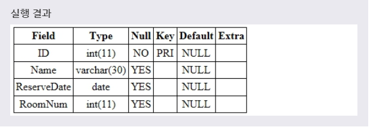

# PRIMARY KEY
***

## 1. PRIMARY KEY

* PRIMARY KEY 제약 조건을 설정하면, **해당 필드는 NOT NULL과 UNIQUE 제약 조건의 특징을 모두 가지게 된다.(PRIMARY KEY가 짱임.)** 따라서 이 제약 조건이 설정된 필드는 **NULL 값을 가질 수 없으며, 또한 중복된 값을 가져서도 안된다.** 이러한 PRIMARY KEY 제약 조건을 **기본 키** 라고 부른다.

* UNIQUE는 한 테이블의 여러 필드에 설정할 수 있지만, **PRIMARY KEY는 테이블당 오직 하나의 필드에만 설정할 수 있다.** 이러한 PRIMARY KEY 제약 조건은 테이블의 데이터를 쉽고 빠르게 찾도록 도와주는 역할을 한다.
***

## 2. CREATE 문으로 PRIMARY KEY 설정

* CREATE 문에서 테이블을 생성할 때 다음과 같이 PRIMARY KEY 제약 조건을 설정할 수 있다. CREATE 문으로 테이블을 생성할 때 해당 필드의 타입 뒤에 PRIMARY KEY를 명시하면, 해당 필드가 기본키로 설정된다.

* 문법
  ```SQL
  CREATE TABLE 테이블이름(
    필드이름 필드타입 PRIMARY KEY,
    ...
  );
  ```

  ```SQL
  CREATE TABLE TEST(
    필드이름 필드타입,
    ...
    [CONSTRAINT 제약조건이름] PRIMARY KEY (필드이름)
  );
  ```
  위의 두 문법은 모두 해당 필드에 PRIMARY KEY 제약 조건을 설정한다. 이때 두 번째 문법을 사용하면, 해당 제약 조건에 이름을 설정할 수 있다.

* 예제
  ```SQL
  CREATE TABLE TEST(
    ID INT PRIMARY KEY,
    NAME VARCHAR(30),
    RESERVEDATE DATE,
    ROOMNUM INT
  );
  ```
  다음 예제는 CREATE TABLE 문을 사용하여 Test 테이블을 생성하면서 ID 필드를 기본 키로 설정하는 예제이다.

* 
***

## 3. ALTER 문으로 PRIMARY KEY 설정

* ALTER 문으로 테이블에 새로운 필드를 추가하거나 수정할 때도 PRIMARY KEY 제약 조건을 설정할 수 있다.

* 문법1
  ```SQL
  ALTER TABLE 테이블이름
  ADD 필드이름 필드타입 PRIMARY KEY;

  ALTER TABLE 테이블이름
  ADD [CONSTRAINT 제약조건이름] PRIMARY KEY (필드이름);
  ```
  테이블에 **새로운 필드를 추가할 때 해당 필드를 기본 키로 설정** 하는 문법이다.

* 문법2
  ```SQL
  ALTER TABLE 테이블이름
  MODIFY COLUMN 필드이름 필드타입 PRIMARY KEY;

  ALTER TABLE 테이블이름
  MODIFY COLUMN [CONSTRAINT 제약조건 이름] PRIMARY KEY (필드이름);
  ```
  **기존 필드에 기본 키로 설정** 하는 문법이다.

* **PRIMARY KEY 제약 조건을 추가할 기존 필드는 NULL 값을 갖지 않도록 먼저 선언되어 있어야 한다.**

* 예제1
  ```SQL
  ALTER TABLE TEST
  CONSTRAINT CUSTOMERID ADD PRIMARY KEY (ID);
  ```
  풀어서 말하면, **TEST 테이블로부터 ID 필드에 CUSTOMERID라는 이름을 가지는 PRIMARY KEY 제약 조건을 설정하겠다.** 라는 뜻이다.

* 

* 문법3
  ```SQL
  ALTER TABLE 테이블이름
  DROP PRIMARY KEY;
  ```
  **설정된 PRIMARY KEY 제약 조건을 삭제** 하는 문법이다.

* 예제2
  ```SQL
  ALTER TABLE TEST
  DROP PRIMARY KEY;
  ```
