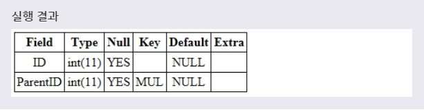
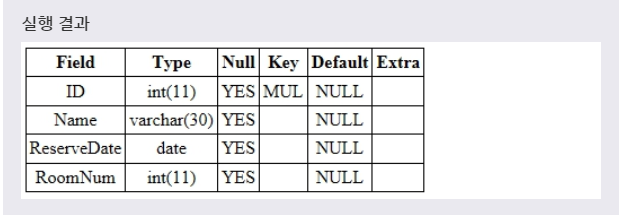

# FOREIGN KEY
***

## 1. FOREIGN KEY

* FOREIGN KEY 제약 조건을 설정한 필드는 외래 키라고 부르며, **한 테이블을 다른 테이블과 연결해주는 역할을 하게 된다.(부모 - 자식관계)** 외래 키가 설정된 테이블에 레코드를 입력하면, 기준이 되는 테이블의 내용을 참조해서 레코드가 입력된다. 즉, FOREIGN KEY 제약 조건은 **하나의 테이블을 다른 테이블에 의존** 하게 만든다.

* FOREIGN KEY 제약 조건을 설정할 때 참조되는 테이블의 필드는 **반드시 UNIQUE나 PRIMARY KEY 제약 조건이 설정** 되어 있어야 한다.
***

## 2. CREATE 문으로 FOREIGN KEY 설정

* CREATE 문에서 테이블을 생성할 때 다음과 같이 FOREIGN KEY 제약 조건을 설정할 수 있다. CREATE 문으로 테이블을 생성할 때 해당 필드의 타입 뒤에 FOREIGN KEY를 명시하면, 해당 필드가 외래 키로 설정된다.

* 문법
  ```SQL
  CREATE TABLE 테이블이름(
    필드이름 필드타입,
    ...,
    [CONSTRAINT 제약조건이름]
    FOREIGN KEY (필드이름)
    REFERENCES 테이블이름 (필드이름)
  );
  ```
  위의 문법을 사용하면 해당 필드에 FOREIGN KEY 제약 조건을 설정한다. 이때 **참조되는 테이블의 이름은 REFERENCES 키워드 다음에 명시** 된다.

* 예제
  ```SQL
  CREATE TABLE TEST_PARENT(
    ID INT,
    PARENTID INT,
    FOREIGN KEY (PARENTID)
    REFERENCES TEST_CHILD(ID) ON UPDATE CASCADE
  );
  ```
  다음 예제는 **TEST 테이블의 PARENTID 필드에 TEST1 테이블의 ID 필드를 참조** 하는 FOREIGN KEY 제약 조건을 설정하는 예제이다. **한마디로 TEST에서 PARENTID 필드가 TEST1에서 ID 필드가 된다.**

* 
* 위의 예제에서 TEST 테이블의 PARENTID 필드는 TEST1 테이블의 ID 필드를 참조하도록 설정된다. 따라서 TEST1 테이블의 ID필드가 변경되면, 같은 값의 TEST 테이블의 PARENTID 필드도 같이 변경될 것이다.
***

## 3. ALTER 문으로 FOREIGN KEY 설정

* ALTER 문으로 테이블에 새로운 필드를 추가하거나 수정할 때도 FOREIGN KEY 제약 조건을 설정할 수 있다.

* 문법1
  ```SQL
  ALTER TABLE 테이블이름
  ADD [CONSTRAINT 제약조건이름]
  FOREIGN KEY (필드이름)
  REFERENCES 테이블이름 (필드이름);
  ```
  테이블에 **새로운 필드를 추가할 때 해당 필드를 외래 키로 설정** 하는 문법이다.

* 예제1
  ```SQL
  ALTER TABLE TEST_PARENT
  ADD CONSTRAINT CUSTOMERID
  FOREIGN KEY (PARENTID)
  REFERENCES TEST_CHILD (ID);
  ```
  풀어서 말하면, **TEST 테이블로부터 PARENTID 필드에 CUSTOMERID라는 이름을 가지는 FOREIGN KEY 제약 조건을 설정하여 수정하겠다.** 라는 뜻이다.

* 

* 문법2
  ```SQL
  ALTER TABLE 테이블이름
  DROP FOREIGN KEY 제약조건이름
  ```
  **설정된 FOREIGN KEY 제약 조건을 삭제** 하는 문법이다.

* 예제2
  ```SQL
  ALTER TABLE TEST
  DROP FOREIGN KEY CUSTOMERID;
  ```
  위 예제는 TEST 테이블의 ID 필드에 설정된 FOREIGN KEY 제약 조건을 삭제하는 예제이다.

## 4. ON DELETE, ON UPDATE

* 
