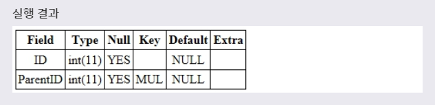

# FOREIGN KEY
***

## 1. FOREIGN KEY

* FOREIGN KEY 제약 조건을 설정한 필드는 외래 키라고 부르며, **한 테이블을 다른 테이블과 연결해주는 역할을 하게 된다.(부모 - 자식관계)** 외래 키가 설정된 테이블에 레코드를 입력하면, 기준이 되는 테이블의 내용을 참조해서 레코드가 입력된다. 즉, FOREIGN KEY 제약 조건은 **하나의 테이블을 다른 테이블에 의존** 하게 만든다.

* FOREIGN KEY 제약 조건을 설정할 때 참조되는 테이블의 필드는 **반드시 UNIQUE나 PRIMARY KEY 제약 조건이 설정** 되어 있어야 한다.
***

## 2. CREATE 문으로 FOREIGN KEY 설정

* CREATE 문에서 테이블을 생성할 때 다음과 같이 FOREIGN KEY 제약 조건을 설정할 수 있다. CREATE 문으로 테이블을 생성할 때 해당 필드의 타입 뒤에 FOREIGN KEY를 명시하면, 해당 필드가 외래 키로 설정된다.

* 문법
  ```SQL
  CREATE TABLE 테이블이름(
    필드이름 필드타입,
    ...,
    [CONSTRAINT 제약조건이름]
    FOREIGN KEY (필드이름)
    REFERENCES 테이블이름 (필드이름)
  );
  ```
  위의 문법을 사용하면 해당 필드에 FOREIGN KEY 제약 조건을 설정한다. 이때 **참조되는 테이블의 이름은 REFERENCES 키워드 다음에 명시** 된다.

* 예제
  ```SQL
  CREATE TABLE TEST_PARENT(
    ID INT,
    PARENTID INT,
    FOREIGN KEY (PARENTID)
    REFERENCES TEST_CHILD(ID) ON UPDATE CASCADE
  );
  ```
  다음 예제는 **TEST_PARENT 테이블의 PARENTID 필드에 TEST_CHILD 테이블의 ID 필드를 참조** 하는 FOREIGN KEY 제약 조건을 설정하는 예제이다. **한마디로 TEST_PARENT에서 PARENTID 필드가 TEST_CHILD에서 ID 필드가 된다.**

* 
* 위의 예제에서 TEST_PARENT 테이블의 PARENTID 필드는 TEST_CHILD 테이블의 ID 필드를 참조하도록 설정된다. 따라서 TEST_CHILD 테이블의 ID필드가 변경되면, 같은 값의 TEST_PARENT 테이블의 PARENTID 필드도 같이 변경될 것이다.
***

## 3. ALTER 문으로 FOREIGN KEY 설정

* ALTER 문으로 테이블에 새로운 필드를 추가하거나 수정할 때도 FOREIGN KEY 제약 조건을 설정할 수 있다.

* 문법1
  ```SQL
  ALTER TABLE 테이블이름
  ADD [CONSTRAINT 제약조건이름]
  FOREIGN KEY (필드이름)
  REFERENCES 테이블이름 (필드이름);
  ```
  테이블에 **새로운 필드를 추가할 때 해당 필드를 외래 키로 설정** 하는 문법이다.

* 예제1
  ```SQL
  ALTER TABLE TEST_PARENT
  ADD CONSTRAINT CUSTOMERID
  FOREIGN KEY (PARENTID)
  REFERENCES TEST_CHILD (ID);
  ```
  풀어서 말하면, **TEST_PARENT 테이블로부터 PARENTID 필드에 CUSTOMERID라는 이름을 가지는 FOREIGN KEY 제약 조건을 설정하여 수정하겠다.** 라는 뜻이다.

* 

* 문법2
  ```SQL
  ALTER TABLE 테이블이름
  DROP FOREIGN KEY 제약조건이름
  ```
  **설정된 FOREIGN KEY 제약 조건을 삭제** 하는 문법이다.

* 예제2
  ```SQL
  ALTER TABLE TEST
  DROP FOREIGN KEY CUSTOMERID;
  ```
  위 예제는 TEST 테이블의 ID 필드에 설정된 FOREIGN KEY 제약 조건을 삭제하는 예제이다.

## 4. ON DELETE, ON UPDATE

* FOREIGN KEY 제약 조건에 의해 **참조되는 테이블에서 데이터의 수정이나 삭제가 발생하면, 참조하고 있는 테이블의 데이터도 같이 영향을 받게 된다.** 이때 참조하고 있는 테이블의 동작은 다음 키워드를 사용하여 FOREIGN KEY 제약 조건에서 미리 설정할 수 있다.
  * ON DELETE - 참조되는 테이블의 값이 삭제될 경우의 동작은 ON DELETE 구문으로 설정할 수 있다.
  * ON UPDATE - 참조되는 테이블의 값이 수정될 경우의 동작은 ON UPDATE 구문으로 설정할 수 있습니다.(ON UPDATE를 주로 많이 쓰인다.)

* 이때 설정할 수 있는 동작은 다음과 같습니다.
  * CASCADE : 참조되는 테이블에서 데이터를 삭제하거나 수정하면, 참조하는 테이블에서도 삭제와 수정이 같이 이루어진다.
  * SET NULL : 참조되는 테이블에서 데이터를 삭제하거나 수정하면, 참조하는 테이블의 데이터는 NULL로 변경된다..
  * NO ACTION : 참조되는 테이블에서 데이터를 삭제하거나 수정해도, 참조하는 테이블의 데이터는 변경되지 않는다.
  * SET DEFAULT : 참조되는 테이블에서 데이터를 삭제하거나 수정하면, 참조하는 테이블의 데이터는 필드의 기본값으로 설정된다.
  * RESTRICT : 참조하는 테이블에 데이터가 남아 있으면, 참조되는 테이블의 데이터를 삭제하거나 수정할 수 없다.

  * 예제
    ```SQL
    CREATE TABLE TEST_PARENT(
      ID INT,
      PARENTID INT,
      FOREIGN KEY (PARENTID)
      REFERENCES TEST_CHILD(ID) ON UPDATE CASCADE ON DELETE RESTRICT
    );
    ```
    다음 예제는 TEST_PARENT 테이블의 PARENTID 필드에 TEST_CHILD 테이블의 ID 필드를 참조하는 FOREIGN KEY 제약 조건을 설정하는 예제이다. 이때 참조되는 필드의 데이터가 수정될 때는 CASCADE 방식으로, 삭제될 때는 RESTRICT 방식으로 동작하게 된다.

  * 

  * CASCADE 방식 - TEST_PARENT 테이블의 ID 필드가 참조하고 있는 TEST_CHILD 테이블의 ID 값이 수정되면, **TEST_PARENT 테이블의 ID 값도 같이 수정** 될 것이다.

  * RESTRICT 방식 - TEST_PARENT 테이블의 레코드 중에서 **TEST_CHILD 테이블의 레코드가 ID 필드를 참조하는 레코드는 삭제할 수 없게 된다.**
