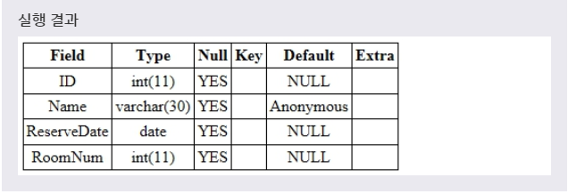
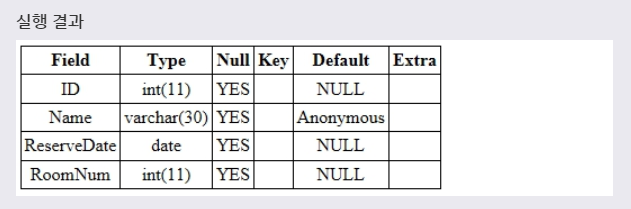

# DEFAULT
> DEFAULT 제약 조건은 해당 필드의 기본값을 설정할 수 있게 해준다. 만약 레코드를 입력할 때 해당 필드 값을 전달하지 않으면, 자동으로 설정된 기본값을 저장한다.
***

## 1. CREATE 문으로 DEFAULT 설정

* CREATE 문에서 테이블을 생성할 때 다음과 같이 제약 조건을 설정할 수 있다.

* 문법
  ```SQL
  CREATE TABLE 테이블이름(
    필드이름 필드타입 DEFAULT 기본값,
    ...
  );
  ```
  CREATE 문에서 테이블을 생성할 때 해당 필드의 타입 뒤에 DEDEFAULT를 명시하면, 해당 필드의 기본값을 설정할 수 있다.

* 예제
  ```SQL
  CREATE TABLE RESERVATION(
    ID INT,
    NAME VARCHAR(30) DEFAULT 'Anonymous',
    RESERVEDATE DATE,
    ROOMNUM INT
  );
  ```
  위의 예제는 CREATE TABLE 문을 사용하여 RESERVATION 테이블을 생성하면서 NAME 필드에 DEFAULT 제약 조건을 이용하여 기본값을 설정하는 예제이다.

* 
* 새로운 레코드를 추가할 때 NAME 필드 값을 전달하지 않으면, 자동으로 기본값인 'Anonymous'가 저장될 것이다.
***

## 2. ALTER 문으로 DEFAULT 설정

* ALTER 문으로 테이블에 새로운 필드를 추가하거나 수정할 때도 DEFAULT 제약 조건을 설정할 수 있다.

* 문법
  ```SQL
  ALTER TABLE 테이블이름
  ADD 필드이름 필드타입 DEFAULT 기본값;
  ```
  테이블에 새로운 필드를 추가할 때 DEFAULT 제약 조건을 설정하는 문법이다.

  ```SQL
  ALTER TABLE 테이블이름
  MODIFY COLUMN 필드이름 필드타입 DEFAULT 기본값;

  ALTER TABLE 테이블이름
  ALTER 필드이름 SET DEFAULT 기본값;
  ```
  기존 필드에 DEFAULT 제약 조건을 설정하는 문법이다.

* 예제
  ```SQL
  ALTER TABLE RESERVATION
  ALTER NAME SET DEFAULT 'Anonymous';
  ```
  풀어서 말하면, **RESERVATION 테이블로부터 NAME 필드에 DEFAULT로 NULL이 아닌 'Anonymous'란 값으로 설정하도록(SET) 변경하겠다.** 라는 뜻이다.

* 

* 다음은 DEFAULT 제약 조건을 삭제하는 방법이다.

* 문법
  ```SQL
  ALTER TABLE 테이블이름
  ALTER 필드이름 DROP DEFAULT;
  ```

* 예제
  ```SQL
  ALTER TABLE RESERVATION
  ALTER NAME DROP DEFAULT;
  ```
  풀어서 말하면, **RESERVATION 테이블로부터 NAME 필드에 DEFAULT 값을 DROP하도록 변경하겠다.** 라는 뜻이다.
