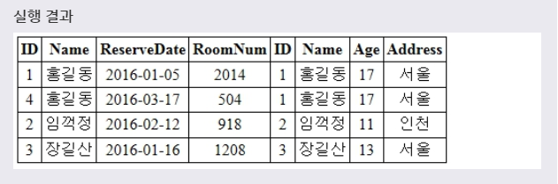
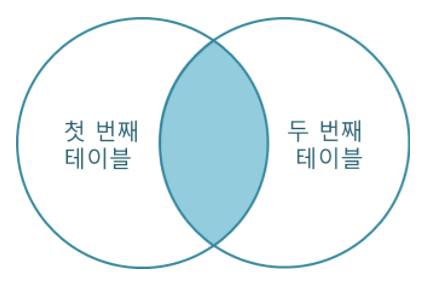
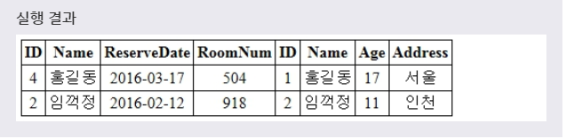
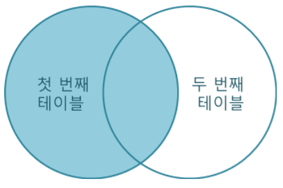
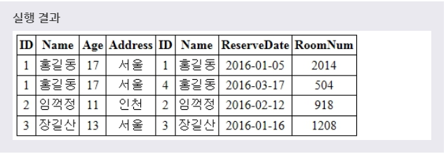
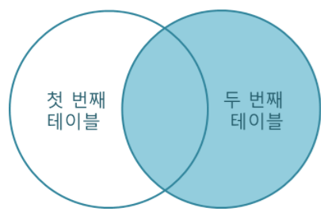

# JOIN
***

## 1. JOIN

* JOIN은 데이터베이스 내의 **여러 테이블에서 가져온 레코드를 조합하여 하나의 테이블이나 결과 집합으로 표현** 해준다. 이러한 JOIN은 보통 SELECT 문과 함께 자주 사용된다.

* 표준 SQL에서는 레코드를 조합하는 방식에 따라 JOIN을 다음과 같이 구분한다.
  * INNER JOIN
  * LEFT JOIN
  * RIGHT JOIN
***

## 2. INNER JOIN

* INNER JOIN은 ON 절과 함께 사용되며, **ON절의 조건을 만족하는 데이터만을 가져온다.**

* 문법
  ```SQL
  첫번째테이블이름
  INNER JOIN 두번째테이블이름
  ON 조건;

  첫번째테이블이름
  JOIN 두번째테이블이름
  ON 조건;
  ```
  **ON 절에서는 WHERE 절에서 사용할 수 있는 모든 조건을 사용** 할 수 있다. 표준 SQL과는 달리 MySQL에서는 **JOIN, INNER JOIN, CROSS JOIN이 모두 같은 의미** 로 사용된다.

* 예제1
  ```SQL
  SELECT *
  FROM TEST
  INNER JOIN CUSTOMER
  ON TEST.NAME = CUSTOMER.NAME;

  SELECT *
  FROM TEST
  JOIN CUSTOMER
  ON TEST.NAME = CUSTOMER.NAME;
  ```
  위의 예제는 TEST 테이블의 NAME 필드와 CUSTOMER 테이블의 NAME 필드가 **서로 일치하는 레코드만** 을 INNER JOIN으로 가져오는 예제입니다. JOIN 결과는 **하나의 테이블 형태** 로 반환된다.

* 

* **INNER JOIN의 결과를 벤 다이어그램** 으로 나타내면 다음과 같다.
* 

* INNER JOIN의 경우에는 앞서 살펴본 표준 SQL 방식과는 별도로 **MySQL에서만 사용할 수 있는 방식** 이 따로 존재한다.

* 예제2
  ```SQL
  SELECT *
  FROM TEST, CUSTOMER
  WHERE TEST.NAME = CUSTOMER.NAME;
  ```
  위의 예제는 앞서 살펴본 INNER JOIN 예제와 같은 실행 결과를 보여줄 것이다.

* 예제3
  ```SQL
  SELECT *
  FROM TEST AS R, CUSTOMER AS C
  WHERE R.NAME = C.NAME;
  ```
  위의 예제처럼 테이블의 이름이 길거나 복잡한 경우에는 별칭(ALIAS)을 사용하여 SQL 구문을 간략화할 수 있다.
***

## 3. LEFT JOIN

* **LEFT JOIN은 첫 번째 테이블을 기준으로, 두 번째 테이블을 조합하는 JOIN** 이다. 이때 ON 절의 조건을 만족하지 않는 경우에는 첫 번째 테이블의 필드 값은 그대로 가져온다. 하지만 해당 레코드의 두 번째 테이블의 필드 값은 모두 NULL로 표시된다.

* 문법
  ```SQL
  첫번째테이블이름
  LEFT JOIN 두번째테이블이름
  ON 조건;
  ```
  ON 절에서는 WHERE 절에서 사용할 수 있는 모든 조건을 사용할 수 있다.

* 예제
  ```SQL
  SELECT *
  FROM TEST
  LEFT JOIN CUSTOMER
  ON TEST.NAME = CUSTOMER.NAME
  WHERE RESERVEDATE > '2017-02-01';
  ```
  풀어서 말하면, **TEST 테이블의 NAME 필드를 기준으로 CUSTOMER 테이블의 NAME 필드와 일치하는 레코드만을 LEFT JOIN으로 가져온 후, 그 중에서 RESERVEDATE 필드의 값이 2017년 02월 01일 이후인 레코드만을 선택하겠다.** 라는 뜻이다.

* 
* 위의 예제에서 두 개의 Name 값이 일치하면, INNER JOIN과 같이 두 테이블의 모든 필드를 그대로 가져온다. 하지만 두 개의 Name 값이 일치하지 않는 경우에는 Customer 테이블의 모든 필드를 NULL로 표시하게 된다.

* **LEFT JOIN의 결과를 벤 다이어그램** 으로 나타내면 다음과 같다.
* 
***

## 4. RIGHT JOIN

* **RIGHT JOIN은 LEFT 조인과는 반대로 두 번째 테이블을 기준으로, 첫 번째 테이블을 조합하는 JOIN** 이다. 이때 ON 절의 조건을 만족하지 않는 경우에는 두 번째 테이블의 필드 값은 그대로 가져온다. 하지만 해당 레코드의 첫 번째 테이블의 필드 값은 모두 NULL로 표시된다.

* 문법
  ```SQL
  첫번째테이블이름
  RIGHT JOIN 두번째테이블이름
  ON 조건;
  ```
  ON 절에서는 WHERE 절에서 사용할 수 있는 모든 조건을 사용할 수 있다.

* 예제
  ```SQL
  SELECT *
  FROM TEST
  RIGHT JOIN CUSTOMER
  ON TEST.NAME = CUSTOMER.NAME;
  ```
  풀어서 말하면, **CUSTOMER 테이블의 NAME 필드를 기준으로 TEST 테이블의 NAME 필드와 일치하는 레코드만을 RIGHT JOIN으로 가져와서 CUSTOMER 테이블을 중심으로 선택하겠다.** 라는 뜻이다.

* 
* 위의 예제에서 두 개의 Name 값이 일치하면, INNER JOIN과 같이 두 테이블의 모든 필드를 그대로 가져온다. 하지만 두 개의 Name 값이 일치하지 않는 경우에는 TEST 테이블의 모든 필드를 NULL로 표시하게 된다.

* **RIGHT JOIN의 결과를 벤 다이어그램** 으로 나타내면 다음과 같다.
* 
