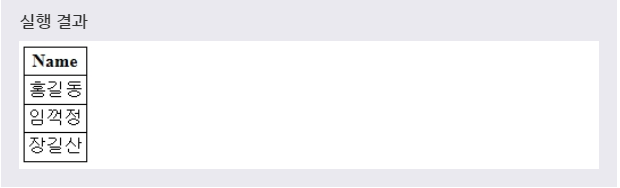
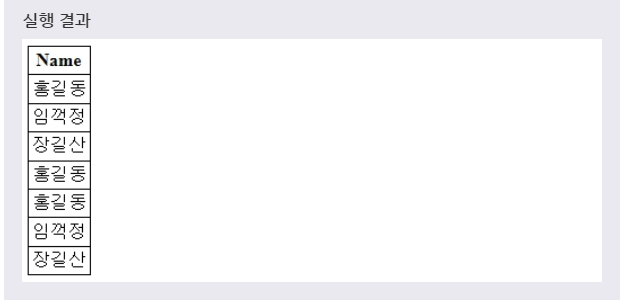

# UNION
***

## 1. UNION

* UNION은 **여러 개의 SELECT 문의 결과를 하나의 테이블이나 결과 집합으로 표현할 때 사용** 한다. 이때 **각각의 SELECT 문으로 선택된 필드의 개수와 타입은 모두 같아야 하며, 필드의 순서 또한 같아야 한다.**

* 문법
  ```SQL
  SELECT 필드이름
  FROM 테이블이름
  UNION
  SELECT 필드이름
  FROM 테이블이름;
  ```

* 예제
  ```SQL
  SELECT NAME
  FROM TEST
  UNION
  SELECT NAME
  FROM CUSTOMER;
  ```
  풀어서 말하면, **TEST 테이블에 있는 NAME 필드를 검색한 것과와 CUSTOMER 테이블에 있는 NAME 필드를 검색한 것 기준으로 UNION을 이용하여 하나의 테이블로 출력하겠다.** 라는 뜻이다.

* 
* 위의 예제에서 두 SELECT 문의 결과는 하나로 합쳐져서 출력된다. 이때 두 SELECT 문의 결과에서 중복된 레코드인 '홍길동'은 한 번만 표시된다.
***

## 2. UNION ALL

* 위의 예제처럼 UNION은 DISTINCT(중복되는 값 제거) 키워드를 따로 명시하지 않아도 기본적으로 중복되는 레코드를 제거한다. 따라서 이렇게 **중복되는 레코드까지 모두 출력** 하고 싶다면, ALL 키워드를 사용해야 한다.

* 문법
  ```SQL
  SELECT 필드이름
  FROM 테이블이름
  UNION ALL
  SELECT 필드이름
  FROM 테이블이름;
  ```

* 예제
  ```SQL
  SELECT NAME
  FROM TEST
  UNION ALL
  SELECT NAME
  FROM CUSTOMER;
  ```
  풀어서 말하면, **TEST 테이블에 있는 NAME 필드를 검색한 것과와 CUSTOMER 테이블에 있는 NAME 필드를 검색한 것 기준으로 UNION ALL을 이용하여 하나의 테이블로 출력하겠다.** 라는 뜻이다.

* 
* 위의 예제에서 두 SELECT 문의 결과는 하나로 합쳐져서 출력된다. 이때 두 SELECT 문의 결과는 중복된 레코드까지 모두 표시된다.
***

## 3. UNION과 UNION ALL의 차이점

* EX) BOYFRIEND - 원빈, 송승헌, 현빈, 외계중성 / GIRLFRIEND - 송혜교, 신민아, 한가인, 한예슬, 외계중성

* 예제1
  ```SQL
  SELECT BOYFRIEND, GIRLFRIEND
  FROM TABLE
  UNION
  SELECT BOYFRIEND, GIRLFRIEND
  FROM TABLE2;
  ```

* 실행결과 - 원빈, 송승헌, 현빈, 외계중성, 송혜교, 신민아, 한가인, 한예슬

* 예제2
  ```SQL
  SELECT BOYFRIEND, GIRLFRIEND
  FROM TABLE
  UNION ALL
  SELECT BOYFRIEND, GIRLFRIEND
  FROM TABLE2;
  ```

* 실행결과 - 원빈, 송승헌, 현빈, 외계중성, 송혜교, 신민아, 한가인, 한예슬, **외계중성**
***

## 4. JOIN과 UNION의 공통점과 차이점

* 공통점 - 하나 이상의 테이블에서 특정한 COLUMN을 검색할 때 사용한다.

* 차이점
  * JOIN
    * **WHERE(ON) 조건** 으로 두 개 이상의 테이블에서 원하는 COLUMN을 선택하여 검색한다.
    * 관계가 있는 여러 개의 테이블로부터 하나의 결과물을 만들기 위해 **병렬 조합** 에 사용된다.
    * 두 개 이상의 테이블로부터 쿼리하여 하나의 결과물을 만드는 연산 방법이다.

  * UNION
    * 두 개 이상의 **SELECT 문으로 사용** 하여 그 검색 결과를 합친다.
    * 결과물과 결과물을 상하위로 합치는 **직렬 조합** 에 사용
    * ORDER BY, COMPUTE BY는 마지막 SELECT 절에 위치한다.
    * 일반적인 업무 수행시 ALL이란 구문을 같이 사용하는 것이 대부분이다.
    * 모든 컬럼이 같이 않다는 것을 알고 ALL이란 구문을 명시하지 않은 경우, 수행 결과는 같지만 같은 지 비교하는 작업이 수행되므로 **ALL을 명시하지 않은 경우 속도가 느리다.(DISTINCT한지 알아내기 위해 대부분 HASH KEY를 만들고 HASH JOIN을 수행, SORT/DISTINCT SORT OR MERGY JOIN/UNION을 수행하기 때문에 시간이 소요)**

* 집합적으로 표현하면, **JOIN은 교집합이고, UNION은 합집합이다.**
