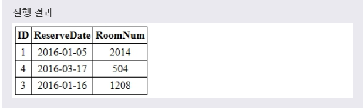
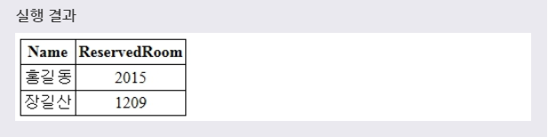

# 서브쿼리
***

## 1. 서브쿼리(SUBQUERY) - '다중검색문', 'FOR문'

* 서브쿼리(subquery)란 다른 쿼리 내부에 포함되어 있는 **SELETE 문** 을 의미한다. 서브쿼리를 포함하고 있는 쿼리를 외부쿼리(outer query)라고 부르며, 서브쿼리는 내부쿼리(inner query)라고도 부른다. 서브쿼리는 반드시 괄호(())로 감싸져 있어야만 한다.

* MySQL에서 서브쿼리를 포함할 수 있는 외부쿼리는 SELECT, INSERT, UPDATE, DELETE, SET, DO 문이 있다. 이러한 서브쿼리는 또 다시 다른 서브쿼리 안에 포함될 수 있다.

* 예제
  ```SQL
  SELECT ID, RESERVEDATE, ROOMNUM - ①
  FROM TEST
  WHERE NAME IN (SELECT NAME            - ②
                 FROM CUSTOMER
                 WHERE ADDRESS = '서울');
  ```
  풀어서 말하면, **TEST 테이블에 있는 ID, RESERVEDATE, ROOMNUM를 검색한다. 조건은 CUSTOMER 테이블에 있는 주소가 서울인 NAME 필드에서 NAME 필드가 조건이다.** 라는 뜻이다.

* 
* 위의 예제에서 ①번 라인의 SELECT 문은 외부쿼리이며, ②번 라인의 SELECT 문은 서브쿼리이다. 우선 ②번 라인의 서브쿼리가 먼저 실행되어 Customer 테이블의 Address 필드의 값이 '서울'인 레코드의 Name 필드를 모두 선택한다. 그리고서 ①번 라인의 외부쿼리가 실행되어 Reservation 테이블에서 서브쿼리에 의해 선택된 결과 집합에 포함된 Name 필드와 일치하는 레코드만을 다시 선택한다.
***

## 2. 서브쿼리의 특징

* 서브쿼리를 사용하면 다음과 같은 장점을 얻을 수 있다.
  * 서브쿼리는 쿼리를 구조화시키므로, 쿼리의 각 부분을 명확히 구분할 수 있게 해준다.
  * 서브쿼리는 복잡한 JOIN이나 UNION과 같은 동작을 수행할 수 있는 또 다른 방법을 제공한다.
  * 서브쿼리는 복잡한 JOIN이나 UNION 보다 좀 더 읽기 편하다.

* 예제
  ```SQL
  SELECT T.ID, T.RESERVEDATE, T.ROOMNUM
  FROM TEST AS T, CUSTOMER AS C
  WHERE C.ADDRESS = '서울' AND T.NAME = C.NAME;
  ```
  위 예제는 위에서 살펴본 예제를 JOIN을 사용하여 표현한 것이다. 쿼리가 복잡한 경우에 JOIN이나 UNION을 사용하는 것보다 서브쿼리를 사용하는 것이 가독성 측면에서 좋다.

* 잘못된 예제
  ```SQL
  UPDATE TEST ...
  WHERE RESERVEDATE = (SELECT ... FROM TEST ...);
  ```
  서브쿼리에서 사용된 테이블이나 그 결과 집합은 수정할 수 없다.
***

## 3. FROM 절의 서브쿼리

* 서브쿼리는 SELECT 문의 FROM 절에서도 사용할 수 있다. 이때 서브쿼리에 의해 선택된 결과 집합은 FROM 절에서 하나의 테이블로써 사용된다.

* 문법
  ```SQL
  SELECT ...
  FROM (서브쿼리) [AS] 이름
  ...;
  ```
  SELECT 문의 FROM 절에서 사용되는 모든 테이블에는 이름이 필요하다. 따라서 FROM 절에서 사용되는 서브쿼리는 위의 문법처럼 반드시 이름을 정의해야 한다.

* 예제
  ```SQL
  SELECT NAME, RESERVEDROOM
  FROM TEST (SELECT NAME, RESERVEDATE, (ROOMNUM + 1) AS RESERVEDROOM)  - ①
             FROM TEST                         
             WHERE ROOMNUM > 1001 ) AS RESERVATIONINFO;   - ②
  ```

* 
* 위의 예제는 우선 ①번 라인의 서브쿼리가 먼저 실행된다. 해당 서브쿼리는 TEST 테이블에서 RoomNum 필드의 값이 1001 이상인 레코드를 찾은 후에, RoomNum 필드값을 1씩 증가시킨다. 그리고 해당 결과 집합은 ②번 라인에서 ReservationInfo라는 이름의 임시 테이블로 만들어진다. 외부쿼리에서는 이렇게 만들어진 임시 테이블에서 Name, ReservedRoom 필드만을 선택하게 된다.
