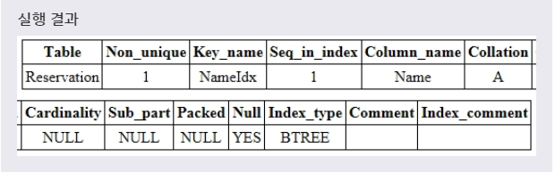
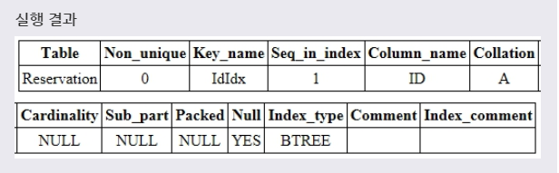
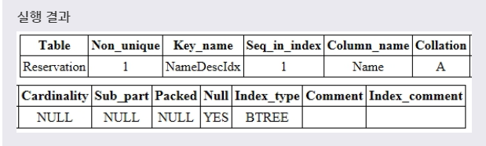

# INDEX 생성
***

## 1. 인덱스(INDEX)란?

* 인덱스(index)는 **테이블에서 원하는 데이터를 쉽고 빠르게 찾기 위해 사용** 한다. 이러한 인덱스는 자주 사용되는 필드 값으로 만들어진 **원본 테이블의 사본** 이라고 생각할 수 있다.

* MySQL에서 데이터를 검색할 때는 첫 번째 필드부터 차례대로 테이블 전체를 검색한다. 따라서 **테이블이 크면 클수록 데이터를 탐색하는 시간도 많이 늘어나게 된다.**

* 하지만 **인덱스를 사용하면 테이블 전체를 읽지 않아도 되므로, 검색과 질의에 대한 처리가 빠르게 이루어진다.** 이러한 인덱스는 사용자가 직접 접근할 수는 없으며, 검색과 질의에 대한 처리에서만 사용된다.

* 이렇게 인덱스가 설정된 필드 값을 포함한 **데이터의 삽입, 삭제, 수정 작업이 원본 테이블에서 이루어질 경우, 인덱스도 함께 수정 되어야한다..** 따라서 인덱스가 설정된 테이블의 처리 속도가 느려질 수 있다. 그러므로 인덱스는 수정보다는 **검색이 자주 사용되는 테이블에서 사용하는 것이 더 좋다.**
***

## 2. 인덱스 생성

* CREATE 문을 사용하여 인덱스를 생성할 수 있다.

* 문법
  ```SQL
  CREATE INDEX 인덱스이름
  ON 테이블이름(필드이름1, 필드이름2, ...);
  ```
  이때 쉼표(,)를 사용하여 여러 필드를 가지는 인덱스를 생성할 수도 있다.

* 예제
  ```SQL
  CREATE INDEX NAMEDIX
  ON RESERVATION (NAME);
  ```
  풀어서 말하면, **RESERVATION 테이블에 있는 NAME 필드에 NAMEIDX라는 인덱스를 만들겠다.** 라는 뜻이다.

* 
***

## 3. 인덱스 정보 보기

* 문법
  ```SQL
  SHOW INDEX
  FROM 테이블이름;
  ```
  위와 같이 생성(CREATE)한 인덱스는 위의 같은 문법을 통해 확인할 수 있다. 위와 같은 문법을 사용하면 해당 테이블에 생성된 모든 인덱스의 정보를 보여준다.

* 이때 반환되는 인덱스 정보의 필드 값은 다음과 같다.
  * Table : 테이블의 이름을 표시함.
  * Non_unique : 인덱스가 중복된 값을 저장할 수 있으면 1, 저장할 수 없으면 0을 표시함.
  * Key_name : 인덱스의 이름을 표시하며, 인덱스가 해당 테이블의 기본 키라면 PRIMARY로 표시함.
  * Seq_in_index : 인덱스에서의 해당 필드의 순서를 표시함.
  * Column_name : 해당 필드의 이름을 표시함.
  * Collation : 인덱스에서 해당 필드가 정렬되는 방법을 표시함.
  * Cardinality : 인덱스에 저장된 유일한 값들의 수를 표시함.
  * Sub_part : 인덱스 접두어를 표시함.
  * Packed : 키가 압축되는(packed) 방법을 표시함.
  * Null : 해당 필드가 NULL을 저장할 수 있으면 YES를 표시하고, 저장할 수 없으면 ''를 표시함.
  * Index_type : 인덱스에 사용되는 메소드(method)를 표시함.
  * Comment : 해당 필드를 설명하는 것이 아닌 인덱스에 관한 기타 정보를 표시함.
  * Index_comment : 인덱스에 관한 모든 기타 정보를 표시함.
***

## 4. UNIQUE INDEX 생성

* UNIQUE INDEX는 중복 값을 허용하지 않는 인덱스이다.

* 문법
  ```SQL
  CREATE UNIQUE INDEX 인덱스이름
  ON 테이블이름(필드이름1, 필드이름2, ...);
  ```
  이때 쉼표(,)를 사용하여 여러 필드에 UNIQUE INDEX를 설정해 줄 수도 있다.

* 예제
  ```SQL
  CREATE UNIQUE INDEX IDIDX
  ON RESERVATION (ID);
  ```
  풀어서 말하면, **RESERVATION 테이블에 있는 ID 필드에 IDIDX라는 UNIQUE INDEX를 만들겠다.** 라는 뜻이다.

* 
***

## 5. 인덱스 정렬

* 인덱스를 생성할 때 인덱스에 포함되는 필드의 정렬 방식을 설정할 수 있다. DESC 키워드를 사용하면 내림차순으로 정렬되며, ASC 키워드를 사용하면 오름차순으로 정렬된다.

* 문법
  ```SQL
  CREATE INDEX 인덱스이름
  ON 테이블이름 (필드이름 DESC);

  CREATE INDEX 인덱스이름
  ON 테이블이름 (필드이름 ASC);
  ```

* 예제
  ```SQL
  CREATE INDEX NAMEDESCIDX
  ON RESERVATION (NAME DESC);
  ```
  풀어서 말하면, **RESERVATION 테이블에 있는 내림차순으로 정렬된 NAME 필드에 NAMEDESCIDX라는 INDEX를 만들겠다.** 라는 뜻이다.

* 
