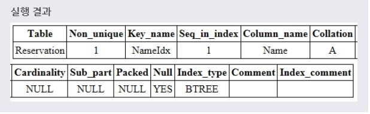
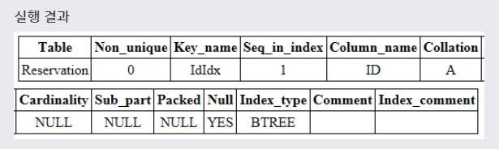
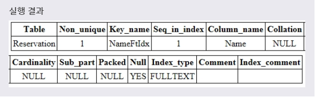

# INDEX 추가
***

## 1. 인덱스 추가

* ALTER 문을 사용하여 테이블에 인덱스를 추가할 수 있다. MySQL에서 추가할 수 있는 인덱스의 타입은 다음과 같다.
  * 기본 인덱스
  * UNIQUE INDEX
  * FULLTEXT INDEX
***

## 2. 기본 인덱스 추가

* 기본 인덱스에서 필드의 값은 같은 값이 여러 번 저장될 수 있으며, NULL 값을 가질 수도 있다.

* 문법
  ```SQL
  ALTER TABLE 테이블이름
  ADD INDEX 인덱스이름(필드이름);
  ```

* 예제
  ```SQL
  ALTER TABLE RESERVATION
  ADD INDEX NAMEIDX(NAME);
  ```
  풀어서 말하면, **RESERVATION 테이블에 있는 NAME 필드에 NAMEIDX라는 기본 인덱스를 추가하겠다.** 라는 뜻이다.

* 
***

## 3. UNIQUE INDEX 추가

* UNIQUE INDEX에서 필드의 값은 중복될 수 없으나, NULL 값을 가질 수는 있다.

* 문법
  ```SQL
  ALTER TABLE 테이블이름
  ADD UNIQUE 인덱스이름(필드이름);
  ```

* 예제
  ```SQL
  ALTER TABLE RESERVATION
  ADD UNIQUE IDIDX(ID);
  ```
  풀어서 말하면, **RESERVATION 테이블에 있는 ID 필드에 NAMEIDX라는 UNIQUE INDEX를 추가하겠다.** 라는 뜻이다.

* 
***

## 4. FULLTEXT INDEX 추가하기

* FULLTEXT INDEX는 일반적인 인덱스와는 달리 **매우 빠르게 테이블의 모든 텍스트 필드를 검색한다.** 이 인덱스는 검색 엔진과 유사한 방법으로 자연어를 이용하여 데이터를 검색할 수 있도록 **모든 데이터의 문자열 단어를 저장한다.**

* 문법
  ```SQL
  ALTER TABLE 테이블이름
  ADD FULLTEXT 인덱스이름(필드이름);
  ```

* 예제
  ```SQL
  ALTER TABLE RESERVATION
  ADD FULLTEXT NAMEFTIDX(NAME);
  ```
  풀어서 말하면, **RESERVATION 테이블에 있는 ID 필드에 NAMEIDX라는 UNIQUE INDEX를 추가하겠다.** 라는 뜻이다.

* 
