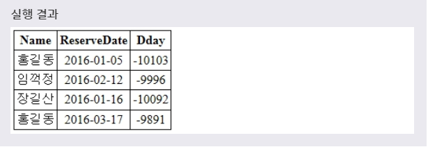
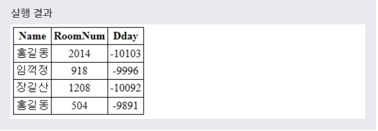

# VIEW 생성 및 대체
***

## 1. 뷰(VIEW)란?

* 뷰(view)는 데이터베이스에 존재하는 **일종의 가상 테이블** 을 의미한다. 이러한 뷰는 실제 테이블처럼 행과 열을 가지고 있지만, 실제로 데이터를 저장하고 있지는 않다.(그냥 보여주기식)

* MySQL에서 뷰(view)는 다른 테이블이나 다른 뷰에 저장되어 있는 데이터를 보여주는 역할만을 수행한다. 즉, 뷰를 사용하면 여러 테이블이나 뷰를 하나의 테이블처럼 볼 수 있다.
***

## 2. 뷰의 특징

* MySQL에서 뷰가 가지는 장점은 다음과 같다.
  * 특정 사용자에게 테이블 전체가 아닌 **필요한 필드만** 을 보여줄 수 있다.
  * 복잡한 쿼리를 단순화해서 사용할 수 있다.
  * 쿼리를 재사용할 수 있다.

* 하지만 이러한 뷰도 다음과 같은 단점을 가지고 있다.
  * 한 번 정의된 뷰는 변경할 수 없다.
  * 삽입, 삭제, 갱신 작업에 많은 제한 사항을 가진다.
  * **자신만의 인덱스를 가질 수 없다.**
***

## 3. 뷰 생성

* 문법
  ```SQL
  CREATE VIEW 뷰이름 AS
  SELECT 필드이름1, 필드이름2, ...
  FROM 테이블이름
  WHERE 조건;
  ```
  뷰의 이름을 명시하고, AS 키워드 다음에 SELECT 문을 사용하여 **해당 뷰가 접근할 수 있는 필드를 명시** 한다. 이때 WHERE 절을 사용하여 특정 조건을 설정할 수도 있다. 이렇게 **CREATE VIEW 문은 SELECT 문에서 선택된 필드를 가지는 새로운 뷰를 생성한다.**

> 뷰는 원본 테이블과 같은 이름을 가질 수 없다.

* 예제
  ```SQL
  CREATE VIEW MYVIEW AS
  SELECT NAME, RESERVEDATE, RESERVEDATE - CURDATE() AS DDAY
  FROM RESERVATION;
  ```
  풀어서 말하면, **RESERVATION 테이블에 있는 NAME, RESERVEDATE, DDAY 필드를 가지는 MYVIEW라는 이름의 뷰를 만들겠다.** 라는 뜻이다.

* 
* 위의 예제에서 생성된 MyView의 Dday 필드는 ReserveDate 필드 값과 현재 날짜와의 차이를 계산하여 생성된다. 따라서 실행한 결과에서 Dday 필드의 값은 위의 실행 결과와는 약간 다를 것이다.

> 이때 사용되는 Curdate() 함수는 현재 날짜를 받아오는 함수이다. Curdate() 함수에 대한 더 자세한 사항은 MySQL 날짜와 시간 관련 함수에서 확인할 수 있다.

> 뷰는 테이블과 마찬가지로 SELECT 문을 사용하여 저장하고 있는 데이터를 확인할 수 있습니다.
***

## 4. 뷰 대체

* CREATE 문에 **OR REPLACE** 절을 추가하여 **기존에 존재하는 뷰를 새로운 뷰로 대체** 할 수 있다.

* 문법
  ```SQL
  CREATE OR REPLACE VIEW 뷰이름 AS
  SELECT 필드이름1, 필드이름2, ...
  FROM 테이블이름
  WHERE 조건;
  ```
  CREATE OR REPLACE VIEW 문은 OR REPLACE 절이 추가된 것을 제외하면, 뷰를 생성하는 문법과 완전히 같다. 이때 해당 뷰가 존재하지 않으면 CREATE VIEW 문과 같은 결과를 반환한다.

* 예제
  ```SQL
  CREATE OR REPLACE VIEW MYVIEW AS
  SELECT NAME, ROOMNUM, DATE - CURDATE() AS DDAY
  FROM RESERVATION;
  ```
  풀어서 말하면, **RESERVATION 테이블에 있는 NAME, RESERVEDATE, DDAY 필드를 가지는 MYVIEW라는 이름의 뷰에서 앞선 예제에서 생성한 RESERVEDATE 필드를 ROOMNUM 필드로 대체하겠다.** 라는 뜻이다.

* 
