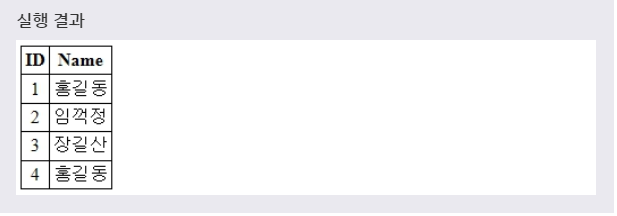

# VIEW 수정 및 삭제
***

## 1. 뷰 수정

* 문법
  ```SQL
  ALTER VIEW 뷰이름 AS
  SELECT 필드이름1, 필드이름2, ...
  FROM 테이블이름;
  ```

* 예제
  ```SQL
  ALTER VIEW MYVIEW AS
  SELECT ID, NAME
  FROM RESERVATION;
  ```
  풀어서 말하면, **MYVIEW라는 이름의 뷰를 RESERVATION 테이블에 있는 ID, NAME 필드만 가지도록 수정하겠다.** 라는 뜻이다.

* 
***

## 2. 뷰 삭제

* 문법
  ```SQL
  DROP VIEW 뷰이름;
  ```

* 예제
  ```SQL
  DROP VIEW MYVIEW;
  ```
