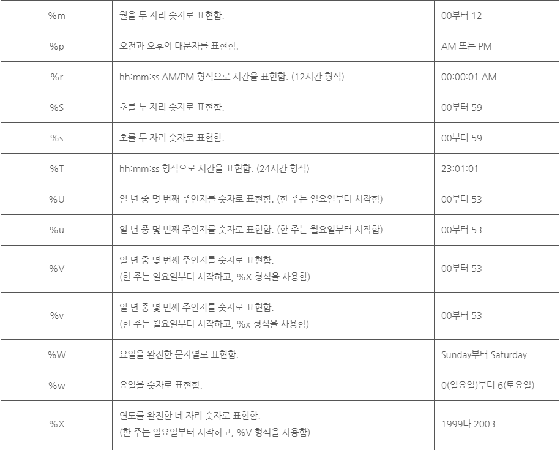

# 날짜와 시간 함수
***

## 1. 현재 날짜와 시간 정보

* NOW() 함수는 현재 날짜와 시간을 반환한다. 이때 반환되는 값은 'YYYY-MM-DD HH:MM:SS' 또는 YYYYMMDDHHMMSS 형태로 반환된다.

* CURDATE() 함수는 현재 날짜를 반환한다. 이때 반환되는 값은 'YYYY-MM-DD' 또는 YYYYMMDD 형태로 반환된다.

* CURTIME() 함수는 현재 시각을 반환한다. 이때 반환되는 값은 'HH:MM:SS' 또는 HHMMSS 형태로 반환된다.

* 예제
  ```SQL
  SELECT NOW(),
  CURDATE(),
  CURTIME();
  ```
***

## 2. 특정 날짜와 시간 정보

* DATE() 함수는 전달받은 값에 해당하는 날짜 정보를 반환한다.
* MONTH() 함수는 전달받은 값에서 월에 해당하는 값만을 반환하며, 0부터 12 사이의 값을 가진다.
* DAY() 함수는 전달받은 값에서 일자에 해당하는 값만을 반환하며, 0부터 31 사이의 값을 가진다.

* HOUR() 함수는 전달받은 값에서 시간에 해당하는 값만을 반환하며, 0부터 23 사이의 값을 가진다.
* MINUTE() 함수는 전달받은 값에서 분에 해당하는 값만을 반환하며, 0부터 59 사이의 값을 가진다.
* SECOND() 함수는 전달받은 값에서 초에 해당하는 값만을 반환하며, 0부터 59 사이의 값을 가진다.

* 예제
  ```SQL
  SELECT DATE('2016-02-19 12:34:56'),
  MONTH('2016-01-02 12:34:56'),
  DAY('2016-01-02 12:34:56'),
  HOUR('12:34:56'),
  MINUTE('12:34:56'),
  SECOND('12:34:56');
  ```

* 실행결과 - '2016-02-19', '1', '2', '12', '34', '56'
***

## 3. 요일과 월 이름

* MONTHNAME() 함수는 전달받은 값의 월에 해당하는 이름을 반환한다.

* DAYNAME() 함수는 전달받은 값의 요일에 해당하는 이름을 반환한다.

* 예제
  ```SQL
  SELECT MONTHNAME('2017-02-19'),
  DAYNAME('2017-02-19');
  ```

* 실행결과 - 'February', 'Sunday'
***

## 4. 연도별, 월별, 주별 일수

* DAYOFWEEK() 함수는 전달받은 값의 일자가 해당 주에서 몇 번째 날인지를 반환한다. 이 함수는 1부터 7 사이의 값을 반환한다. (일요일 = 1, 토요일 = 7)

* DAYOFMONTH() 함수는 전달받은 값의 일자가 해당 월에서 몇 번째 날인지를 반환한다. 이 함수는 0부터 31 사이의 값을 반환한다.

* DAYOFYEAR() 함수는 전달받은 값의 일자가 해당 연도에서 몇 번째 날인지를 반환한다. 이 함수는 1부터 366 사이의 값을 반환한다.

* 예제
  ```SQL
  SELECT DAYOFMONTH('2017-02-19'),
  DAYOFWEEK('2017-02-19'),
  DAYOFYEAR('2017-02-19');
  ```

* 실행결과 - '1', '19', '50'
***

## 5. 날짜와 시간의 형식화

* DATE_FORMAT() 함수는 전달받은 형식에 맞춰 날짜와 시간 정보를 문자열로 반환한다. DATE_FORMAT() 함수에 인수로 전달할 수 있는 날짜와 시간 표현의 형식은 다음과 같다.

* 
* 
* 

* 예제
  ```SQL
  SELECT DATE_FORMAT('2017-02-19 12:34:56', '%D %y %a %d %m %b %j');
  ```

* 실행결과 - '19th 17 Sun 19 02 Feb 050'
