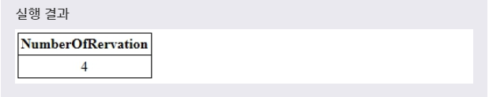
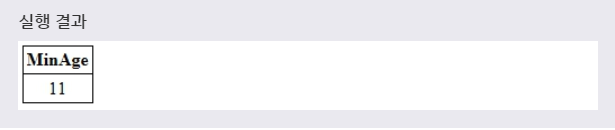
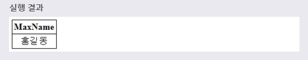
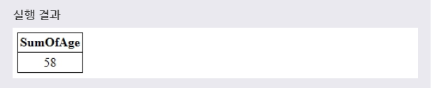
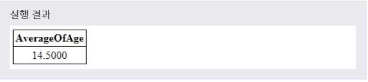
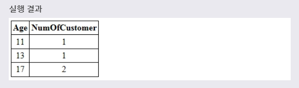
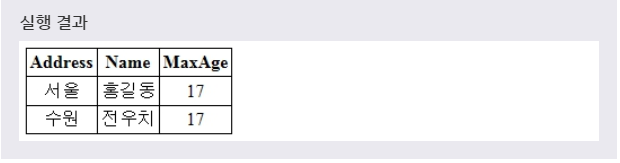

# 그룹 함수
***

## 1. 그룹(AGGREGATE) 함수

* MySQL에서는 하나의 값이 아닌 값들의 집합에 대해서 동작하는 그룹(aggregate) 함수를 제공하고 있다. MySQL에서 자주 사용되는 대표적인 그룹 함수는 다음과 같다.
  * COUNT()
  * MIN()과 MAX()
  * SUM()
  * AVG

> 대부분의 그룹 함수는 NULL 값을 제외하고 동작한 결과를 반환한다.
***

## 2. COUNT()

* COUNT() 함수는 선택된 필드에서 특정 조건을 만족하는 레코드의 총 개수를 반환한다. 만약 조건을 만족하는 레코드가 없다면, COUNT() 함수는 0을 반환한다. 이때 중복된 값을 제외하려면, 필드 이름 앞에 DISTINCT 키워드를 사용하면 된다.

* 예제
  ```SQL
  SELECT COUNT(*) AS NUMBEROFRESERVATION
  FROM RESERVATION;
  ```
  풀어서 말하면, **RESERVATION 테이블에서 레코드의 총 개수를 구하고 그것을 NUMBEROFRESERVATION라고 별칭을 붙이겠다.** 라는 뜻이다.

* 
***

## 3. MIN()과 MAX()

* MIN() 함수는 선택된 필드에 저장된 값 중 가장 작은 값을 반환한다.

* MAX() 함수는 선택된 필드에 저장된 값 중 가장 큰 값을 반환한다.

* 예제1
  ```SQL
  SELECT MIN(AGE) AS MINAGE
  FROM CUSTOMER;
  ```
  풀어서 말하면, **CUSTOMER 테이블에서 AGE 필드에 저장된 값 중 최솟값을 구하고 그것을 MINAGE라고 별칭을 붙이겠다.** 라는 뜻이다.

* 

* 예제2
  ```SQL
  SELECT MAX(NAME) AS MAXNAME
  FROM CUSTOMER;
  ```
  풀어서 말하면, **CUSTOMER 테이블에서 NAME 필드에 저장된 값 중 ㄱ부터 정렬을 했을 때 가장 늦게 나오는 값(MAX)을 구하고 그것을 MAXNAME라고 별칭을 붙이겠다.** 라는 뜻이다.

* 

> 위의 예제처럼 MIN() 함수와 MAX() 함수는 **문자열 타입의 필드** 에서도 최솟값과 최댓값을 구할 수 있다.
***

## 4. SUM()

* SUM() 함수는 선택된 숫자 타입의 필드에 저장된 값의 총 합을 반환한다.

* 예제
  ```SQL
  SELECT SUM(AGE) AS SUMOFAGE
  FROM CUSTOMER;
  ```
  풀어서 말하면, **CUSTOMER 테이블에서 AGE 필드에 저장된 값의 총 합을 구하고 그것을 SUMOFAGE라고 별칭을 붙이겠다.** 라는 뜻이다.

* 
***

## 5. AVG()

* AVG() 함수는 선택된 숫자 타입의 필드에 저장된 값의 평균값을 반환한다.

* 예제
  ```SQL
  SELECT AVG(AGE) AS AVERAGEOFAGE
  FROM CUSTOMER;
  ```
  풀어서 말하면, **CUSTOMER 테이블에서 AGE 필드에 저장된 값의 평균값을 구하고 그것을 AVERAGEOFAGE라고 별칭을 붙이겠다.** 라는 뜻이다.

* 
***

## 6. GROUP BY 절

* GROUP BY 절은 선택된 레코드의 집합을 **필드의 값이나 표현식에 의해 그룹화한 결과 집합을 반환** 한다. 즉, GROUP BY 절은 **하나의 그룹을 하나의 레코드로 반환** 하므로, 결과 집합의 **크기를 줄여주는 역할** 을 한다.

* 이러한 GROUP BY 절은 **SELECT 문에서만** 사용할 수 있으며, 앞서 살펴 본 그룹 함수를 사용할 때 자주 같이 사용된다.

* 문법
  ```SQL
  SELECT 필드이름, 그룹함수(필드이름)
  FROM 테이블이름
  [WHERE 조건]
  GROUP BY 필드이름;
  ```

* 예제
  ```SQL
  SELECT AVG, COUNT(*) AS NUMOFCUSTOMER
  FROM CUSTOMER
  GROUP BY AGE;
  ```
  풀어서 말하면, **CUSTOMER 테이블에서 AGE 필드에 대한 그룹을 하여 그 그룹을 COUNT하여 검색하고 그것을 NUMOFCUSTOMER라고 별칭을 붙이겠다.** 라는 뜻이다.

* 

> 위의 예제처럼 GROUP BY 절에 사용된 필드의 이름은 반드시 SELECT 문에도 같이 명시되어야 한다.
***

## 7. HAVING 절

* HAVING 절은 SELECT 문의 **WHERE 절처럼 GROUP BY 절에 의해 반환되는 결과 집합의 조건을 설정** 할 수 있게 해준다.

* 문법
  ```SQL
  SELECT 필드이름, 그룹함수(필드이름)
  FROM 테이블이름
  [WHERE 조건]
  GROUP BY 필드이름
  HAVING 조건;
  ```

* 예제
  ```SQL
  SELECT ADDRESS, NAME, MAX(AGE) AS MAXAGE
  FROM CUSTOMER
  GROUP BY ADDRESS
  HAVING MAXAGE > 15;
  ```
  풀어서 말하면, **CUSTOMER 테이블에서 ADDRESS 필드에 대한 그룹을 하여 그 그룹을 NAME, MAX(AGE)하여 검색하고 그것을 MAXAGE라고 별칭을 붙이겠다.** 라는 뜻이다.

* 
